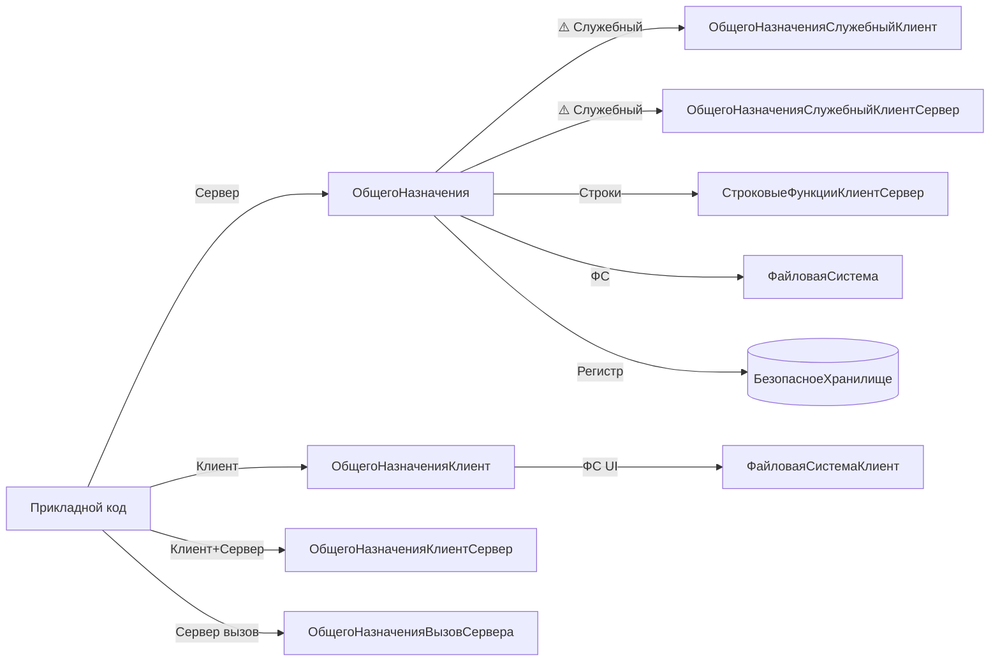

# BSP Base Common (БазоваяФункциональность: утилиты общего назначения)

Утилитарный скил по подсистеме «БазоваяФункциональность» — общие модули `ОбщегоНазначения*`, `СтроковыеФункции*`, `ФайловаяСистема*`. Покрывает задачи, встречающиеся в **каждом** прикладном модуле: вывод сообщений пользователю, сериализация XML/JSON, проверка типов и метаданных, безопасное хранение секретов, форматирование строк, парсинг дат, работа с временными каталогами и проводником.

## When to use

- Нужно вывести сообщение пользователю с привязкой к реквизиту формы (поле, путь к данным) — `СообщитьПользователю`.
- Нужно сериализовать произвольное значение (структуру, массив, объект) в XML/JSON или десериализовать обратно — `ЗначениеВСтрокуXML` / `ЗначениеИзСтрокиXML` / `ЗначениеВJSON` / `JSONВЗначение`.
- Нужно проверить, что значение является ссылочным типом (`ЭтоСсылка`) или что у объекта есть конкретный реквизит (`ЕстьРеквизитОбъекта`, `ЗначениеРеквизитаОбъекта`).
- Нужно программно проверить, подключена ли подсистема БСП в текущей конфигурации (`ПодсистемаСуществует`).
- Нужно сохранить пароль внешнего сервиса, токен API или другой секрет в безопасном хранилище (`ЗаписатьДанныеВБезопасноеХранилище`) и прочитать его позже.
- Нужно отформатировать строку с подстановкой параметров (`ПодставитьПараметрыВСтроку`), разложить строку в массив подстрок (`РазложитьСтрокуВМассивПодстрок`) или распарсить дату из произвольного формата (`СтрокаВДату`).
- Нужно создать временный каталог на сервере (`СоздатьВременныйКаталог`) или открыть Проводник Windows с клиента (`ОткрытьПроводник`).

## Не использовать, если

- Нужны API конкретных подсистем (пользователи и доступ → `bsp-users-access`, печать и отчёты → `bsp-print-reports`, фоновая печать → `bsp-longs-and-jobs`, обмен → `bsp-data-exchange`, контактная информация → `bsp-contact-info`, файлы и версии → `bsp-files-and-versions`).
- Нужно настроить/перенести подсистему в конфигурацию (задача внедрения БСП, не относится к прикладной разработке).
- Нужны методы из `#Область СлужебныйПрограммныйИнтерфейс` или `#Область СлужебныеПроцедурыИФункции` без явной необходимости — стабильного аналога нет, но сначала проверьте `bsp-fundamentals` и поищите в `## Key methods` других L1-скилов.
- Нужна работа с контактной информацией, адресами, ОКТМО, КЛАДР → `bsp-contact-info`.
- Нужна работа с электронной подписью и МЧД → `bsp-esign-mcd`.

## Core concepts

### Где живут утилиты

Все модули `ОбщегоНазначения*`, `СтроковыеФункции*`, `ФайловаяСистема*` расположены в `ОбщиеМодули/` (BSL/XML). В выгрузке конфигурации исходники лежат в `CommonModules/<ИмяМодуля>/Ext/Module.bsl`. Агент **сам читает реальный код модуля**, а не абстрактную документацию.

### Суффиксная система имён модулей

- **`ОбщегоНазначения`** — серверный код (без клиентского).
- **`ОбщегоНазначенияКлиент`** — клиентский код.
- **`ОбщегоНазначенияКлиентСервер`** — общий (вызывается и с клиента, и с сервера).
- **`ОбщегоНазначенияВызовСервера`** — клиентский код с вызовом сервера без контекста формы.
- **`ОбщегоНазначенияСлужебныйКлиент`** и **`ОбщегоНазначенияСлужебныйКлиентСервер`** — служебный API (⚠️ обратная совместимость не гарантируется; в прикладном коде — только если стабильного аналога нет).
- **⚠️ `ОбщегоНазначенияСлужебный` (без суффикса) не существует.** Типовая ошибка — вызвать несуществующий модуль.
- **`СтроковыеФункции`**, **`СтроковыеФункцииКлиент`**, **`СтроковыеФункцииКлиентСервер`** — строковые утилиты; в этом скиле используется **`СтроковыеФункцииКлиентСервер`** (универсально).
- **`ФайловаяСистема`** (сервер), **`ФайловаяСистемаКлиент`** (клиент). **⚠️ `ФайловаяСистемаКлиентСервер` не существует** — клиентский код вызывает сервер через контекст формы.

### Безопасное хранилище

`БезопасноеХранилище` — это **регистр сведений**, а **не общий модуль**. Доступ к нему осуществляется **только** через обёртки `ОбщегоНазначения.ЗаписатьДанныеВБезопасноеХранилище` / `ПрочитатьДанныеИзБезопасногоХранилища` / `УдалитьДанныеИзБезопасногоХранилища`. Прямой `РегистрыСведений.БезопасноеХранилище.СоздатьНаборЗаписей()` из прикладного кода — **анти-паттерн** (см. Anti-patterns).

### Области в общем модуле

В каждом модуле БСП есть регионы:
- `#Область ПрограммныйИнтерфейс` — стабильный API, можно вызывать из прикладного кода.
- `#Область СлужебныйПрограммныйИнтерфейс` — экспортные методы, **обратная совместимость не гарантируется**.
- `#Область СлужебныеПроцедурыИФункции` — внутренний код.

В Key methods этого скила — **только** стабильные методы из `#Область ПрограммныйИнтерфейс`. Если нужен служебный — он помечается ⚠️ в столбце «Стабильность».

### `ТекущаяДатаСеанса` — не функция БСП

`ТекущаяДатаСеанса()` — **платформенный** глобальный метод, доступен из любого модуля **без** префикса `ОбщегоНазначения.`. БСП его **не оборачивает**. Это частая ошибка: вызвать `ОбщегоНазначения.ТекущаяДатаСеанса()` — компилятор выдаст ошибку «Метод объекта не обнаружен». Подробнее — в Anti-patterns.

## Key methods

| Метод | Сигнатура | Сервер/Клиент | Назначение | Пример вызова |
|---|---|---|---|---|
| `ОбщегоНазначения.СообщитьПользователю` | `СообщитьПользователю(Знач ТекстСообщенияПользователю, Знач КлючДанных = Неопределено, Знач Поле = "", Знач ПутьКДанным = "", Отказ = Ложь)` | Сервер (вызывается с любого контекста) | Сообщение пользователю с привязкой к реквизиту формы / объекту | `ОбщегоНазначения.СообщитьПользователю(НСтр("ru='Ошибка.'"), , "ПолеВРеквизите", "Объект");` |
| `ОбщегоНазначения.ЗначениеВСтрокуXML` | `ЗначениеВСтрокуXML(Значение)` | Сервер | Сериализация произвольного значения в XML | `ОбщегоНазначения.ЗначениеВСтрокуXML(СтруктураДанных)` |
| `ОбщегоНазначения.ЗначениеИзСтрокиXML` | `ЗначениеИзСтрокиXML(СтрокаXML)` | Сервер | Десериализация XML обратно в значение | `ОбщегоНазначения.ЗначениеИзСтрокиXML(ТекстXML)` |
| `ОбщегоНазначения.ЗначениеВJSON` | `ЗначениеВJSON(Знач Значение)` | Сервер | → JSON-строка | `ОбщегоНазначения.ЗначениеВJSON(СтруктураДанных)` |
| `ОбщегоНазначения.JSONВЗначение` | `JSONВЗначение(Знач Строка, Знач ИменаСвойствСоЗначениямиДата = Неопределено, Знач ПрочитатьВСоответствие = Истина)` | Сервер | ← JSON-строка; `ИменаСвойствСоЗначениямиДата` — список свойств, которые нужно десериализовать как `Дата` (RFC 3339) | `ОбщегоНазначения.JSONВЗначение(ТелоОтвета, "ДатаОтправки,ДатаПолучения")` |
| `ОбщегоНазначения.ЭтоСсылка` | `ЭтоСсылка(ПроверяемыйТип)` | Сервер | Проверка, является ли тип ссылочным (через `Тип` или строку имени типа) | `ОбщегоНазначения.ЭтоСсылка(ТипЗнч(Объект))` |
| `ОбщегоНазначения.ЕстьРеквизитОбъекта` | `ЕстьРеквизитОбъекта(ИмяРеквизита, МетаданныеОбъекта)` | Сервер | Проверка наличия реквизита в метаданных | `ОбщегоНазначения.ЕстьРеквизитОбъекта("ИНН", Метаданные.Документы.Заказ)` |
| `ОбщегоНазначения.ЗначениеРеквизитаОбъекта` | `ЗначениеРеквизитаОбъекта(Ссылка, ИмяРеквизита, ВыбратьРазрешенные = Ложь, Знач КодЯзыка = Неопределено)` | Сервер | Получить значение реквизита по ссылке; `ВыбратьРазрешенные = Истина` применяет RLS | `ОбщегоНазначения.ЗначениеРеквизитаОбъекта(ДокументСсылка, "Контрагент")` |
| `ОбщегоНазначения.ПодсистемаСуществует` | `ПодсистемаСуществует(ПолноеИмяПодсистемы)` | Сервер | Проверка, подключена ли подсистема в текущей конфигурации (имя в формате `Подсистема1.Подсистема2`) | `ОбщегоНазначения.ПодсистемаСуществует("СтандартныеПодсистемы.ЭлектроннаяПодпись")` |
| `ОбщегоНазначения.ЗаписатьДанныеВБезопасноеХранилище` | `ЗаписатьДанныеВБезопасноеХранилище(Владелец, Данные, Ключ = "Пароль")` | Сервер | Записать секрет (пароль, токен) в защищённое хранилище. `Владелец` — ссылка на объект-владелец (настройка, учётная запись и т. п.) | `ОбщегоНазначения.ЗаписатьДанныеВБезопасноеХранилище(УчётнаяЗапись, Пароль)` |
| `ОбщегоНазначения.ПрочитатьДанныеИзБезопасногоХранилища` | `ПрочитатьДанныеИзБезопасногоХранилища(Владелец, Ключи = "Пароль", ОбщиеДанные = Неопределено)` | Сервер | Прочитать секрет(ы); `Ключи` — строка или массив строк. `ОбщиеДанные = Истина` — для общих данных (не привязанных к пользователю) | `Пароль = ОбщегоНазначения.ПрочитатьДанныеИзБезопасногоХранилища(УчётнаяЗапись);` |
| `ОбщегоНазначения.УдалитьДанныеИзБезопасногоХранилища` | `УдалитьДанныеИзБезопасногоХранилища(Знач Владелец, Знач Ключи = Неопределено)` | Сервер | Удалить секрет(ы) | `ОбщегоНазначения.УдалитьДанныеИзБезопасногоХранилища(УчётнаяЗапись);` |
| `СтроковыеФункцииКлиентСервер.ПодставитьПараметрыВСтроку` | `ПодставитьПараметрыВСтроку(Знач ШаблонСтроки, Знач Параметр1, Знач Параметр2 = Неопределено, ..., Знач Параметр9 = Неопределено)` | Клиент + Сервер | Форматирование строки с `%1 … %9`; безопасная альтернатива `СтрШаблон` для строк с большим числом параметров | `СтроковыеФункцииКлиентСервер.ПодставитьПараметрыВСтроку(НСтр("ru='Ошибка в строке %1, колонке %2.'"), НомерСтроки, ИмяКолонки);` |
| `СтроковыеФункцииКлиентСервер.РазложитьСтрокуВМассивПодстрок` | `РазложитьСтрокуВМассивПодстрок(Знач Значение, Знач Разделитель = ",", Знач ПропускатьПустыеСтроки = Неопределено, СокращатьНепечатаемыеСимволы = Ложь)` | Клиент + Сервер | Разбить строку в массив подстрок; `ПропускатьПустыеСтроки = Истина` отбрасывает пустые элементы | `МассивЧастей = СтроковыеФункцииКлиентСервер.РазложитьСтрокуВМассивПодстрок(CSVСтрока, ",");` |
| `СтроковыеФункцииКлиентСервер.СтрокаВДату` | `СтрокаВДату(Знач Значение, ЧастьДаты = Неопределено)` | Клиент + Сервер | Парсинг даты из строки; `ЧастьДаты` — `ЧастиДаты.ДатаВремя` (по умолчанию), `.Дата` или `.Время` | `Дата = СтроковыеФункцииКлиентСервер.СтрокаВДату(СтрокаДаты, ЧастиДаты.Дата);` |
| `ФайловаяСистема.СоздатьВременныйКаталог` | `СоздатьВременныйКаталог(Знач Расширение = "")` | Сервер | Создать уникальный временный каталог; возвращает полный путь | `Каталог = ФайловаяСистема.СоздатьВременныйКаталог("xml");` |
| `ФайловаяСистемаКлиент.ОткрытьПроводник` | `ОткрытьПроводник(ПутьККаталогуИлиФайлу)` | Клиент | Открыть Проводник Windows с фокусом на пути | `ФайловаяСистемаКлиент.ОткрытьПроводник(ИмяФайла);` |

## Patterns

### 1. Сообщение пользователю с привязкой к реквизиту формы

```bsl
// В модуле формы, в обработчике команды
Попытка
    // ...бизнес-логика...
Исключение
    ОбщегоНазначения.СообщитьПользователю(
        НСтр("ru = 'Не удалось провести документ.'"),
        ,
        "Объект.НомерСтроки",
        ,
        Отказ);
КонецПопытки;
```

`Поле` — путь относительно формы или объекта, `ПутьКДанным` — путь к реквизиту формы (например, `"Объект"`). `Отказ = Истина` прерывает транзакцию формы.

### 2. Безопасное сохранение и чтение пароля внешнего сервиса

```bsl
// Сохранение (например, при настройке интеграции)
ОбщегоНазначения.ЗаписатьДанныеВБезопасноеХранилище(
    УчётнаяЗаписьИнтеграции,    // Владелец
    НовыйПароль,                 // Данные
    "API_Password");             // Ключ (если у одного владельца несколько секретов)

// Чтение (в момент HTTP-вызова)
Пароль = ОбщегоНазначения.ПрочитатьДанныеИзБезопасногоХранилища(
    УчётнаяЗаписьИнтеграции,
    "API_Password");
```

Ключ по умолчанию — `"Пароль"`. Хранилище шифрует данные и не отдаёт их в пользовательский интерфейс напрямую.

### 3. Безопасный разбор JSON из внешнего источника

```bsl
ЧтениеJSON = Новый ЧтениеJSON;
ЧтениеJSON.УстановитьСтроку(ТелоОтвета);
Данные = ПрочитатьJSON(ЧтениеJSON);  // простой путь

// Или через обёртку БСП с контролем типов:
ИменаПолейКакДата = Новый Массив;
ИменаПолейКакДата.Добавить("ДатаОтправки");
ИменаПолейКакДата.Добавить("ДатаПолучения");
Данные = ОбщегоНазначения.JSONВЗначение(
    ТелоОтвета,
    СтрСоединить(ИменаПолейКакДата, ","));
```

`ОбщегоНазначения.JSONВЗначение` парсит JSON в `Соответствие` (по умолчанию) или в `Структура` (`ПрочитатьВСоответствие = Ложь`).

### 4. Условная логика с проверкой подсистемы

```bsl
Если ОбщегоНазначения.ПодсистемаСуществует("СтандартныеПодсистемы.ЭлектроннаяПодпись") Тогда
    // ...вызов API ЭП...
КонецЕсли;
```

Позволяет опционально использовать функциональность БСП, не требуя её обязательного подключения.

## Anti-patterns

### ❌ Вызывать `ОбщегоНазначения.ТекущаяДатаСеанса` (метод не существует)

```bsl
// ❌ ОШИБКА КОМПИЛЯЦИИ: Метод объекта не обнаружен
Дата = ОбщегоНазначения.ТекущаяДатаСеанса();
```

```bsl
// ✅ ТекущаяДатаСеанса() — платформенный глобальный метод
Дата = ТекущаяДатаСеанса();
```

`ТекущаяДата()` — устаревший платформенный метод (возвращает дату сервера, не учитывает часовой пояс сеанса). Для пользовательских сообщений и расчёта «сегодня» используйте `ТекущаяДатаСеанса()`.

### ❌ Конкатенация строк для форматируемых сообщений

```bsl
// ❌ Локализация ломается, не работает мульти-язык
Текст = "Ошибка в строке " + НомерСтроки + ", колонке " + ИмяКолонки;
```

```bsl
// ✅ ПодставитьПараметрыВСтроку + НСтр (для локализации)
Текст = СтроковыеФункцииКлиентСервер.ПодставитьПараметрыВСтроку(
    НСтр("ru = 'Ошибка в строке %1, колонке %2.'"),
    НомерСтроки,
    ИмяКолонки);
```

### ❌ Свои обёртки над `БезопасноеХранилище`

```bsl
// ❌ Прямой доступ к регистру, обходит шифрование
НаборЗаписей = РегистрыСведений.БезопасноеХранилище.СоздатьНаборЗаписей();
НаборЗаписей.Отбор.Владелец.Установить(УчётнаяЗапись);
НаборЗаписей.Прочитать();
```

```bsl
// ✅ Только через ОбщегоНазначения.*
ОбщегоНазначения.ЗаписатьДанныеВБезопасноеХранилище(УчётнаяЗапись, Пароль);
```

### ❌ `Сообщить()` или `ПоказатьПредупреждение()` для ошибок бизнес-логики

```bsl
// ❌ Не привязывается к реквизиту, не влияет на Отказ
Сообщить("Ошибка!");
```

```bsl
// ✅ СообщитьПользователю с путём к реквизиту
ОбщегоНазначения.СообщитьПользователю(НСтр("ru='Ошибка.'"), , "ПолеВРеквизите", "Объект", Отказ);
```

### ❌ Вызывать `JSONСтрокой` (метод не существует в `ОбщегоНазначения`)

```bsl
// ❌ ОШИБКА: метод не найден
JSON = ОбщегоНазначения.JSONСтрокой(Структура);
```

```bsl
// ✅ Стабильный API — ЗначениеВJSON
JSON = ОбщегоНазначения.ЗначениеВJSON(Структура);
```

(`ЗаписатьJSON` и `ЧтениеJSON` — платформенные альтернативы, но обёртка `ЗначениеВJSON`/`JSONВЗначение` — идиоматический БСП-стиль.)

### ❌ Передавать `Строка` как второй параметр `ЭтоСсылка`

```bsl
// ❌ ЭтоСсылка ожидает Тип, а не строку
Если ОбщегоНазначения.ЭтоСсылка("СправочникСсылка.Контрагенты") Тогда
```

```bsl
// ✅ Оборачиваем в Тип()
Если ОбщегоНазначения.ЭтоСсылка(Тип("СправочникСсылка.Контрагенты")) Тогда
```

`ПроверяемыйТип` имеет тип `Тип`. Если есть строка имени типа — сначала `Тип(Строка)`.

### ❌ Длинные строки `ПодставитьПараметрыВСтроку` через `СтрШаблон`

```bsl
// ❌ СтрШаблон — платформенный, для строк с > 5 параметров становится громоздким
Текст = СтрШаблон("Заказ №%1 от %2, контрагент %3, сумма %4, статус %5, дата отгрузки %6, ответственный %7, приоритет %8, комментарий %9",
    Номер, Дата, Контрагент, Сумма, Статус, ДатаОтгрузки, Ответственный, Приоритет, Комментарий);
```

```bsl
// ✅ Поддерживает до 9 параметров с авто-нумерацией %1..%9
Текст = СтроковыеФункцииКлиентСервер.ПодставитьПараметрыВСтроку(
    НСтр("ru='Заказ №%1 от %2, контрагент %3, сумма %4, статус %5, дата отгрузки %6, ответственный %7, приоритет %8, комментарий %9'"),
    Номер, Дата, Контрагент, Сумма, Статус, ДатаОтгрузки, Ответственный, Приоритет, Комментарий);
```

(Для >9 параметров — `ПодставитьПараметрыВСтрокуИзМассива` в том же модуле.)

## How to explore deeper

### Где искать модули в выгрузке конфигурации

- `CommonModules/ОбщегоНазначения/Ext/Module.bsl` — серверные общие утилиты.
- `CommonModules/ОбщегоНазначенияКлиент/Ext/Module.bsl` — клиентские утилиты.
- `CommonModules/ОбщегоНазначенияКлиентСервер/Ext/Module.bsl` — общие (клиент + сервер).
- `CommonModules/СтроковыеФункцииКлиентСервер/Ext/Module.bsl` — строковые утилиты.
- `CommonModules/ФайловаяСистема/Ext/Module.bsl` — серверные файловые операции.
- `CommonModules/ФайловаяСистемаКлиент/Ext/Module.bsl` — клиентские файловые операции (включая UI-вызовы).

### Grep-шаблоны

```text
# Найти все экспортные методы в модуле (для оценки размера API)
^(Функция|Процедура) [А-Я][А-Яа-яA-Za-z_]+\(.*\) Экспорт

# Стабильный API внутри модуля
^#Область ПрограммныйИнтерфейс

# Служебный API (⚠️ — обратная совместимость не гарантируется)
^#Область СлужебныйПрограммныйИнтерфейс

# Проверить существование метода в модуле
^(Функция|Процедура) <ИмяМетода>\(
```

### Glob-маски

- `CommonModules/ОбщегоНазначения*/Ext/Module.bsl` — все суффиксные варианты `ОбщегоНазначения`.
- `CommonModules/СтроковыеФункции*/Ext/Module.bsl` — все строковые модули.
- `CommonModules/ФайловаяСистема*/Ext/Module.bsl` — все файловые модули.
- `InformationRegisters/БезопасноеХранилище/Ext/RecordSetModule.bsl` — модуль набора записей РС (для глубокой отладки).

### На что обратить внимание в дереве метаданных

- **`РегистрСведений.БезопасноеХранилище`** — при первом использовании убедиться, что в конфигурации он подключён (отсутствует → будет ошибка инициализации).
- **`ПодпискиНаСобытия`** для модулей `ОбщегоНазначенияСлужебныйКлиент*` — служебные модули могут подписываться на системные события платформы.
- В **формах** — типичные элементы, использующие `СообщитьПользователю`: реквизиты с `АвтоОтметкаНезаполненного`, `ПроверкаЗаполнения` формы.

### Mermaid — карта модулей подсистемы


