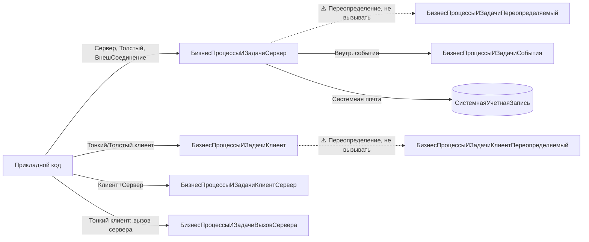

# BSP BP and Tasks (БизнесПроцессыИЗадачи)

Скил по подсистеме **БизнесПроцессыИЗадачи** 3.1.11. Покрывает серверные и клиентские точки входа, через которые прикладной код **исполняет задачи**, **перенаправляет** их на других исполнителей, **принимает к исполнению / отменяет принятие**, **останавливает / активирует** бизнес-процессы, **получает форму** выполнения задачи и **запускает регламентный контроль** сроков. Также покрывает клиентскую обёртку, открывающую управляемую форму перенаправления списка задач.

Скил **не** описывает проектирование маршрутов, добавление прикладных бизнес-процессов и регистров адресации, настройку ролей и групп исполнителей — это задача архитектора конфигурации, решается через `БизнесПроцессыИЗадачиПереопределяемый` и `БизнесПроцессыИЗадачиКлиентПереопределяемый`.

## When to use

- Нужно программно **выполнить задачу** от имени исполнителя, в т. ч. с авто-вызовом `ОбработкаВыполненияПоУмолчанию` модуля менеджера бизнес-процесса — `БизнесПроцессыИЗадачиСервер.ВыполнитьЗадачу`.
- Нужно **перенаправить одну или несколько задач** новому исполнителю / в новую роль / подразделение и заодно проверить, что перенаправление возможно (на сервере, в транзакции) — `БизнесПроцессыИЗадачиСервер.ПеренаправитьЗадачи` (это **Функция**, возвращает `Булево`).
- Нужно **открыть из списка задач** управляемую форму перенаправления с предварительной проверкой возможности (с клиента, без серверного вызова бизнес-логики) — `БизнесПроцессыИЗадачиКлиент.ПеренаправитьЗадачи`.
- Нужно **принять** массив задач к исполнению или **отменить** ранее принятую задачу (смена исполнителя, отказ от роли) — `БизнесПроцессыИЗадачиСервер.ПринятьЗадачиКИсполнению` / `ОтменитьПринятиеЗадачиКИсполнению`.
- Нужно **остановить активный** бизнес-процесс или **возобновить** остановленный — `БизнесПроцессыИЗадачиСервер.ОстановитьБизнесПроцесс` / `СделатьАктивнымБизнесПроцесс`.
- Нужно **узнать параметры формы выполнения** конкретной задачи (для последующего `ОткрытьФорму`) — `БизнесПроцессыИЗадачиСервер.ФормаВыполненияЗадачи` (Функция, возвращает `Структура` параметров; `Неопределено`, если у задачи нет бизнес-процесса).
- Нужно **проверить, является ли задача ведущей** (родительской для ветки) — `БизнесПроцессыИЗадачиСервер.ЭтоВедущаяЗадача`.
- Нужно **вызвать обработчик регламентного задания** `МониторингЗадач` (уведомления о просроченных задачах) или `УведомлениеИсполнителейОНовыхЗадачах` — `БизнесПроцессыИЗадачиСервер.ПроконтролироватьЗадачи` / `УведомитьИсполнителейОНовыхЗадачах` (без параметров, рассылка от системной учётной записи).

## Не использовать, если

- Нужны базовые утилиты общего назначения (сериализация, проверка типа, безопасное хранилище, форматирование строк) — `bsp-base-common`. Здесь только **специализированные** методы по задачам и бизнес-процессам.
- Нужно открыть **список задач** текущего пользователя или форму бизнес-процесса — это работа управляемого приложения через команды формы (`ОткрытьЗначение(...)` / `ОткрытьФорму(...)`); скил даёт серверные методы-обработчики, а не UI-команды.
- Нужно **спроектировать маршрут** нового прикладного бизнес-процесса (точки маршрута, роли, адресация, регистры) — это задача внедрения БСП в конфигурацию; скил описывает **управление** существующими задачами, не их проектирование.
- Нужно **переопределить поведение** БСП по задачам (свои правила перенаправления, свой обработчик выполнения, свой контроль сроков) — это делается в модуле `БизнесПроцессыИЗадачиПереопределяемый` (сервер) и `БизнесПроцессыИЗадачиКлиентПереопределяемый` (клиент); скил описывает **вызов** стабильного API, а не замещение.
- Нужно определить, подключена ли подсистема в текущей конфигурации — `ОбщегоНазначения.ПодсистемаСуществует("СтандартныеПодсистемы.БизнесПроцессыИЗадачи")` (`bsp-base-common`).
- Нужна **фоновая обёртка** для регламентной рассылки (в режиме сервиса / длительных операций) — `bsp-longs-and-jobs`. `ПроконтролироватьЗадачи` и `УведомитьИсполнителейОНовыхЗадачах` сами по себе — точки входа регламентных заданий; запускать их вручную из фоновых заданий 1С не нужно.
- Нужно отправить e-mail по факту изменения состояния задачи (шаблон сообщения, вложения) — `bsp-comms` / `bsp-perf-monitoring`; этот скил только про состояние задач в ИБ.

## Core concepts

### Именование модулей — `…Сервер` обязателен

Подсистема `БизнесПроцессыИЗадачи` обслуживается семейством общих модулей **с обязательным суффиксом**. ⚠️ **Общего модуля `БизнесПроцессыИЗадачи` (без суффикса) НЕ существует** — серверный модуль называется `БизнесПроцессыИЗадачиСервер`. Проверить перед вызовом: `CommonModules/БизнесПроцессыИЗадачи/Ext/Module.bsl` отсутствует, есть только `…/БизнесПроцессыИЗадачиСервер/Ext/Module.bsl`.

| Модуль | Контекст | Назначение |
|---|---|---|
| `БизнесПроцессыИЗадачиСервер` | Сервер, Толстый клиент, Внешнее соединение | **Стабильный API** подсистемы: выполнение, перенаправление, принятие, остановка, активация, контроль сроков, уведомления |
| `БизнесПроцессыИЗадачиКлиент` | Тонкий / Толстый клиент | **Клиентские обёртки** UI: открытие формы перенаправления, открытие доп. информации, открытие предмета задачи |
| `БизнесПроцессыИЗадачиКлиентСервер` | Сервер, Тонкий / Толстый клиент | Безопасный код (без серверного вызова и без БД) |
| `БизнесПроцессыИЗадачиВызовСервера` | Сервер, Тонкий / Толстый клиент | Серверные вызовы из клиентского кода (тонкий / веб-клиент) |
| `БизнесПроцессыИЗадачиПереопределяемый` | Сервер | «Крючки» прикладной конфигурации (НЕ вызывать, реализовывать) |
| `БизнесПроцессыИЗадачиКлиентПереопределяемый` | Клиент | Клиентские «крючки» (НЕ вызывать, реализовывать) |
| `БизнесПроцессыИЗадачиСобытия` | Сервер | Обработчики событий приложения / сеанса (внутреннее) |

### ⚠️ Частые «фантомы» — НЕ вызывать

В `БизнесПроцессыИЗадачиСервер` и `БизнесПроцессыИЗадачиКлиент` **нет** следующих методов. Их регулярно выдумывают по аналогии с другими подсистемами. Не пытайтесь их вызвать — компилятор выдаст ошибку «Метод объекта не обнаружен»:

- ❌ `БизнесПроцессыИЗадачиСервер.ФормированиеЗадач` — **не существует**. За формирование задач отвечает код бизнес-процесса (`БизнесПроцессы.<Имя>.СоздатьЗадачу(...)` в модуле менеджера / обработчике точки маршрута), а не общий модуль БСП.
- ❌ `БизнесПроцессыИЗадачиСервер.СоздатьЗадачу` — **не существует**. Создание задачи — дело конкретного бизнес-процесса (`БизнесПроцессы.<Имя>.СоздатьЗадачу(...)`); общий модуль этим не занимается.
- ❌ `БизнесПроцессыИЗадачиКлиент.ОткрытьФормуЗадачи` — **не существует**. В `БизнесПроцессыИЗадачиКлиент` есть `ОткрытьДопИнформациюОЗадаче`, `ОткрытьБизнесПроцесс`, `ОткрытьПредметЗадачи` — но **не** `ОткрытьФормуЗадачи`. Для открытия формы задачи используется стандартный `ОткрытьЗначение(...)` либо параметризованное `ОткрытьФорму("Задача.ЗадачаИсполнителя.ФормаОбъекта", ...)` после `БизнесПроцессыИЗадачиСервер.ФормаВыполненияЗадачи(...)`.

### Стабильный vs служебный API

В Key methods этого скила — **только** методы из `#Область ПрограммныйИнтерфейс` модуля `БизнесПроцессыИЗадачиСервер` и `#Область ПрограммныйИнтерфейс` модуля `БизнесПроцессыИЗадачиКлиент`. Все они помечены `✅ стабильный`. Служебный API (`БизнесПроцессыИЗадачиСервер` / `БизнесПроцессыИЗадачиСобытия`) для прикладного кода **не предназначен** и в скил не включён.

### Контекст вызова

Все методы `БизнесПроцессыИЗадачиСервер` доступны с **Сервера, Толстого клиента и Внешнего соединения**. Это означает, что из модуля формы (тонкий клиент) вызывать их напрямую **нельзя** — нужно оборачивать в серверный вызов (`&НаСервере`, `ВыполнитьОбработкуОповещения` через серверный модуль, либо через `БизнесПроцессыИЗадачиВызовСервера` если обёртка уже есть). Исключение — `БизнесПроцессыИЗадачиКлиент.ПеренаправитьЗадачи`, который специально предназначен для тонкого клиента и сам внутри делает серверный вызов проверки через `БизнесПроцессыИЗадачиВызовСервера.ПеренаправитьЗадачи(..., Истина)`.

### Структура `ИнфоОПеренаправлении`

`БизнесПроцессыИЗадачиСервер.ПеренаправитьЗадачи` вторым параметром принимает **Структуру** с новыми значениями реквизитов адресации задачи. Состав ключей соответствует реквизитам адресации задачи `ЗадачаИсполнителя` (`Исполнитель`, `РольИсполнителя`, `ОсновнойОбъектАдресации`, `ДополнительныйОбъектАдресации`). Если `Исполнитель` — пользователь или внешний пользователь, дополнительно проверяется, что он **не помечен на удаление** и **действителен** (иначе будет вызвано `ОбщегоНазначения.СообщитьПользователю`).

### Регламентные задания — точки входа

Две процедуры `БизнесПроцессыИЗадачиСервер` не имеют параметров и являются **обработчиками регламентных заданий** БСП:

- `ПроконтролироватьЗадачи` → обработчик `МониторингЗадач`. Рассылает уведомления исполнителям и авторам задач, не выполненных в срок; если задача направлена «в никуда» (роль с пустым списком исполнителей) — создаёт новую задачу ответственному за настройку ролей.
- `УведомитьИсполнителейОНовыхЗадачах` → обработчик `УведомлениеИсполнителейОНовыхЗадачах`. Рассылает уведомления о новых задачах за период с момента предыдущей рассылки.

Запускать их вручную из прикладного кода обычно **не нужно** — регламентное задание вызовет их само. Если требуется принудительный запуск (например, в обработке обновления ИБ) — допустимо, но учитывайте, что рассылка идёт по почте **от системной учётной записи** и может занять заметное время.

## Key methods

| Метод | Сигнатура | Сервер/Клиент | Назначение | Пример вызова |
|---|---|---|---|---|
| `БизнесПроцессыИЗадачиСервер.ВыполнитьЗадачу` | `ВыполнитьЗадачу(ЗадачаСсылка, ДействиеПоУмолчанию = Ложь)` | Сервер | Выполнить задачу; при `ДействиеПоУмолчанию = Истина` дополнительно вызывается `ОбработкаВыполненияПоУмолчанию` модуля менеджера бизнес-процесса | `БизнесПроцессыИЗадачиСервер.ВыполнитьЗадачу(ЗадачаСсылка, Истина)` |
| `БизнесПроцессыИЗадачиСервер.ПеренаправитьЗадачи` | `ПеренаправитьЗадачи(Знач ПеренаправляемыеЗадачи, Знач ИнфоОПеренаправлении, Знач ТолькоПроверка = Ложь, ПеренаправленныеЗадачи = Неопределено)` | Сервер | **Функция**, возвращает `Булево` (Истина = успех). Перенаправляет массив задач на нового исполнителя / в новую роль. `ТолькоПроверка = Истина` — только проверить возможность. 4 параметра | `БизнесПроцессыИЗадачиСервер.ПеренаправитьЗадачи(МассивЗадач, ИнфоОПеренаправлении)` |
| `БизнесПроцессыИЗадачиКлиент.ПеренаправитьЗадачи` | `ПеренаправитьЗадачи(ПеренаправляемыеЗадачи, ФормаВладелец)` | Клиент | Открывает **управляемую форму** перенаправления списка задач; внутри делает серверный вызов проверки (`ТолькоПроверка = Истина`) | `БизнесПроцессыИЗадачиКлиент.ПеренаправитьЗадачи(ВыделенныеЗадачи, ЭтаФорма)` |
| `БизнесПроцессыИЗадачиСервер.ПринятьЗадачиКИсполнению` | `ПринятьЗадачиКИсполнению(Задачи)` | Сервер | Отметить массив задач как принятые текущим пользователем к исполнению | `БизнесПроцессыИЗадачиСервер.ПринятьЗадачиКИсполнению(МассивЗадач)` |
| `БизнесПроцессыИЗадачиСервер.ОстановитьБизнесПроцесс` | `ОстановитьБизнесПроцесс(БизнесПроцесс)` | Сервер | Отметить бизнес-процесс как остановленный (принимает `ОпределяемыйТип.БизнесПроцесс`) | `БизнесПроцессыИЗадачиСервер.ОстановитьБизнесПроцесс(БизнесПроцессСсылка)` |
| `БизнесПроцессыИЗадачиСервер.СделатьАктивнымБизнесПроцесс` | `СделатьАктивнымБизнесПроцесс(БизнесПроцесс)` | Сервер | Отметить остановленный бизнес-процесс как активный (принимает `ОпределяемыйТип.БизнесПроцесс`) | `БизнесПроцессыИЗадачиСервер.СделатьАктивнымБизнесПроцесс(БизнесПроцессСсылка)` |
| `БизнесПроцессыИЗадачиСервер.ЭтоВедущаяЗадача` | `ЭтоВедущаяЗадача(ЗадачаСсылка)` | Сервер | **Функция**, возвращает `Булево`. Проверить, является ли задача ведущей (родительской) для своего бизнес-процесса | `Если БизнесПроцессыИЗадачиСервер.ЭтоВедущаяЗадача(Задача) Тогда …` |
| `БизнесПроцессыИЗадачиСервер.ФормаВыполненияЗадачи` | `ФормаВыполненияЗадачи(Знач ЗадачаСсылка)` | Сервер | **Функция**, возвращает `Структура` параметров формы выполнения задачи. Если у задачи нет бизнес-процесса — пустая `Структура`. Состав ключей определяется `БизнесПроцессыИЗадачиПереопределяемый.ПриПолученииФормыВыполненияЗадачи` | `Параметры = БизнесПроцессыИЗадачиСервер.ФормаВыполненияЗадачи(ЗадачаСсылка)` |
| `БизнесПроцессыИЗадачиСервер.ПроконтролироватьЗадачи` | `ПроконтролироватьЗадачи()` | Сервер | Обработчик регламентного задания `МониторингЗадач`: уведомления о просроченных задачах + создание задач ответственному за «пустые» роли | `БизнесПроцессыИЗадачиСервер.ПроконтролироватьЗадачи()` |
| `БизнесПроцессыИЗадачиСервер.УведомитьИсполнителейОНовыхЗадачах` | `УведомитьИсполнителейОНовыхЗадачах()` | Сервер | Обработчик регламентного задания `УведомлениеИсполнителейОНовыхЗадачах`: рассылка уведомлений о новых задачах с момента предыдущей рассылки | `БизнесПроцессыИЗадачиСервер.УведомитьИсполнителейОНовыхЗадачах()` |

## Patterns

### 1. Выполнить задачу из формы списка с авто-обработчиком по умолчанию

```bsl
&НаКлиенте
Процедура ВыполнитьЗадачу(Команда)
    ТекущиеДанные = Элементы.СписокЗадач.ТекущиеДанные;
    Если ТекущиеДанные = Неопределено Тогда
        Возврат;
    КонецЕсли;
    ВыполнитьЗадачуНаСервере(ТекущиеДанные.Ссылка);
    ОповеститьОбИзменении(Тип("ЗадачаСсылка.ЗадачаИсполнителя"));
КонецПроцедуры

&НаСервере
Процедура ВыполнитьЗадачуНаСервере(ЗадачаСсылка)
    БизнесПроцессыИЗадачиСервер.ВыполнитьЗадачу(ЗадачаСсылка, Истина);
КонецПроцедуры
```

`ДействиеПоУмолчанию = Истина` означает, что БСП после стандартной отметки выполнения вызовет `ОбработкаВыполненияПоУмолчанию` модуля менеджера бизнес-процесса (если она там определена). Без этого флага выполняется только стандартная отметка.

### 2. Перенаправление массива задач новому исполнителю с предварительной проверкой

```bsl
// МассивЗадач — массив ЗадачаСсылка.ЗадачаИсполнителя
// Инфо — структура с новыми значениями реквизитов адресации
//        (Исполнитель, РольИсполнителя, ОсновнойОбъектАдресации, ДополнительныйОбъектАдресации)
ИнфоОПеренаправлении = Новый Структура;
ИнфоОПеренаправлении.Вставить("Исполнитель", НовыйИсполнитель);
ИнфоОПеренаправлении.Вставить("РольИсполнителя", Неопределено);

// Шаг 1 — только проверить, что перенаправление возможно
МожноПеренаправить = БизнесПроцессыИЗадачиСервер.ПеренаправитьЗадачи(
    МассивЗадач, ИнфоОПеренаправлении, Истина);
Если НЕ МожноПеренаправить Тогда
    Возврат; // Сообщение пользователю уже сформировано внутри
КонецЕсли;

// Шаг 2 — собственно перенаправить
ПеренаправленныеЗадачи = Новый Массив;
Успех = БизнесПроцессыИЗадачиСервер.ПеренаправитьЗадачи(
    МассивЗадач, ИнфоОПеренаправлении, Ложь, ПеренаправленныеЗадачи);
```

Двухшаговая схема `ТолькоПроверка = Истина` → `ТолькоПроверка = Ложь` — стандартный идиоматический приём в этой подсистеме: сначала проверить (быстро, без физического изменения), потом выполнить. В параметр `ПеренаправленныеЗадачи` БСП положит **только успешно перенаправленные** задачи (если не все удалось — массив будет короче исходного).

### 3. Открытие формы перенаправления из списка задач

```bsl
&НаКлиенте
Процедура ПеренаправитьЗадачи(Команда)
    ВыделенныеЗадачи = Элементы.СписокЗадач.ВыделенныеСтроки;
    Если ВыделенныеЗадачи.Количество() = 0 Тогда
        ПоказатьПредупреждение(, НСтр("ru = 'Не выбраны задачи.'"));
        Возврат;
    КонецЕсли;
    // Открывает форму перенаправления; внутри сам делает серверный
    // вызов проверки возможности (ТолькоПроверка = Истина)
    БизнесПроцессыИЗадачиКлиент.ПеренаправитьЗадачи(ВыделенныеЗадачи, ЭтаФорма);
КонецПроцедуры
```

Эта клиентская обёртка **не** дублирует серверный метод — она открывает управляемую форму, в которой пользователь вводит нового исполнителя / роль, а серверный вызов проверки делается внутри (`БизнесПроцессыИЗадачиВызовСервера.ПеренаправитьЗадачи(..., Истина)`).

### 4. Остановка и возобновление бизнес-процесса

```bsl
// Остановить
БизнесПроцессыИЗадачиСервер.ОстановитьБизнесПроцесс(БизнесПроцессСсылка);

// Возобновить (отменить остановку)
БизнесПроцессыИЗадачиСервер.СделатьАктивнымБизнесПроцесс(БизнесПроцессСсылка);
```

Параметр — `ОпределяемыйТип.БизнесПроцесс` (т. е. ссылка на бизнес-процесс **любого** вида из прикладной конфигурации, удовлетворяющая определяемому типу). Не нужно указывать конкретный вид (`БизнесПроцессСсылка.Согласование`, `…ЗаявкаНаРасходованиеДС` и т. п.) — определяемый тип сам разрешает нужный.

### 5. Получить и открыть форму выполнения задачи

```bsl
&НаКлиенте
Процедура ОткрытьФормуВыполнения(ЗадачаСсылка)
    ПараметрыФормы = БизнесПроцессыИЗадачиСервер.ФормаВыполненияЗадачи(ЗадачаСсылка);
    Если ПараметрыФормы = Неопределено ИЛИ ПараметрыФормы.Количество() = 0 Тогда
        // У задачи нет бизнес-процесса — открываем обычную форму задачи
        ОткрытьЗначение(ЗадачаСсылка);
        Возврат;
    КонецЕсли;
    ОткрытьФорму("Задача.ЗадачаИсполнителя.ФормаВыполненияЗадачи",
        ПараметрыФормы, ЭтаФорма);
КонецПроцедуры
```

`ФормаВыполненияЗадачи` возвращает **универсальный контейнер** параметров: имя формы, ключ, параметры — зависят от прикладного бизнес-процесса, переопределяются в `БизнесПроцессыИЗадачиПереопределяемый.ПриПолученииФормыВыполненияЗадачи`. Прямое `ОткрытьФорму("Задача.ЗадачаИсполнителя.ФормаОбъекта", ...)` — **анти-паттерн** для прикладных бизнес-процессов (не пройдёт проверку прав и не подменит форму выполнения, если она задана).

## Anti-patterns

### ❌ Вызывать `БизнесПроцессыИЗадачи.ВыполнитьЗадачу` (модуль без суффикса)

```bsl
// ❌ ОШИБКА КОМПИЛЯЦИИ: общий модуль БизнесПроцессыИЗадачи не существует
БизнесПроцессыИЗадачи.ВыполнитьЗадачу(ЗадачаСсылка);
```

```bsl
// ✅ Серверный модуль — БизнесПроцессыИЗадачиСервер
БизнесПроцессыИЗадачиСервер.ВыполнитьЗадачу(ЗадачаСсылка, Истина);
```

`БизнесПроцессыИЗадачи` (без суффикса) — **не общий модуль**. Это **имя подсистемы** (`СтандартныеПодсистемы.БизнесПроцессыИЗадачи`) и имя **определяемого типа** `ОпределяемыйТип.БизнесПроцесс` — но не общий модуль. Все серверные методы — в `БизнесПроцессыИЗадачиСервер`, все клиентские — в `БизнесПроцессыИЗадачиКлиент`.

### ❌ Вызывать `БизнесПроцессыИЗадачиСервер.ФормированиеЗадач` (фантом)

```bsl
// ❌ ОШИБКА: метод не существует
БизнесПроцессыИЗадачиСервер.ФормированиеЗадач(БизнесПроцесс);
```

```bsl
// ✅ За формирование задач отвечает сам бизнес-процесс в модуле менеджера / обработчике точки
БизнесПроцессы.Согласование.СоздатьЗадачу(...); // пример прикладного вызова
```

Задачи создаются **в коде бизнес-процесса** (`БизнесПроцессы.<Имя>.СоздатьЗадачу(...)`) и в обработчиках точек маршрута. `БизнесПроцессыИЗадачиСервер` этим не занимается.

### ❌ Вызывать `БизнесПроцессыИЗадачиКлиент.ОткрытьФормуЗадачи` (фантом)

```bsl
// ❌ ОШИБКА: метод не существует
БизнесПроцессыИЗадачиКлиент.ОткрытьФормуЗадачи(ЗадачаСсылка);
```

```bsl
// ✅ Стандартное открытие управляемой формы объекта
ОткрытьЗначение(ЗадачаСсылка);

// ✅ Либо параметризованное открытие формы выполнения через серверный метод
ПараметрыФормы = БизнесПроцессыИЗадачиСервер.ФормаВыполненияЗадачи(ЗадачаСсылка);
ОткрытьФорму("Задача.ЗадачаИсполнителя.ФормаВыполненияЗадачи", ПараметрыФормы, ЭтаФорма);
```

В `БизнесПроцессыИЗадачиКлиент` есть `ОткрытьДопИнформациюОЗадаче`, `ОткрытьБизнесПроцесс`, `ОткрытьПредметЗадачи` — но не `ОткрытьФормуЗадачи`. Для открытия самой задачи — стандартный платформенный механизм.

### ❌ Создавать задачу вручную через `Задачи.ЗадачаИсполнителя.СоздатьЗадачу()` без бизнес-процесса

```bsl
// ❌ Задача без бизнес-процесса не пройдёт часть БСП-проверок и
// не появится в стандартных отчётах / формах списка задач
НоваяЗадача = Задачи.ЗадачаИсполнителя.СоздатьЗадачу();
НоваяЗадача.Исполнитель = ...;
НоваяЗадача.Записать();
```

```bsl
// ✅ Создавать задачу — в коде бизнес-процесса или в обработчике точки маршрута
// (вызывается из модуля менеджера или из формы бизнес-процесса)
НоваяЗадача = Задачи.ЗадачаИсполнителя.СоздатьЗадачу();
НоваяЗадача.БизнесПроцесс = ЭтотБизнесПроцесс;
НоваяЗадача.ТочкаМаршрута = ...;
НоваяЗадача.Исполнитель = ...;
НоваяЗадача.Записать();
```

Связь «задача ↔ бизнес-процесс ↔ точка маршрута» — обязательное условие для работы `ПроконтролироватьЗадачи`, `УведомитьИсполнителейОНовыхЗадачах`, `ЭтоВедущаяЗадача` и т. п.

### ❌ Вызывать серверный `ПеренаправитьЗадачи` с клиента тонкого приложения

```bsl
// ❌ Модуль БизнесПроцессыИЗадачиСервер недоступен с тонкого клиента
&НаКлиенте
Процедура Перенаправить()
    БизнесПроцессыИЗадачиСервер.ПеренаправитьЗадачи(...); // ОШИБКА КОМПИЛЯЦИИ
КонецПроцедуры
```

```bsl
// ✅ С клиента — клиентская обёртка, открывающая форму
&НаКлиенте
Процедура Перенаправить(Команда)
    БизнесПроцессыИЗадачиКлиент.ПеренаправитьЗадачи(ВыделенныеЗадачи, ЭтаФорма);
КонецПроцедуры

// ✅ Либо с клиента через обёртку вызова сервера (если нужно перенаправить программно)
&НаКлиенте
Процедура ПеренаправитьПрограммно(Команда)
    БизнесПроцессыИЗадачиВызовСервера.ПеренаправитьЗадачи(...);
КонецПроцедуры
```

`БизнесПроцессыИЗадачиСервер` доступен только с **Сервера, Толстого клиента и Внешнего соединения**. Из тонкого клиента — только через `БизнесПроцессыИЗадачиКлиент` или `БизнесПроцессыИЗадачиВызовСервера`.

### ❌ Забыть `ТолькоПроверка = Истина` перед реальным перенаправлением

```bsl
// ❌ Сразу перенаправляем — если есть невыполненные / чужие задачи,
// ошибка придёт уже после частичного изменения состояния
Успех = БизнесПроцессыИЗадачиСервер.ПеренаправитьЗадачи(МассивЗадач, Инфо);
```

```bsl
// ✅ Сначала проверить (быстро, без побочных эффектов), потом выполнить
Можно = БизнесПроцессыИЗадачиСервер.ПеренаправитьЗадачи(МассивЗадач, Инфо, Истина);
Если НЕ Можно Тогда Возврат КонецЕсли;
Успех = БизнесПроцессыИЗадачиСервер.ПеренаправитьЗадачи(МассивЗадач, Инфо, Ложь, Перенаправленные);
```

Двухшаговая схема позволяет корректно отработать частично перенаправляемые массивы: проверка скажет «все подходят / некоторые нет», и пользователь увидит сообщение до фактического изменения.

## How to explore deeper

### Где искать исходники в репозитории конфигурации

Подсистема `БизнесПроцессыИЗадачи` — **часть** подсистемы `СтандартныеПодсистемы`. Её исходники лежат в выгрузке конфигурации (BSL/XML), физически присутствуют в репо агента, поскольку БСП включена в конфигурацию как подмножество.

**Семейство общих модулей** — открывать по суффиксу (см. таблицу в `## Core concepts`):

- `CommonModules/БизнесПроцессыИЗадачиСервер/Ext/Module.bsl` — стабильный серверный API. Ищите `#Область ПрограммныйИнтерфейс` в начале модуля — внутри все 9 методов Key methods этого скила.
- `CommonModules/БизнесПроцессыИЗадачиКлиент/Ext/Module.bsl` — клиентские обёртки UI (`ОткрытьДопИнформациюОЗадаче`, `ОткрытьБизнесПроцесс`, `ОткрытьПредметЗадачи`, `ПеренаправитьЗадачи`).
- `CommonModules/БизнесПроцессыИЗадачиКлиентСервер/Ext/Module.bsl` — безопасный код (без серверного вызова и БД).
- `CommonModules/БизнесПроцессыИЗадачиВызовСервера/Ext/Module.bsl` — клиентский модуль, делающий серверный вызов; содержит обёртки вроде `ПеренаправитьЗадачи` для тонкого клиента.
- `CommonModules/БизнесПроцессыИЗадачиПереопределяемый/Ext/Module.bsl` — «крючки» прикладной конфигурации. **Не вызывать**, реализовывать.
- `CommonModules/БизнесПроцессыИЗадачиКлиентПереопределяемый/Ext/Module.bsl` — клиентские «крючки».
- `CommonModules/БизнесПроцессыИЗадачиСобытия/Ext/Module.bsl` — обработчики событий приложения (внутреннее, не использовать из прикладного кода).

**Описание подсистемы:**

- `Subsystems/СтандартныеПодсистемы/Subsystems/БизнесПроцессыИЗадачи.xml` — состав объектов подсистемы (какие справочники, регистры, определяемые типы входят).

**Связанные объекты метаданных** (при глубокой отладке):

- `Tasks/ЗадачаИсполнителя/` — определение самой задачи (реквизиты адресации, основной / дополнительный объекты адресации).
- `InformationRegisters/<РегистрИсторииБизнесПроцессов>/` — если нужен аудит состояний.

### Grep-шаблоны

```text
# Экспортные методы модуля БизнесПроцессыИЗадачиСервер (для оценки размера API)
^(Функция|Процедура) [А-Я][А-Яа-яA-Za-z_]+\(.*\) Экспорт

# Найти стабильный API внутри модуля
^#Область ПрограммныйИнтерфейс

# Служебный API (⚠️ обратная совместимость не гарантируется)
^#Область СлужебныйПрограммныйИнтерфейс

# Проверить существование конкретного метода в модуле
^(Функция|Процедура) ПеренаправитьЗадачи\(

# Найти точку, где серверный метод вызывается из клиентского кода (для трассировки)
БизнесПроцессыИЗадачиСервер\.
```

### Glob-маски

- `CommonModules/БизнесПроцессыИЗадачи*/Ext/Module.bsl` — все суффиксные варианты семейства модулей подсистемы.
- `Tasks/ЗадачаИсполнителя/Ext/*` — модули самой задачи (для глубокой отладки адресации).
- `Subsystems/СтандартныеПодсистемы/Subsystems/БизнесПроцессыИЗадачи*` — описание подсистемы и её вложенных подсистем (если есть).

### На что обратить внимание в дереве метаданных

- **`ОпределяемыйТип.БизнесПроцесс`** — расширяется в прикладной конфигурации (список типов бизнес-процессов). `БизнесПроцессыИЗадачиСервер.ОстановитьБизнесПроцесс` / `СделатьАктивнымБизнесПроцесс` принимают значения именно этого определяемого типа — при вызове из прикладного кода достаточно передать ссылку нужного вида (`БизнесПроцессСсылка.<Имя>`), а платформа сама разберётся.
- **`ОпределяемыйТип.РольИсполнителя`** — аналогично для ролей в `ИнфоОПеренаправлении`.
- **Регламентные задания `МониторингЗадач` и `УведомлениеИсполнителейОНовыхЗадачах`** — расписание настраивается в прикладной конфигурации; если регл. задания отключены, `ПроконтролироватьЗадачи` / `УведомитьИсполнителейОНовыхЗадачах` не будут вызваны.
- **Подписки на события** `БизнесПроцессыИЗадачиСобытия` — обработчики событий приложения / сеанса; используются внутри БСП, из прикладного кода не вызывать.
- **В формах списков задач** типичные имена элементов: `СписокЗадач` (динамический список), `ГруппаКомандПеренаправления`, кнопка `Перенаправить` — обработчик `&НаКлиенте` сводится к `БизнесПроцессыИЗадачиКлиент.ПеренаправитьЗадачи(Элементы.СписокЗадач.ВыделенныеСтроки, ЭтаФорма)`.

### Mermaid — карта модулей подсистемы


