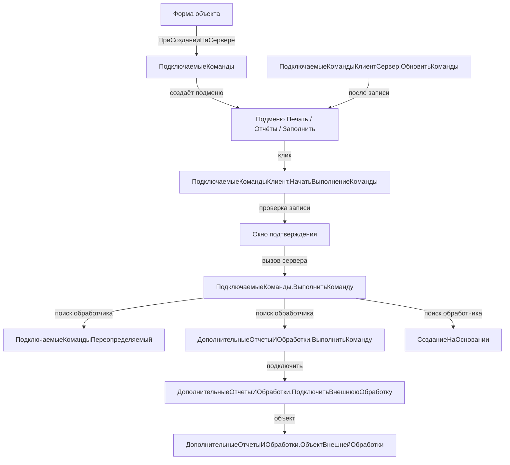

# BSP Connected Commands and External Reports (ПодключаемыеКоманды, ДополнительныеОтчетыИОбработки)

Инфраструктура БСП для **подключаемых команд** формы (печатные формы, отчёты, команды заполнения, команды «Создать на основании») и для **внешних отчётов/обработок**, подключаемых через справочник `ДополнительныеОтчетыИОбработки`. Скил покрывает подсистемы `ПодключаемыеКоманды`, `ДополнительныеОтчетыИОбработки` и `СозданиеНаОсновании`.

> 🔗 **Связь с `bsp-print-reports`:** команды печати — это подмножество подключаемых команд. Здесь — инфраструктура (как зарегистрировать команду в форме, как её выполнить). Печатные формы как вид команды — в `bsp-print-reports` (`УправлениеПечатью.СоздатьКоллекциюКомандПечати`, `УправлениеПечатью.ПриОпределенииНастроекПечати` и т. д.). **API команд печати в этом скиле намеренно не дублируется.**

## When to use

- Добавить команду в форму объекта (документа, справочника) через инфраструктуру подключаемых команд — `ПодключаемыеКоманды.ПриСозданииНаСервере` в обработчике `ПриСозданииНаСервере` формы.
- Зарегистрировать новую внешнюю обработку (отчёт) с видом «Заполнение объекта», «Отчёт», «Создание связанных объектов», «Шаблон сообщения», «Дополнительная обработка» или «Дополнительный отчёт» — программно или через переопределяемый модуль.
- Переопределить виды подключаемых команд и состав команд, доступных конкретному объекту, — через `ПодключаемыеКомандыПереопределяемый`.
- Выполнить команду внешней обработки программно из регламентного задания или фонового кода — `ДополнительныеОтчетыИОбработки.ВыполнитьКоманду` / `ДополнительныеОтчетыИОбработкиКлиент.ВыполнитьКомандуВФоне`.
- Объявить команды «Создать на основании» для документа, чтобы пользователь видел подменю в форме — `СозданиеНаОсновании.ДобавитьКомандуСозданияНаОсновании` в обработчике `ПриДобавленииКомандСозданияНаОсновании`.
- Управлять видимостью команды по контексту объекта (значение реквизита, проведён/не проведён) — `ПодключаемыеКоманды.ДобавитьУсловиеВидимостиКоманды`.

## Не использовать, если

- Нужно добавить **обычную** команду формы (не «подключаемую» — без участия БСП-инфраструктуры) — это задача платформы, прямые `КомандаФормы` и обработчик `&НаКлиенте`. Подключаемые команды нужны там, где источник команды — внешняя обработка или другой подключаемый объект.
- Нужно сформировать **печатную форму** через БСП — переключайтесь на `bsp-print-reports` (`УправлениеПечатью.СформироватьПечатныеФормы`, `УправлениеПечатьюКлиент.ВыполнитьКомандуПечати`).
- Нужно **создать** объект на основании программно (через `СоздатьНаОсновании(...)` платформенный метод, `Документы.ХХХ.СоздатьДокумент()`) — это не API БСП, не требует подключаемых команд.
- Нужно запустить **фоновое задание** (отчёт, обмен, длительная обработка) — `bsp-longs-and-jobs` (`ДлительныеОперации.ВыполнитьФункцию` / `ВыполнитьПроцедуру`).
- Нужна регистрация изменений для обмена данными — `bsp-data-exchange` (если будет сделан).

## Core concepts

### Архитектура подключаемых команд

Подсистема `ПодключаемыеКоманды` — это инфраструктура, которая **находит**, **размещает в форме** и **выполняет** команды, зарегистрированные разными источниками: внешними отчётами/обработками, модулями `СозданиеНаОсновании`, модулем `УправлениеПечатью`, обработчиками `ПодключаемыеКомандыПереопределяемый`.

Жизненный цикл команды:

1. **Объявление** — источник команды (внешняя обработка, переопределяемый модуль, `СозданиеНаОсновании`) добавляет запись в таблицу команд через `УправлениеПечатью.СоздатьКоллекциюКомандПечати` (для печати) или через `ДобавитьКомандуСозданияНаОсновании` (для «создать на основании»), или через `ПодключаемыеКомандыПереопределяемый.ПриОпределенииКомандПодключенныхКОбъекту` (произвольные команды).
2. **Регистрация в форме** — обработчик `ПриСозданииНаСервере` формы вызывает `ПодключаемыеКоманды.ПриСозданииНаСервере(Форма, ПараметрыРазмещения)`. БСП создаёт на форме подменю («Печать», «Отчёты», «Создать на основании», «Заполнить»), в которые помещает кнопки команд.
3. **Запуск** — клик по кнопке вызывает `ПодключаемыеКомандыКлиент.НачатьВыполнениеКоманды(Форма, Команда, Источник)`, который при необходимости переключается на сервер через `ПодключаемыеКоманды.ВыполнитьКоманду` (для серверных команд) или запускает фоновую обработку.
4. **Подключение внешней обработки** — пользователь регистрирует обработку через «Администрирование → Печатные формы, отчёты и обработки → Дополнительные отчёты и обработки»; БСП при первом вызове команды подключает её через `ДополнительныеОтчетыИОбработки.ПодключитьВнешнююОбработку` и получает объект через `ДополнительныеОтчетыИОбработки.ОбъектВнешнейОбработки`.

### Виды команд

| Вид | Источник | Конструктор команды |
|---|---|---|
| **Печатная форма** | Внешняя обработка с `Вид = "ПечатнаяФорма"` или прикладной код | `УправлениеПечатью.СоздатьКоллекциюКомандПечати` |
| **Отчёт** | Внешний отчёт с `Вид = "Отчет"` / `"ДополнительныйОтчет"` | Объект `ОтчетыКлиентСервер` |
| **Заполнение объекта** | Внешняя обработка с `Вид = "ЗаполнениеОбъекта"` | `ДополнительныеОтчетыИОбработкиКлиентСервер.ВидОбработкиЗаполнениеОбъекта` |
| **Создание связанных объектов** | Внешняя обработка с `Вид = "СозданиеСвязанныхОбъектов"` | `ДополнительныеОтчетыИОбработкиКлиентСервер.ВидОбработкиСозданиеСвязанныхОбъектов` |
| **Создать на основании** | Прикладной код в `СозданиеНаОсновании` | `СозданиеНаОсновании.ДобавитьКомандуСозданияНаОсновании` |
| **Шаблон сообщения** | Внешняя обработка с `Вид = "ШаблонСообщения"` | `ДополнительныеОтчетыИОбработкиКлиентСервер.ВидОбработкиШаблонСообщения` |
| **Произвольная** | Переопределяемый модуль | `ПодключаемыеКомандыПереопределяемый.ПриОпределенииКомандПодключенныхКОбъекту` |

### Карта общих модулей подсистемы

**`ПодключаемыеКоманды`** (сервер — основная логика размещения в форме):
- `ПодключаемыеКоманды` — основной модуль (сервер). `ПриСозданииНаСервере`, `ВыполнитьКоманду`, `ПараметрыРазмещения`, `ПараметрыВыполненияКоманды`, `ДобавитьУсловиеВидимостиКоманды`.
- `ПодключаемыеКомандыКлиент` — клиентские обработчики команд формы: `НачатьВыполнениеКоманды`, `ВыполнитьКоманду`, `НачатьОбновлениеКоманд`, `ПослеЗаписи`, `ПараметрыВыполненияКоманды`.
- `ПодключаемыеКомандыКлиентСервер` — общий код, вызывается и с клиента, и с сервера. `ОбновитьКоманды`, `УсловияВыполняются`, `ПараметрыВыполненияКоманды`, `ПараметрыПодключаемыхКоманд`, `ВладелецКомандыПоИмениКоманды`.
- `ПодключаемыеКомандыВызовСервера` — клиентский модуль с вызовом сервера без контекста формы (тонкий/веб-клиент → сервер).
- `ПодключаемыеКомандыГлобальный` — процедуры глобального контекста.
- `ПодключаемыеКомандыПовтИсп` — кэшируемые данные.
- `ПодключаемыеКомандыКлиентПовтИсп` — кэшируемые данные на клиенте.
- `ПодключаемыеКомандыПереопределяемый` — **переопределение** поведения в прикладной конфигурации (`ПриОпределенииВидовПодключаемыхКоманд`, `ПриОпределенииСоставаНастроекПодключаемыхОбъектов`, `ПриОпределенииКомандПодключенныхКОбъекту`).

**`ДополнительныеОтчетыИОбработки`** (внешние отчёты и обработки):
- `ДополнительныеОтчетыИОбработки` — сервер. `ПодключитьВнешнююОбработку`, `ОбъектВнешнейОбработки`, `ВыполнитьКоманду`, `ВыполнитьКомандуИзФормыВнешнегоОбъекта`, `СведенияОВнешнейОбработке`, `СохранитьНастройки`, `ЗагрузитьНастройки`, `ИспользуютсяДополнительныеОтчетыИОбработки`.
- `ДополнительныеОтчетыИОбработкиКлиент` — клиент. `ОткрытьФормуКомандДополнительныхОтчетовИОбработок`, `ОткрытьВариантДополнительногоОтчета`, `ВыполнитьКомандуВФоне`, `ОткрытьСписокДополнительныхОтчетовИОбработок`.
- `ДополнительныеОтчетыИОбработкиКлиентСервер` — общий. Серия функций `ВидОбработки<...>` и `ТипКоманды<...>`.
- `ДополнительныеОтчетыИОбработкиВызовСервера`, `ДополнительныеОтчетыИОбработкиГлобальный`, `ДополнительныеОтчетыИОбработкиПовтИсп` — варианты для разных контекстов.
- `ДополнительныеОтчетыИОбработкиПереопределяемый`, `ДополнительныеОтчетыИОбработкиКлиентПереопределяемый` — переопределение.
- `ДополнительныеОтчетыИОбработкиВМоделиСервиса` — вариант для облачного режима (SaaS).

**`СозданиеНаОсновании`** (команды «Создать на основании» в форме):
- `СозданиеНаОсновании` — сервер. `ДобавитьКомандуСозданияНаОсновании`, `ПриОпределенииВидовПодключаемыхКоманд`, `ПриОпределенииКомандПодключенныхКОбъекту`, `ОбъектыПодключеныКПодсистеме`.
- `СозданиеНаОснованииПереопределяемый` — переопределение состава объектов с командами создания на основании.
- `СозданиеНаОснованииПовтИсп` — кэширование.

> ⚠️ **Имена суффиксов:** модули называются **по подсистеме**, без префикса. Суффикс (`Клиент`, `Сервер`, `КлиентСервер`, `ВызовСервера`, `Глобальный`, `ПовтИсп`, `Переопределяемый`, `ВМоделиСервиса`) определяет контекст вызова. `Переопределяемый` модуль **не вызывают** — в нём реализуют свою логику поверх БСП.

### Стабильный vs служебный API

- **Стабильный API** — `#Область ПрограммныйИнтерфейс` в `ПодключаемыеКоманды`, `ДополнительныеОтчетыИОбработки`, `СозданиеНаОсновании` и соответствующих `*Клиент` / `*КлиентСервер`. Методы в `## Key methods` ниже — из стабильных областей. Обратная совместимость поддерживается.
- **Служебный API** — `#Область СлужебныйПрограммныйИнтерфейс`. Экспортные методы с пометкой `⚠️ служебный` (например, `ПодключаемыеКоманды.ОписаниеКоманды`). Используйте **только** когда стабильного аналога нет; сигнатура может измениться между минорными версиями БСП.

### «Тесная интеграция» с `УправлениеПечатью`

Команды печати — подмножество подключаемых команд. Если вы добавляете печатную форму через `УправлениеПечатью.СоздатьКоллекциюКомандПечати` и затем вызываете `ПодключаемыеКоманды.ПриСозданииНаСервере` в форме, БСП автоматически создаст подменю «Печать». Подробности — в `bsp-print-reports` (этот скил **не** описывает API `УправлениеПечатью`).

## Key methods

| Метод | Сигнатура | Сервер/Клиент | Назначение | Пример вызова | Стабильность |
|---|---|---|---|---|---|
| `ПодключаемыеКоманды.ПриСозданииНаСервере` | `ПриСозданииНаСервере(Форма, Знач ПараметрыРазмещения = Неопределено)` | Сервер | Регистрация команд в форме; создание подменю «Печать», «Отчёты», «Заполнить» и т. п. | `ПодключаемыеКоманды.ПриСозданииНаСервере(ЭтотОбъект, ПараметрыРазмещения);` | стабильный |
| `ПодключаемыеКоманды.ВыполнитьКоманду` | `ВыполнитьКоманду(Знач Форма, Знач ПараметрыВызова, Знач Источник = Неопределено, Результат = Неопределено)` | Сервер | Серверный обработчик команды, требующей контекстного вызова сервера | `ПодключаемыеКоманды.ВыполнитьКоманду(Форма, ПараметрыВызова, Форма.Объект, Результат);` | стабильный |
| `ПодключаемыеКоманды.ДобавитьУсловиеВидимостиКоманды` | `ДобавитьУсловиеВидимостиКоманды(Команда, Реквизит, Значение = Неопределено, Знач ВидСравнения = Неопределено)` | Сервер | Условие видимости команды по значению реквизита объекта (например, «показывать только для проведённых») | `ПодключаемыеКоманды.ДобавитьУсловиеВидимостиКоманды(Команда, "Проведен", Истина, ВидСравненияКомпоновкиДанных.Равно);` | стабильный |
| `ПодключаемыеКомандыКлиент.НачатьВыполнениеКоманды` | `НачатьВыполнениеКоманды(Форма, Команда, Знач Источник = Неопределено)` | Клиент | Обработчик клика по кнопке подключаемой команды в форме (создаёт `ПараметрыВыполнения`, проверяет запись/проведение) | `ПодключаемыеКомандыКлиент.НачатьВыполнениеКоманды(ЭтотОбъект, Команда, Элементы.Список);` | стабильный |
| `ПодключаемыеКомандыКлиент.ВыполнитьКоманду` | `ВыполнитьКоманду(Форма, Команда, Источник)` | Клиент | Обработчик команды формы, требующей клиентского выполнения (без серверного вызова) | `ПодключаемыеКомандыКлиент.ВыполнитьКоманду(ЭтотОбъект, Команда, Элементы.Список);` | стабильный |
| `ПодключаемыеКомандыКлиент.НачатьОбновлениеКоманд` | `НачатьОбновлениеКоманд(Форма)` | Клиент | Запуск клиентской фазы пересчёта видимости/доступности команд после изменения контекста (например, после записи) | `ПодключаемыеКомандыКлиент.НачатьОбновлениеКоманд(ЭтотОбъект);` | стабильный |
| `ПодключаемыеКомандыКлиент.ПослеЗаписи` | `ПослеЗаписи(Форма, Объект, ПараметрыЗаписи)` | Клиент | Обработчик события `ПослеЗаписи` формы — обновляет команды, зависящие от значений реквизитов объекта | `ПодключаемыеКомандыКлиент.ПослеЗаписи(ЭтотОбъект, Объект, ПараметрыЗаписи);` | стабильный |
| `ПодключаемыеКомандыКлиентСервер.ОбновитьКоманды` | `ОбновитьКоманды(Форма, Знач Источник = Неопределено)` | Клиент + Сервер | Пересчитать состояние команд формы (видимость, доступность, пометки) | `ПодключаемыеКомандыКлиентСервер.ОбновитьКоманды(ЭтотОбъект, Форма.Объект);` | стабильный |
| `ПодключаемыеКомандыПереопределяемый.ПриОпределенииВидовПодключаемыхКоманд` | `ПриОпределенииВидовПодключаемыхКоманд(ВидыПодключаемыхКоманд)` | Сервер (переопределение) | Заполнить массив видов команд, доступных в конфигурации; вызывается из `ПодключаемыеКоманды.ПолноеИмяПодсистемы()` для регистрации собственных видов | `Процедура ПриОпределенииВидовПодключаемыхКоманд(ВидыПодключаемыхКоманд) ... КонецПроцедуры` | стабильный (переопределение) |
| `ПодключаемыеКомандыПереопределяемый.ПриОпределенииКомандПодключенныхКОбъекту` | `ПриОпределенииКомандПодключенныхКОбъекту(НастройкиФормы, Источники, ПодключенныеОтчетыИОбработки, Команды)` | Сервер (переопределение) | Реализация произвольных команд, привязанных к конкретному объекту метаданных | `// реализация в своём модуле ПодключаемыеКомандыПереопределяемый` | стабильный (переопределение) |
| `ДополнительныеОтчетыИОбработки.ПодключитьВнешнююОбработку` | `ПодключитьВнешнююОбработку(Ссылка)` | Сервер | Подключить обработку/отчёт из справочника `ДополнительныеОтчетыИОбработки`, вернуть имя, под которым она подключена | `Имя = ДополнительныеОтчетыИОбработки.ПодключитьВнешнююОбработку(Ссылка);` | стабильный |
| `ДополнительныеОтчетыИОбработки.ОбъектВнешнейОбработки` | `ОбъектВнешнейОбработки(Ссылка)` | Сервер | Получить экземпляр объекта подключённой внешней обработки/отчёта | `ВнешОбъект = ДополнительныеОтчетыИОбработки.ОбъектВнешнейОбработки(Ссылка);` | стабильный |
| `ДополнительныеОтчетыИОбработки.ВыполнитьКоманду` | `ВыполнитьКоманду(ПараметрыКоманды, АдресРезультата = Неопределено)` | Сервер | Программный запуск команды внешней обработки (из регламентного задания, фонового кода) | `ДополнительныеОтчетыИОбработки.ВыполнитьКоманду(ПараметрыКоманды);` | стабильный |
| `ДополнительныеОтчетыИОбработки.СведенияОВнешнейОбработке` | `СведенияОВнешнейОбработке(ВерсияБСП = "")` | Сервер | Шаблон структуры `ПараметрыРегистрации` для модуля объекта внешней обработки (`Вид`, `Назначение`, `Команды`, `БезопасныйРежим` и т. д.) | `П = ДополнительныеОтчетыИОбработки.СведенияОВнешнейОбработке();` | стабильный |
| `ДополнительныеОтчетыИОбработки.СохранитьНастройки` | `СохранитьНастройки(Ссылка, Настройки)` | Сервер | Сохранить произвольные настройки обработки (для интерактивных и регламентных обработок) | `ДополнительныеОтчетыИОбработки.СохранитьНастройки(Ссылка, Настройки);` | стабильный |
| `ДополнительныеОтчетыИОбработкиКлиент.ОткрытьФормуКомандДополнительныхОтчетовИОбработок` | `ОткрытьФормуКомандДополнительныхОтчетовИОбработок(ПараметрКоманды, ПараметрыВыполненияКоманды, Вид, ИмяРаздела = "")` | Клиент | Открыть форму со списком доступных команд обработок выбранного вида | `ДополнительныеОтчетыИОбработкиКлиент.ОткрытьФормуКомандДополнительныхОтчетовИОбработок(Объект, ПараметрыКоманды, ВидОбработки, "Справочник.Контрагенты");` | стабильный |
| `ДополнительныеОтчетыИОбработкиКлиент.ОткрытьСписокДополнительныхОтчетовИОбработок` | `ОткрытьСписокДополнительныхОтчетовИОбработок()` | Клиент | Открыть форму списка справочника «Дополнительные отчёты и обработки» (для администратора) | `ДополнительныеОтчетыИОбработкиКлиент.ОткрытьСписокДополнительныхОтчетовИОбработок();` | стабильный |
| `ДополнительныеОтчетыИОбработкиКлиент.ВыполнитьКомандуВФоне` | `ВыполнитьКомандуВФоне(Знач ИдентификаторКоманды, Знач ПараметрыКоманды, Знач Обработчик)` | Клиент | Запуск команды обработки в фоне с обработчиком завершения (для длительных операций) | `ДополнительныеОтчетыИОбработкиКлиент.ВыполнитьКомандуВФоне(Идентификатор, ПараметрыКоманды, Новый ОписаниеОповещения(...));` | стабильный |
| `СозданиеНаОсновании.ДобавитьКомандуСозданияНаОсновании` | `ДобавитьКомандуСозданияНаОсновании(КомандыСозданияНаОсновании, ОбъектМетаданных)` | Сервер | Добавить запись о команде «Создать на основании» в коллекцию команд объекта | `СозданиеНаОсновании.ДобавитьКомандуСозданияНаОсновании(Команды, Метаданные.Документы.СчётНаОплату);` | стабильный |
| `СозданиеНаОсновании.ПриОпределенииКомандПодключенныхКОбъекту` | `ПриОпределенииКомандПодключенныхКОбъекту(НастройкиФормы, Источники, ПодключенныеОтчетыИОбработки, Команды)` | Сервер | Регистрация команд «Создать на основании» для конкретного объекта — реализуется в модуле `СозданиеНаОсновании` прикладной конфигурации | `// реализация в модуле СозданиеНаОсновании` | стабильный |

> **Полный список** (23 метода, включая `ПараметрыРазмещения`, `ПараметрыВыполненияКоманды`, `ЗагрузитьНастройки`) — в [`references/key-methods.md`](references/key-methods.md).

## Patterns

### 1. Добавление подключаемых команд в форму объекта

```bsl
// Модуль формы документа

&НаСервере
Процедура ПриСозданииНаСервере(Отказ, СтандартнаяОбработка)
    Если Параметры.КлючНазначенияИспользования = "Печать" Тогда
        // Подменю «Печать» создаётся автоматически на основе
        // УправлениеПечатью.СоздатьКоллекциюКомандПечати в модуле менеджера.
    КонецЕсли;

    ПодключаемыеКоманды.ПриСозданииНаСервере(ЭтотОбъект);
КонецПроцедуры

&НаКлиенте
Процедура ПодключаемаяКоманда(Команда)
    ПодключаемыеКомандыКлиент.НачатьВыполнениеКоманды(ЭтотОбъект, Команда, Элементы.Список);
КонецПроцедуры

&НаКлиенте
Процедура ПослеЗаписи(ПараметрыЗаписи)
    ПодключаемыеКомандыКлиент.ПослеЗаписи(ЭтотОбъект, Объект, ПараметрыЗаписи);
КонецПроцедуры
```

`ПодключаемыеКоманды.ПриСозданииНаСервере` сам найдёт подходящие команды (печатные формы, отчёты, «Создать на основании», внешние обработки) и создаст подменю на командной панели формы.

### 2. Регистрация команд «Создать на основании» для документа

```bsl
// Модуль менеджера документа или общий модуль

Процедура ДобавитьКомандыСозданияНаОсновании(Команды, Объект, Параметры) Экспорт
    // Создание счёта-фактуры
    СозданиеНаОсновании.ДобавитьКомандуСозданияНаОсновании(Команды, Метаданные.Документы.СчетФактураВыданный);
    // Создание платёжного поручения
    СозданиеНаОсновании.ДобавитьКомандуСозданияНаОсновании(Команды, Метаданные.Документы.ПлатежноеПоручение);
КонецПроцедуры
```

БСП сама вызовет эту процедуру при формировании подменю «Создать на основании» в форме.

### 3. Программный запуск команды внешней обработки из регламентного задания

```bsl
// Модуль регламентного задания
Процедура ЗаполнитьДокументы() Экспорт
    Если Не ДополнительныеОтчетыИОбработки.ИспользуютсяДополнительныеОтчетыИОбработки() Тогда
        Возврат;
    КонецЕсли;

    Ссылка = Справочники.ДополнительныеОтчетыИОбработки.НайтиПоНаименованию("Заполнение документов");
    Если Ссылка.Пустая() Тогда
        Возврат;
    КонецЕсли;

    ПараметрыКоманды = Новый Структура;
    ПараметрыКоманды.Вставить("ДополнительнаяОбработкаСсылка", Ссылка);
    ПараметрыКоманды.Вставить("ИдентификаторКоманды",          "Заполнить");
    ПараметрыКоманды.Вставить("ОбъектыНазначения",              СсылкиНаДокументы());

    ДополнительныеОтчетыИОбработки.ВыполнитьКоманду(ПараметрыКоманды);
КонецПроцедуры
```

`ПараметрыКоманды.ДополнительнаяОбработкаСсылка` — обязательное поле; `ОбъектыНазначения` — массив ссылок, обязателен для назначаемых обработок (вида «Заполнение объекта»).

### 4. Условная видимость команды по значению реквизита

```bsl
// В модуле менеджера объекта, в обработчике ДобавитьКомандыПечати
// (или в ПодключаемыеКомандыПереопределяемый.ПриОпределенииКомандПодключенныхКОбъекту)

КомандаПечати = КомандыПечати.Добавить();
КомандаПечати.Идентификатор = "Акт";
КомандаПечати.Представление = "Акт выполненных работ";

// Показывать команду только для проведённых документов
ПодключаемыеКоманды.ДобавитьУсловиеВидимостиКоманды(
    КомандаПечати,
    "Проведен",
    Истина,
    ВидСравненияКомпоновкиДанных.Равно);
```

Поддерживаются `Равно`, `НеРавно`, `Заполнено`, `НеЗаполнено`, `ВСписке`, `НеВСписке`, `Больше`, `Меньше`, `БольшеИлиРавно`, `МеньшеИлиРавно`.

### 5. Создание внешней обработки с регистрацией параметров

```bsl
// Модуль объекта внешней обработки
Функция СведенияОВнешнейОбработке() Экспорт
    ПараметрыРегистрации = ДополнительныеОтчетыИОбработки.СведенияОВнешнейОбработке("3.1.11.0");

    ПараметрыРегистрации.Вид            = ДополнительныеОтчетыИОбработкиКлиентСервер.ВидОбработкиЗаполнениеОбъекта();
    ПараметрыРегистрации.Назначение     = Новый Массив;
    ПараметрыРегистрации.Назначение.Добавить("Документ.РеализацияТоваровУслуг");
    ПараметрыРегистрации.Наименование   = "Заполнение реализации по заказу";
    ПараметрыРегистрации.БезопасныйРежим = Истина;
    ПараметрыРегистрации.Информация     = "Заполняет табличную часть «Товары» по данным заказа";

    НоваяКоманда = ПараметрыРегистрации.Команды.Добавить();
    НоваяКоманда.Идентификатор     = "ЗаполнитьПоЗаказу";
    НоваяКоманда.Представление     = "Заполнить по заказу";
    НоваяКоманда.Использование     = ДополнительныеОтчетыИОбработкиКлиентСервер.ТипКомандыВызовСерверногоМетода();
    НоваяКоманда.ПоказыватьОповещение = Истина;

    Возврат ПараметрыРегистрации;
КонецФункции

Процедура ВыполнитьКоманду(ИдентификаторКоманды, ПараметрыВыполнения) Экспорт
    // ... серверная логика ...
КонецПроцедуры
```

## Anti-patterns

### ❌ Добавлять обычную кнопку в форму вручную и дублировать логику подключаемых команд

```bsl
// ❌ АНТИПАТТЕРН: ручная кнопка, игнорирующая инфраструктуру
&НаКлиенте
Процедура МояКнопка(Команда)
    Если Объект.Проведен Тогда
        // ... вызов печати в обход УправлениеПечатью ...
    КонецЕсли;
КонецПроцедуры
```

```bsl
// ✅ ПРАВИЛЬНО: подключаемая команда с условием видимости
// В модуле менеджера:
КомандаПечати = КомандыПечати.Добавить();
ПодключаемыеКоманды.ДобавитьУсловиеВидимостиКоманды(
    КомандаПечати, "Проведен", Истина, ВидСравненияКомпоновкиДанных.Равно);
```

Ручная кнопка не пройдёт через подсистему команд печати, не попадёт в общий список команд формы, не будет учтена в отчётах «Текущие дела», не синхронизируется с настройками видимости для разных ролей.

### ❌ Хранить ссылку на внешнюю обработку в макете конфигурации

```bsl
// ❌ АНТИПАТТЕРН: встроенная обработка, обходящая подсистему
&НаКлиенте
Процедура ОткрытьОбработку(Команда)
    ОткрытьЗначение(ПолучитьМакетОбработки());  // не БСП-способ
КонецПроцедуры
```

```bsl
// ✅ ПРАВИЛЬНО: зарегистрировать в справочнике ДополнительныеОтчетыИОбработки
// и вызывать через ДополнительныеОтчетыИОбработкиКлиент.ОткрытьФормуКомандДополнительныхОтчетовИОбработок
// или через подключаемую команду формы
```

Внешние обработки должны жить в справочнике — это даёт пользователю (администратору) возможность загружать/обновлять/выгружать их без обновления конфигурации, а также работает в режиме сервиса (SaaS) с учётом разделителей.

### ❌ Вызывать `ВыполнитьКоманду` напрямую с формы без проверки записи

```bsl
// ❌ АНТИПАТТЕРН: серверный вызов без проверки, что объект записан
&НаКлиенте
Процедура КомандаСерверная(Команда)
    ПараметрыВызова = Новый Структура("ИмяКомандыВФорме, ПараметрКоманды", Команда.Имя, Форма.Объект);
    ПодключаемыеКоманды.ВыполнитьКоманду(ЭтотОбъект, ПараметрыВызова, Форма.Объект);  // объект ещё не записан!
КонецПроцедуры
```

```bsl
// ✅ ПРАВИЛЬНО: использовать НачатьВыполнениеКоманды — он сам проверит ТребуетсяЗапись / ТребуетсяПроведение
&НаКлиенте
Процедура ПодключаемаяКоманда(Команда)
    ПодключаемыеКомандыКлиент.НачатьВыполнениеКоманды(ЭтотОбъект, Команда, Элементы.Список);
КонецПроцедуры
```

`НачатьВыполнениеКоманды` выстраивает диалог с пользователем: «Сохранить документ?», «Провести?», и только после подтверждения вызывает сервер.

### ❌ Забыть вызвать `ПодключаемыеКоманды.ПриСозданииНаСервере` в форме

```bsl
// ❌ АНТИПАТТЕРН: форма без вызова — подменю не появятся
&НаСервере
Процедура ПриСозданииНаСервере(Отказ, СтандартнаяОбработка)
    // ... свой код, но забыли про подключаемые команды ...
КонецПроцедуры
```

```bsl
// ✅ ПРАВИЛЬНО: всегда вызывать ПриСозданииНаСервере (после своего кода)
&НаСервере
Процедура ПриСозданииНаСервере(Отказ, СтандартнаяОбработка)
    // ... свой код инициализации ...
    ПодключаемыеКоманды.ПриСозданииНаСервере(ЭтотОбъект);
КонецПроцедуры
```

Без этого вызова формы объектов не получат стандартных подменю «Печать», «Отчёты», «Заполнить», «Создать на основании» — то есть вся инфраструктура БСП не работает.

### ❌ Использовать устаревший «встроенный» механизм внешних обработок (без справочника)

```bsl
// ❌ АНТИПАТТЕРН: «самописная» регистрация обработок через регистр сведений
НоваяСтрока = РегистрыСведений.ВнешниеОбработки.СоздатьМенеджерЗаписи();
НоваяСтрока.ВидОбработки = Перечисления.ВидыДопОбработок.Заполнение;
НоваяСтрока.ИмяФайла     = "МояОбработка.epf";
НоваяСтрока.Записать();
```

```bsl
// ✅ ПРАВИЛЬНО: использовать штатный справочник ДополнительныеОтчетыИОбработки
// (загрузка через «Администрирование → Печатные формы, отчёты и обработки»)
// и подключение через ДополнительныеОтчетыИОбработки.ПодключитьВнешнююОбработку
```

«Самописный» реестр обработок не поддерживает функциональные опции, безопасный режим, разрешения, разделение данных в модели сервиса и регламентные задания. БСП-перехватчик `УправлениеВнешнимиОбработками` о нём не знает.

### ❌ Программный вызов `ПодключаемыеКоманды.ВыполнитьКоманду` из клиентского кода (без `ВызовСервера`)

```bsl
// ❌ АНТИПАТТЕРН: вызов серверного модуля напрямую с клиента
&НаКлиенте
Процедура Клик(Команда)
    ПодключаемыеКоманды.ВыполнитьКоманду(...);  // ❌ метод не доступен на клиенте
КонецПроцедуры
```

```bsl
// ✅ ПРАВИЛЬНО: на клиенте — ПодключаемыеКомандыКлиент, на сервере — ПодключаемыеКоманды
&НаКлиенте
Процедура Клик(Команда)
    ПодключаемыеКомандыКлиент.НачатьВыполнениеКоманды(ЭтотОбъект, Команда, Источник);
КонецПроцедуры
```

`ПодключаемыеКоманды.ВыполнитьКоманду` — **серверный** модуль. С клиента напрямую не вызывается. Тонкий клиент вызывает сервер либо через управляемую форму (внутри `НачатьВыполнениеКоманды`), либо через `ПодключаемыеКомандыВызовСервера` (без контекста формы).

## How to explore deeper

### Где искать модули подсистемы в выгрузке конфигурации

Все общие модули БСП лежат в каталоге `CommonModules/`. Для подключаемых команд и внешних обработок:

- `CommonModules/ПодключаемыеКоманды/Ext/Module.bsl` — основной серверный модуль, 1800+ строк. Здесь — `ПриСозданииНаСервере`, `ВыполнитьКоманду`, `ПараметрыРазмещения`, `ДобавитьУсловиеВидимостиКоманды`.
- `CommonModules/ПодключаемыеКомандыКлиент/Ext/Module.bsl` — клиентские обработчики: `НачатьВыполнениеКоманды`, `ВыполнитьКоманду`, `НачатьОбновлениеКоманд`, `ПослеЗаписи`.
- `CommonModules/ПодключаемыеКомандыКлиентСервер/Ext/Module.bsl` — общий код: `ОбновитьКоманды`, `УсловияВыполняются`, `ПараметрыВыполненияКоманды`, `ПараметрыПодключаемыхКоманд`, `ВладелецКомандыПоИмениКоманды`.
- `CommonModules/ПодключаемыеКомандыВызовСервера/Ext/Module.bsl` — вызов сервера без контекста формы.
- `CommonModules/ПодключаемыеКомандыПереопределяемый/Ext/Module.bsl` — **переопределение** (реализация в прикладной конфигурации, не вызов).
- `CommonModules/ДополнительныеОтчетыИОбработки/Ext/Module.bsl` — 3400+ строк, самая большая. `ПодключитьВнешнююОбработку`, `ОбъектВнешнейОбработки`, `ВыполнитьКоманду`, `СведенияОВнешнейОбработке`, `СохранитьНастройки`, `ЗагрузитьНастройки`, `ИспользуютсяДополнительныеОтчетыИОбработки`.
- `CommonModules/ДополнительныеОтчетыИОбработкиКлиент/Ext/Module.bsl` — клиент. `ОткрытьФормуКомандДополнительныхОтчетовИОбработок`, `ОткрытьВариантДополнительногоОтчета`, `ВыполнитьКомандуВФоне`.
- `CommonModules/ДополнительныеОтчетыИОбработкиКлиентСервер/Ext/Module.bsl` — общий. Серия `ВидОбработки<...>` и `ТипКоманды<...>`.
- `CommonModules/ДополнительныеОтчетыИОбработкиПереопределяемый/Ext/Module.bsl` — переопределение видов команд.
- `CommonModules/СозданиеНаОсновании/Ext/Module.bsl` — 300 строк. `ДобавитьКомандуСозданияНаОсновании`, `ПриОпределенииКомандПодключенныхКОбъекту`.
- `CommonModules/СозданиеНаОснованииПереопределяемый/Ext/Module.bsl` — переопределение состава объектов.

Подсистемы (для навигации):
- `Subsystems/СтандартныеПодсистемы/Subsystems/ПодключаемыеКоманды.xml` — описание подсистемы верхнего уровня.
- `Subsystems/СтандартныеПодсистемы/Subsystems/ДополнительныеОтчетыИОбработки.xml` — описание подсистемы внешних обработок.
- `Catalogs/ДополнительныеОтчетыИОбработки.xml` — справочник внешних обработок.

### Grep-шаблоны

```text
# Найти все экспортные методы модуля (для оценки API)
^(Функция|Процедура) [А-Я][А-Яа-яA-Za-z_]+\(.*\) Экспорт

# Стабильный API внутри модуля
^#Область ПрограммныйИнтерфейс

# Служебный API (⚠️ обратная совместимость не гарантируется)
^#Область СлужебныйПрограммныйИнтерфейс

# Проверить, существует ли метод в модуле
^(Функция|Процедура) <ИмяМетода>\(

# Найти все формы, вызывающие подключаемые команды (быстрый аудит конфигурации)
ПриСозданииНаСервере.*ПодключаемыеКоманды\.ПриСозданииНаСервере

# Найти все модули, использующие СозданиеНаОсновании
СозданиеНаОсновании\.ДобавитьКомандуСозданияНаОсновании
```

### Glob-маски

- `CommonModules/ПодключаемыеКоманды*/Ext/Module.bsl` — все варианты `ПодключаемыеКоманды` (включая `Клиент`, `КлиентСервер`, `ВызовСервера`, `Переопределяемый`, `ПовтИсп`, `КлиентПовтИсп`, `Глобальный`).
- `CommonModules/ДополнительныеОтчетыИОбработки*/Ext/Module.bsl` — все варианты `ДополнительныеОтчетыИОбработки` (включая `ВМоделиСервиса`, `ВАвтономномРежиме`, `ВБезопасномРежимеСлужебный`).
- `CommonModules/СозданиеНаОсновании*/Ext/Module.bsl` — все варианты `СозданиеНаОсновании`.
- `Catalogs/ДополнительныеОтчетыИОбработки/Ext/ObjectModule.bsl` — модуль объекта справочника (для глубокой отладки).

### На что обратить внимание в дереве метаданных

- **`Catalogs/ДополнительныеОтчетыИОбработки`** — справочник-контейнер внешних обработок. Убедитесь, что в конфигурации подключена подсистема `СтандартныеПодсистемы.ДополнительныеОтчетыИОбработки` — иначе `ДополнительныеОтчетыИОбработки.ИспользуютсяДополнительныеОтчетыИОбработки()` вернёт `Ложь` и весь механизм не работает.
- **`ПодпискиНаСобытия`** для модулей `ПодключаемыеКоманды*` и `СозданиеНаОсновании` — служебные модули могут подписываться на системные события (запись объектов, проведение).
- **В формах** типичные элементы, которые создаёт `ПодключаемыеКоманды.ПриСозданииНаСервере`:
  - группа `ПодключаемыеКоманды` (родитель для подменю);
  - подменю `ПодменюПечать`, `ПодменюОтчеты`, `ПодменюЗаполнить`, `ФормаСоздатьНаОсновании`;
  - динамические кнопки с префиксом, заданным в `ПараметрыРазмещения.ПрефиксГрупп`.
- **`ФункциональныеОпции.ИспользоватьДополнительныеОтчетыИОбработки`** — общая функциональная опция подсистемы. Проверять в вызывающем коде перед обращением к API.

### Mermaid — архитектура


