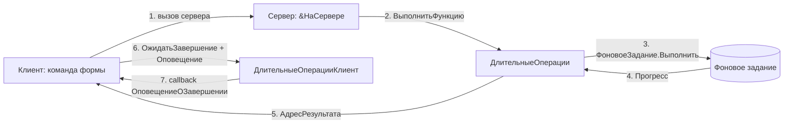

# BSP Longs and Jobs (ДлительныеОперации + РегламентныеЗадания)

Скил по **двум связанным механизмам БСП 3.1.11**:

1. **Длительные операции** — запуск произвольной серверной процедуры/функции в фоновом задании с UI-ожиданием и отменой.
2. **Регламентные задания** — программное управление расписанием и состоянием регламентных заданий (по сути — обёртки над платформенным `РегламентныеЗадания.*`).

Оба механизма — инфраструктурные. Их нельзя «обойти собственной реализацией»: в управляемом режиме длительный серверный вызов **зависает клиент**, а ручное `ФоновыеЗадания.ПолучитьФоновыеЗадания(...)` ломает интеграцию с другими подсистемами БСП (журнал регистрации, замеры производительности, контроль прав, обработка ошибок через `СтандартныеПодсистемыКлиент.ВывестиИнформациюОбОшибке`).

## When to use

- Нужно выполнить тяжёлую серверную обработку (отчёт, печать пакета, обмен, загрузку) **без блокировки управляемой формы** — вынести в фон через `ДлительныеОперации.ВыполнитьФункцию` / `ВыполнитьПроцедуру` и подключить `ДлительныеОперацииКлиент.ОжидатьЗавершение` с `ОписаниеОповещения`.
- Нужно **получить возвращаемое значение** функции, выполненной в фоне (например, подготовленная таблица, рассчитанный документ) — `ДлительныеОперации.ВыполнитьФункцию` + `ПолучитьИзВременногоХранилища(Результат.АдресРезультата)`.
- Нужно **показать прогресс** длительной операции (процент, текущий шаг) — `ДлительныеОперации.СообщитьПрогресс(Процент, Текст)` в теле фоновой процедуры + `ДлительныеОперацииКлиент.ПараметрыОжидания(...)` с `ВыводитьПрогрессВыполнения = Истина`.
- Нужно **отменить** запущенное фоновое задание по команде пользователя — `ДлительныеОперации.ОтменитьВыполнениеЗадания(ИдентификаторЗадания)`.
- Нужно **программно создать/найти/изменить/удалить** регламентное задание (например, при первоначальном заполнении ИБ или при обновлении конфигурации) — `РегламентныеЗаданияСервер.ДобавитьЗадание` / `НайтиЗадания` / `ИзменитьЗадание` / `УдалитьЗадание`.
- Нужно **сменить расписание** или **включить/выключить** регламентное задание из прикладного кода — `РегламентныеЗаданияСервер.УстановитьРасписаниеРегламентногоЗадания` / `УстановитьИспользованиеРегламентногоЗадания`.
- Нужно **преобразовать** `РасписаниеРегламентногоЗадания` в `Структуру` (для передачи на клиент) или обратно — `РегламентныеЗадания.РасписаниеВСтруктуру` / `РегламентныеЗадания.СтруктураВРасписание`.

## Не использовать, если

- Задача — простой синхронный вызов без ожидания и без UI (`СообщитьПользователю`, сериализация, проверка типа) — это `bsp-base-common`. Фон нужен только когда операция > 1 сек и форма не должна «виснуть».
- Нужна **оркестрация задач бизнес-процессов** (адресация, перенаправление, принятие к исполнению, контроль) — это `bsp-bp-tasks` (`БизнесПроцессыИЗадачиСервер.*`).
- Нужен **фоновый отчёт/печать** — `bsp-print-reports` (§5.4 плана), но с фоновым запуском через `ДлительныеОперации.ВыполнитьФункцию` (для тяжёлых печатных форм).
- Нужно запустить фоновую обработку **в режиме внешнего соединения** (COM, веб-сервис) — `ДлительныеОперации.ВыполнитьФункцию` поддерживают ВнешнееСоединение, но не запускают там настоящих фоновых заданий; используйте прямой вызов экспортной процедуры.
- Нужно просто проверить, завершилось ли фоновое задание (без длительной операции) — `ФоновоеЗаданиеЗавершено` (⚠️ служебный, в `ДлительныеОперацииВызовСервера`).

## Core concepts

### Два модуля, один скил

Скил покрывает **две разные подсистемы** БСП 3.1.11, объединённые по функциональной близости (фоновое выполнение и планирование). Их нельзя путать.

### «Длительные операции» — **функциональный блок** внутри `БазоваяФункциональность`

`ДлительныеОперации` — **не отдельная подсистема**. Это набор общих модулей, входящих в подсистему `БазоваяФункциональность` (`Subsystems/СтандартныеПодсистемы/Subsystems/БазоваяФункциональность.xml`). В дереве метаданных конфигурации модули лежат рядом с `ОбщегоНазначения*`, `СтроковыеФункции*`, `ФайловаяСистема*`.

Состав модулей:

| Модуль | Контекст | Назначение |
|---|---|---|
| `ДлительныеОперации` | Сервер, ВнешнееСоединение | Запуск фоновых заданий, прогресс, отмена |
| `ДлительныеОперацииКлиент` | Тонкий/толстый клиент | Ожидание завершения, открытие формы прогресса |
| `ДлительныеОперацииВызовСервера` | Сервер (только) | ⚠️ Содержит только `ФоновоеЗаданиеЗавершено` — узкослужебный, не для прямого вызова |

⚠️ **Модуль `ДлительныеОперацииСлужебный` НЕ существует.** Служебные функции (`УстановкаПараметровСеанса`, `ПриДобавленииСерверныхОповещений`, `ПриОтправкеСерверногоОповещения` и т. п.) встроены в сам `ДлительныеОперации` в область `#Область СлужебныйПрограммныйИнтерфейс` (line 1084+). Попытка вызвать `ДлительныеОперацииСлужебный.ЧтоТо()` — ошибка компиляции.

### «Регламентные задания» — **отдельная подсистема**

`РегламентныеЗадания` — самостоятельная подсистема верхнего уровня (`Subsystems/СтандартныеПодсистемы/Subsystems/РегламентныеЗадания.xml`).

Состав модулей:

| Модуль | Контекст | Назначение |
|---|---|---|
| `РегламентныеЗадания` | Сервер, ВнешнееСоединение | **Только** конвертация расписания (`РасписаниеВСтруктуру`, `СтруктураВРасписание`, `РасписанияОдинаковые`) |
| `РегламентныеЗаданияКлиент` | Клиент | `ПриНачалеРаботыСистемы`, `ПоказатьФормуБлокировкиРаботыСВнешнимиРесурсами`, `ПерейтиКНастройкеРегламентныхЗаданий` |
| `РегламентныеЗаданияСервер` | Сервер, ВнешнееСоединение | **Стабильный API**: `НайтиЗадания`, `Задание`, `ДобавитьЗадание`, `УдалитьЗадание`, `ИзменитьЗадание`, `УстановитьРасписаниеРегламентногоЗадания` и т. д. |
| `РегламентныеЗаданияПереопределяемый` | Сервер, ВнешнееСоединение | **Переопределение поведения БСП** — реализация в прикладном коде, не вызов |
| `РегламентныеЗаданияСлужебный` | Сервер, ВнешнееСоединение | ⚠️ **Служебный API** — экспортные методы для внутренних нужд БСП, обратная совместимость не гарантируется |

⚠️ **Модуля `РегламентныеЗадания` (без суффикса) как общий модуль для CRUD-операций НЕ существует** в смысле «добавить/изменить/удалить». Методы `ДобавитьЗадание` / `НайтиЗадания` / `Задание` / `ИзменитьЗадание` / `УдалитьЗадание` находятся в `РегламентныеЗаданияСервер` и **стабильны** (расположены в `#Область ПрограммныйИнтерфейс`). Имя «`РегламентныеЗаданияСервер`» легко спутать с «`РегламентныеЗаданияСлужебный`» — последний содержит другие методы (`РегламентноеЗаданиеДоступноПоФункциональнымОпциям`, `ВыполнитьРегламентноеЗаданиеВручную`, `ПолучитьСвойстваФоновогоЗадания` и т. п.), и его вызов — ⚠️ служебный.

### Области в общих модулях

В `ДлительныеОперации`:
- `#Область ПрограммныйИнтерфейс` (lines 9–985) — стабильный API: `ВыполнитьФункцию`, `ВыполнитьПроцедуру`, `ПараметрыВыполненияФункции`, `ПараметрыВыполненияПроцедуры`, `СообщитьПрогресс`, `ЗаданиеВыполнено`, `ОтменитьВыполнениеЗадания`, `ПрочитатьПрогресс`, `СообщенияПользователю`, `ДопустимоеКоличествоПотоков`, `ВыполнитьФункциюВНесколькоПотоков`, `ВыполнитьПроцедуруВНесколькоПотоков`.
- `#Область УстаревшиеПроцедурыИФункции` (lines 986–1080) — `ЗапуститьВыполнениеВФоне` (⚠️ **устарел**, заменён на `ВыполнитьВФоне`).
- `#Область СлужебныйПрограммныйИнтерфейс` (lines 1084–1257) — экспортные методы для других подсистем БСП.
- `#Область СлужебныеПроцедурыИФункции` (lines 1338+) — внутренние.

В `ДлительныеОперации` есть и устаревший `ВыполнитьВФоне` (line 500, всё ещё в `#Область ПрограммныйИнтерфейс`, но официальная документация рекомендует `ВыполнитьФункцию` / `ВыполнитьПроцедуру`).

### Цепочка «клиент ↔ сервер» при запуске фонового задания



## Key methods

| Метод | Сигнатура | Сервер/Клиент | Назначение | Пример вызова | Стабильность |
|---|---|---|---|---|---|
| `ДлительныеОперации.ВыполнитьФункцию` | `ВыполнитьФункцию(Знач ПараметрыВыполнения, ИмяФункции, Знач Параметр1 = Неопределено, ..., Знач Параметр7 = Неопределено)` | Сервер, ВнешнееСоединение | Запуск функции в фоне; возвращает `Структура` со `Статус`, `ИдентификаторЗадания`, `АдресРезультата` | `ДлительнаяОперация = ДлительныеОперации.ВыполнитьФункцию(ПараметрыВыполнения, "Обработка.Моя.Подготовить", П1, П2);` | ✅ **предпочтительный** |
| `ДлительныеОперации.ВыполнитьПроцедуру` | `ВыполнитьПроцедуру(Знач ПараметрыВыполнения = Неопределено, ИмяПроцедуры, Знач Параметр1 = Неопределено, ..., Знач Параметр7 = Неопределено)` | Сервер, ВнешнееСоединение | Запуск процедуры в фоне; без возвращаемого значения | `ДлительныеОперации.ВыполнитьПроцедуру(Параметры, "Обработка.Моя.Выполнить", Список);` | ✅ **предпочтительный** |
| `ДлительныеОперации.ВыполнитьВФоне` | `ВыполнитьВФоне(Знач ИмяПроцедуры, Знач ПараметрыПроцедуры, Знач ПараметрыВыполнения)` | Сервер, ВнешнееСоединение | Запуск через структуру параметров; рекомендуется заменить на `ВыполнитьФункцию` / `ВыполнитьПроцедуру` | `ДлительнаяОперация = ДлительныеОперации.ВыполнитьВФоне("Обработка.Моя.Метод", ПараметрыПроцедуры, ПараметрыВыполнения);` | ⚠️ **deprecated** (документация рекомендует `ВыполнитьФункцию`/`ВыполнитьПроцедуру`) |
| `ДлительныеОперации.ПараметрыВыполненияФункции` | `ПараметрыВыполненияФункции(Знач ИдентификаторФормы)` | Сервер | Конструктор структуры параметров для `ВыполнитьФункцию` (аналог `ПараметрыВыполненияПроцедуры()` — без параметров) | `Параметры = ДлительныеОперации.ПараметрыВыполненияФункции(УникальныйИдентификатор);` | ✅ стабильный |
| `ДлительныеОперации.СообщитьПрогресс` | `СообщитьПрогресс(Знач Процент = Неопределено, Знач Текст = Неопределено, Знач ДополнительныеПараметры = Неопределено)` | Сервер (в фоне) | Сообщить процент/текст; вызывать в теле фоновой процедуры | `ДлительныеОперации.СообщитьПрогресс(50, "Половина работы");` | ✅ стабильный |
| `ДлительныеОперации.ОтменитьВыполнениеЗадания` | `ОтменитьВыполнениеЗадания(Знач ИдентификаторЗадания)` | Сервер | Отменить фоновое задание по идентификатору | `ДлительныеОперации.ОтменитьВыполнениеЗадания(ДлительнаяОперация.ИдентификаторЗадания);` | ✅ стабильный |
| `ДлительныеОперацииКлиент.ОжидатьЗавершение` | `ОжидатьЗавершение(Знач ДлительнаяОперация, Знач ОповещениеОЗавершении = Неопределено, Знач ПараметрыОжидания = Неопределено)` | Клиент | Подключить обработчик оповещения и открыть форму ожидания | `ДлительныеОперацииКлиент.ОжидатьЗавершение(ДлительнаяОперация, Оповещение, ПараметрыОжидания);` | ✅ стабильный |
| `ДлительныеОперацииКлиент.ПараметрыОжидания` | `ПараметрыОжидания(ФормаВладелец)` | Клиент | Конструктор параметров ожидания: `ВыводитьОкноОжидания`, `ВыводитьПрогрессВыполнения`, `ОповещениеОПрогрессеВыполнения`, `ВыводитьСообщения`, `Интервал` | `Параметры = ДлительныеОперацииКлиент.ПараметрыОжидания(ЭтотОбъект);` | ✅ стабильный |
| `РегламентныеЗаданияСервер.НайтиЗадания` | `НайтиЗадания(Отбор)` | Сервер, ВнешнееСоединение | Найти регламентные задания по отбору (`Метаданные`, `Ключ`, `Использование`, `УникальныйИдентификатор`) | `Задания = РегламентныеЗаданияСервер.НайтиЗадания(Новый Структура("Ключ", "Моя"));` | ✅ стабильный |
| `РегламентныеЗаданияСервер.Задание` | `Задание(Знач Идентификатор)` | Сервер, ВнешнееСоединение | Получить одно задание (по `УникальныйИдентификатор`, имени метаданных или объекту метаданных) | `Задание = РегламентныеЗаданияСервер.Задание(Идентификатор);` | ✅ стабильный |
| `РегламентныеЗаданияСервер.ДобавитьЗадание` | `ДобавитьЗадание(Параметры)` | Сервер, ВнешнееСоединение | Создать задание; `Параметры` — структура (`Метаданные`, `Расписание`, `Ключ`, `Параметры`, `Использование`) | `Задание = РегламентныеЗаданияСервер.ДобавитьЗадание(ПараметрыЗадания);` | ✅ стабильный |
| `РегламентныеЗаданияСервер.ИзменитьЗадание` | `ИзменитьЗадание(Знач Идентификатор, Знач Параметры)` | Сервер, ВнешнееСоединение | Изменить свойства задания | `РегламентныеЗаданияСервер.ИзменитьЗадание(Идентификатор, НовыеПараметры);` | ✅ стабильный |
| `РегламентныеЗаданияСервер.УдалитьЗадание` | `УдалитьЗадание(Знач Идентификатор)` | Сервер, ВнешнееСоединение | Удалить задание | `РегламентныеЗаданияСервер.УдалитьЗадание(Идентификатор);` | ✅ стабильный |
| `РегламентныеЗаданияСервер.УстановитьРасписаниеРегламентногоЗадания` | `УстановитьРасписаниеРегламентногоЗадания(Знач Идентификатор, Знач Расписание)` | Сервер, ВнешнееСоединение | Установить `РасписаниеРегламентногоЗадания` | `РегламентныеЗаданияСервер.УстановитьРасписаниеРегламентногоЗадания(Ид, Расписание);` | ✅ стабильный |
| `РегламентныеЗаданияСервер.УстановитьИспользованиеРегламентногоЗадания` | `УстановитьИспользованиеРегламентногоЗадания(Знач Идентификатор, Знач Использование)` | Сервер, ВнешнееСоединение | Включить/выключить задание | `РегламентныеЗаданияСервер.УстановитьИспользованиеРегламентногоЗадания(Ид, Ложь);` | ✅ стабильный |
| `РегламентныеЗадания.РасписаниеВСтруктуру` | `РасписаниеВСтруктуру(Знач Расписание)` | Сервер, ВнешнееСоединение | `РасписаниеРегламентногоЗадания` → `Структура` (для передачи на клиент) | `Структура = РегламентныеЗадания.РасписаниеВСтруктуру(Расписание);` | ✅ стабильный |
| `РегламентныеЗадания.СтруктураВРасписание` | `СтруктураВРасписание(Знач СтруктураРасписания)` | Сервер, ВнешнееСоединение | `Структура` → `РасписаниеРегламентногоЗадания` | `Расписание = РегламентныеЗадания.СтруктураВРасписание(Структура);` | ✅ стабильный |
| `РегламентныеЗаданияСлужебный.ВыполнитьРегламентноеЗаданиеВручную` | `ВыполнитьРегламентноеЗаданиеВручную(Знач Задание)` | Сервер, ВнешнееСоединение | Запустить задание немедленно (вручную), а не по расписанию | `РегламентныеЗаданияСлужебный.ВыполнитьРегламентноеЗаданиеВручную(Задание);` | ⚠️ служебный |
| `РегламентныеЗаданияСлужебный.ПолучитьСвойстваФоновогоЗадания` | `ПолучитьСвойстваФоновогоЗадания(Идентификатор, ИменаСвойств = "")` | Сервер, ВнешнееСоединение | Свойства конкретного фонового задания по `ИменаСвойств` | `Свойства = РегламентныеЗаданияСлужебный.ПолучитьСвойстваФоновогоЗадания(Ид, "Статус,Начало");` | ⚠️ служебный |
| `РегламентныеЗаданияПереопределяемый.ПриОпределенииНастроекРегламентныхЗаданий` | `ПриОпределенииНастроекРегламентныхЗаданий(Настройки)` | Сервер, ВнешнееСоединение | **Переопределение** (не вызов): настройка блокировки регл. заданий в модели сервиса | `// В своём РегламентныеЗаданияПереопределяемый: Настройки[...] = …;` | ✅ стабильный (для переопределения) |

## Patterns

### 1. Запуск функции в фоне с возвратом значения

```bsl
// 1) Серверная функция — будет выполнена в фоне.
Функция ПодготовитьДанныеОтчёта(Знач Параметр1, Знач Параметр2) Экспорт
    ДлительныеОперации.СообщитьПрогресс(10, "Загрузка справочников");
    // ...тяжёлая работа...
    ДлительныеОперации.СообщитьПрогресс(90, "Формирование таблицы");
    Возврат Результат;
КонецФункции

// 2) Старт с сервера (например, из &НаСервере).
&НаСервере
Функция ЗапуститьПодготовку()
    ПараметрыВыполнения = ДлительныеОперации.ПараметрыВыполненияФункции(УникальныйИдентификатор);
    Возврат ДлительныеОперации.ВыполнитьФункцию(
        ПараметрыВыполнения,
        "Обработка.МояОбработка.ПодготовитьДанныеОтчёта",
        Параметр1, Параметр2);
КонецФункции

// 3) Клиент — подключить оповещение и форму ожидания.
&НаКлиенте
Процедура Запустить()
    ДлительнаяОперация = ЗапуститьПодготовку(); // серверный вызов
    Оповещение = Новый ОписаниеОповещения("ОбработатьРезультат", ЭтотОбъект);
    ПараметрыОжидания = ДлительныеОперацииКлиент.ПараметрыОжидания(ЭтотОбъект);
    ДлительныеОперацииКлиент.ОжидатьЗавершение(ДлительнаяОперация, Оповещение, ПараметрыОжидания);
КонецПроцедуры

&НаКлиенте
Процедура ОбработатьРезультат(Результат, ДопПараметры) Экспорт
    Если Результат = Неопределено Тогда Возврат; КонецЕсли;
    Если Результат.Статус = "Ошибка" Тогда
        СтандартныеПодсистемыКлиент.ВывестиИнформациюОбОшибке(Результат.ИнформацияОбОшибке);
        Возврат;
    КонецЕсли;
    Данные = ПолучитьИзВременногоХранилища(Результат.АдресРезультата);
КонецПроцедуры
```

### 2. Запуск процедуры в фоне без возвращаемого значения

```bsl
&НаСервере
Процедура ЗапуститьРассылку()
    ПараметрыВыполнения = ДлительныеОперации.ПараметрыВыполненияПроцедуры();
    ПараметрыВыполнения.НаименованиеФоновогоЗадания = "Рассылка уведомлений";
    ДлительныеОперации.ВыполнитьПроцедуру(
        ПараметрыВыполнения,
        "Обработка.РассылкаУведомлений.ВыполнитьРассылку",
        СписокПолучателей);
КонецПроцедуры
```

### 3. Создание регламентного задания с расписанием

```bsl
// Расписание удобнее собирать в структуре (на клиенте), затем конвертировать.
РасписаниеСтруктурой = РегламентныеЗадания.РасписаниеВСтруктуру(РасписаниеРегламентногоЗадания);
РасписаниеСтруктурой.ПериодПовтораДней = 1;
РасписаниеСтруктурой.ПериодПовтораВТечениеДня = 3600;
РасписаниеОбъектом = РегламентныеЗадания.СтруктураВРасписание(РасписаниеСтруктурой);

ПараметрыЗадания = Новый Структура;
ПараметрыЗадания.Вставить("Метаданные",   Метаданные.РегламентныеЗадания.МояЗадача);
ПараметрыЗадания.Вставить("Расписание",   РасписаниеОбъектом);
ПараметрыЗадания.Вставить("Использование", Истина);
ПараметрыЗадания.Вставить("Ключ",        "МояЗадача_Основная");
Задание = РегламентныеЗаданияСервер.ДобавитьЗадание(ПараметрыЗадания);
```

### 4. Изменение расписания и блокировка дублей

```bsl
// Найти задание по ключу и сменить расписание.
Отбор = Новый Структура("Ключ", "МояЗадача_Основная");
Задания = РегламентныеЗаданияСервер.НайтиЗадания(Отбор);
Если Задания.Количество() > 0 Тогда
    Идентификатор = Задания[0].УникальныйИдентификатор;
    РегламентныеЗаданияСервер.УстановитьРасписаниеРегламентногоЗадания(Идентификатор, НовоеРасписание);
    // Блокируем случайные дубли — оставляем только одно.
    Для Сч = 1 По Задания.ВГраница() Цикл
        РегламентныеЗаданияСервер.УдалитьЗадание(Задания[Сч].УникальныйИдентификатор);
    КонецЦикла;
КонецЕсли;
```

### 5. Регламентное задание с защитой от дублей и обработкой ошибок

```bsl
// В модуле менеджера объекта или серверном общем модуле.
Процедура МояЗадача() Экспорт
    Ключ = "МояЗадача_Основная";
    Отбор = Новый Структура("Ключ", Ключ);
    Если РегламентныеЗаданияСервер.НайтиЗадания(Отбор).Количество() = 0 Тогда
        Возврат; // задание удалили
    КонецЕсли;
    Попытка
        // ...основная работа...
    Исключение
        РегламентныеЗаданияСервер.УстановитьИспользованиеРегламентногоЗадания(
            РегламентныеЗаданияСервер.НайтиЗадания(Отбор)[0].УникальныйИдентификатор, Ложь);
        ОбщегоНазначения.ЗаписатьВЖурналРегистрации(...);
        ВызватьИсключение;
    КонецПопытки;
КонецПроцедуры
```

## Anti-patterns

### ❌ Запускать тяжёлую работу в обработчике команды синхронно

```bsl
// ❌ Форма «висит» на несколько минут, пользователь не понимает, что происходит
&НаКлиенте
Процедура СформироватьОтчёт(Команда)
    ОтчётСформирован = СформироватьОтчётНаСервере(); // 60 секунд
КонецПроцедуры
```

```bsl
// ✅ Длительная операция с формой ожидания и прогрессом
&НаКлиенте
Процедура СформироватьОтчёт(Команда)
    ДлительнаяОперация = ЗапуститьФормированиеНаСервере();
    ДлительныеОперацииКлиент.ОжидатьЗавершение(ДлительнаяОперация,
        Новый ОписаниеОповещения("ПослеФормирования", ЭтотОбъект),
        ДлительныеОперацииКлиент.ПараметрыОжидания(ЭтотОбъект));
КонецПроцедуры
```

### ❌ Использовать `ВыполнитьВФоне` вместо `ВыполнитьФункцию` / `ВыполнитьПроцедуру`

```bsl
// ❌ Устаревший путь — лишний уровень (Структура `ПараметрыПроцедуры`, `АдресРезультата`)
ПараметрыПроцедуры = Новый Структура("Параметр1, Параметр2", П1, П2);
ДлительнаяОперация = ДлительныеОперации.ВыполнитьВФоне(
    "Обработка.МояОбработка.Метод", ПараметрыПроцедуры,
    ДлительныеОперации.ПараметрыВыполненияВФоне(УникальныйИдентификатор));
// и в `Метод` обязательно 2 параметра: (Параметры, АдресРезультата)
```

```bsl
// ✅ Произвольное число параметров (до 7), нет обёртки «Параметры» / «АдресРезультата»
ДлительнаяОперация = ДлительныеОперации.ВыполнитьФункцию(
    ДлительныеОперации.ПараметрыВыполненияФункции(УникальныйИдентификатор),
    "Обработка.МояОбработка.Метод", П1, П2);
```

### ❌ Создавать `ФоновоеЗадание` напрямую

```bsl
// ❌ Обходит журнал регистрации, замеры производительности, обработку ошибок БСП
Задание = ФоновыеЗадания.Выполнить("ОбщегоНазначения.МояПроцедура", МассивПараметров, , Ключ);
```

```bsl
// ✅ Через ДлительныеОперации.ВыполнитьПроцедуру — единая точка интеграции
ДлительныеОперации.ВыполнитьПроцедуру(
    ДлительныеОперации.ПараметрыВыполненияПроцедуры(),
    "ОбщегоНазначения.МояПроцедура", Параметр1);
```

### ❌ Забыть про таймаут / отмену

```bsl
// ❌ Нет `ОжидатьЗавершение` — пользователь не видит прогресс и не может отменить
&НаКлиенте
Процедура Кнопка(Команда)
    ЗапуститьТяжёлуюОперациюНаСервере();
КонецПроцедуры
```

```bsl
// ✅ Всегда подключать `ОжидатьЗавершение` — это и прогресс, и cancel, и сообщения об ошибках
ПараметрыОжидания = ДлительныеОперацииКлиент.ПараметрыОжидания(ЭтотОбъект);
ПараметрыОжидания.ВыводитьПрогрессВыполнения = Истина;
ДлительныеОперацииКлиент.ОжидатьЗавершение(ДлительнаяОперация, Оповещение, ПараметрыОжидания);
```

### ❌ Вызывать `РегламентныеЗаданияСервер.ДобавитьЗадание` из клиентского кода

```bsl
// ❌ Клиентский контекст — модуль помечен `Сервер`, вызов упадёт на тонком клиенте
ДобавитьЗадание(Новый Структура("Метаданные, Расписание", ...));
```

```bsl
// ✅ Через серверный вызов (&НаСервере без контекста формы — `ДлительныеОперацииВызовСервера`
// или команда с директивой `&НаСервере`)
&НаСервереБезКонтекста
Функция СоздатьЗадание(ПараметрыЗадания)
    Возврат РегламентныеЗаданияСервер.ДобавитьЗадание(ПараметрыЗадания);
КонецФункции
```

### ❌ Плодить регламентные задания с одинаковой логикой

```bsl
// ❌ Десять заданий с одним `Метаданные` и разными ключами — конфликтуют при запуске
Для Каждого Организация Из Организации Цикл
    ПараметрыЗадания.Вставить("Ключ", "Рассылка_" + Организация.ИНН);
    РегламентныеЗаданияСервер.ДобавитьЗадание(ПараметрыЗадания);
КонецЦикла;
```

```bsl
// ✅ Один `Метаданные`, итерация внутри обработчика; либо разные `Метаданные`
РегламентныеЗаданияСервер.ДобавитьЗадание(ПараметрыЗадания); // один раз
// в обработчике:
Для Каждого Организация Из Организации() Цикл
    // ...
КонецЦикла;
```

Для поиска методов/модулей в выгрузке конфигурации используйте python scripts/bsp_core_search.py method <имя>.
