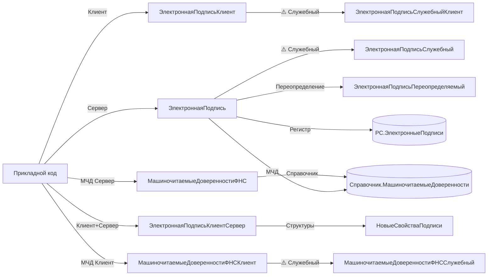

# BSP ESign + MCD (Электронная подпись и Машиночитаемые доверенности ФНС)

Скил по подсистемам «Электронная подпись» (подписание, проверка, управление сертификатами) и «Машиночитаемые доверенности» (МЧД в реестре ФНС, файлы доверенностей). Покрывает стабильный серверный/клиентский API и тонкости асинхронной модели оповещений БСП.

## When to use

- Нужно подписать двоичные данные, файл или объект ИБ выбранным сертификатом через стандартную форму подписания.
- Нужно программно проверить действительность подписи и/или сертификата на сервере (в фоне) или на клиенте (синхронно, через `ОписаниеОповещения`).
- Нужно добавить подпись к ссылочному объекту (документу, справочнику), у которого есть реквизит `ПодписанЭП`, и записать его.
- Нужно получить список уже установленных подписей объекта (свойства, отпечатки, статусы проверки) для UI-формы или отчёта.
- Нужно подписать данные на токене (Рутокен, JaCarta) или в облачном сервисе подписи (DSS) — выбор между встроенным криптопровайдером, токеном и облаком.
- Нужно проверить, что подсистема `ЭлектроннаяПодпись` подключена в текущей конфигурации (функциональная опция), прежде чем дёргать её API.
- Нужно открыть список МЧД, создать новую МЧД, добавить подпись к файлу доверенности или проверить, что записанная подпись соответствует действующей МЧД из реестра ФНС.
- Нужно программно зарегистрировать личный или корпоративный сертификат через стандартную форму (UI).

## Не использовать, если

- Задача про «общую» работу с файлами, прикрепление сканов без подписи — это `bsp-files-and-versions`.
- Нужны утилиты общего назначения (сообщения пользователю, безопасное хранилище для паролей сертификатов, JSON/XML-сериализация) — это `bsp-base-common`.
- Нужно запустить длительную операцию проверки пакета подписей в фоне с прогрессом — это `bsp-longs-and-jobs` (фон), а уже **внутри** фоновой процедуры — API этого скила.
- Нужно работать с мобильной подписью DSS (отдельная подсистема `ЭлектроннаяПодписьСервисаDSS`, общий модуль `СервисМобильнойПодписи*`) — API частично пересекается, но обслуживает другой транспорт; для DSS-специфики открывайте `СервисМобильнойПодписиКлиент` и `СервисМобильнойПодписи` напрямую, не через этот скил.
- Нужен низкоуровневый `МенеджерКриптографии` платформы без обвязки БСП — вызывайте `Новый МенеджерКриптографии(...)` платформенно; БСП-обёртку `ЭлектроннаяПодпись.МенеджерКриптографии` используйте только когда нужна интеграция с подсистемой.

## Core concepts

### Где живёт API

Подсистема `ЭлектроннаяПодпись` обслуживается **семейством общих модулей** по суффиксной системе БСП. Все модули **без префикса** (`БСП_…` не существует):

| Суффикс | Назначение |
|---|---|
| (без суффикса) | Серверный код: операции над ссылочными объектами, регистры подписей, бизнес-логика |
| `Клиент` | Клиентский код: интерактивные сценарии — форма подписания, форма выбора сертификата, диалоги |
| `КлиентСервер` | Безопасный код — общие структуры (`НовыеСвойстваПодписи`, `РезультатПроверкиПодписи`) |
| `Переопределяемый` | **Переопределять**, не вызывать: «крючки» вроде `ПередНачаломОперации` |
| `Служебный` | ⚠️ Служебный API, обратная совместимость **не гарантируется**. Использовать только при отсутствии стабильного аналога |
| `СлужебныйКлиент` / `СлужебныйКлиентСервер` / `СлужебныйВызовСервера` / `СлужебныйПовтИсп` | То же + варианты по контексту |
| `Локализация` / `КлиентЛокализация` / `КлиентСерверЛокализация` | Региональные переопределения (например, специфика РФ по МЧД) |
| `СлужебныйРФ` | Служебный код, специфика РФ |
| `ВМоделиСервиса` и комбинации | Разделение данных в SaaS-режиме |

> ⚠️ **Модуля `ЭлектроннаяПодписьКлиентСерверСлужебный` (без других суффиксов) не существует.** Служебные варианты имеют суффиксы `СлужебныйКлиент`, `СлужебныйКлиентСервер`, `СлужебныйВызовСервера`, `СлужебныйПовтИсп`. Перед использованием сверяйтесь с деревом общих модулей.

### МЧД — отдельный «хвост» с суффиксом `ФНС`

Подсистема `МашиночитаемыеДоверенности` — **взаимодействие с реестром ФНС**. Все модули этого семейства **обязательно** имеют суффикс `ФНС`:

| Модуль | Назначение |
|---|---|
| `МашиночитаемыеДоверенностиФНС` | Серверный API: создание, изменение, добавление подписи к файлу доверенности, проверка |
| `МашиночитаемыеДоверенностиФНСКлиент` | Клиентский API: открытие списка, создание МЧД через форму, проверка доверенности |
| `МашиночитаемыеДоверенностиФНСПереопределяемый` / `…КлиентПереопределяемый` | Крючки для прикладной конфигурации |
| `МашиночитаемыеДоверенностиФНСПовтИсп` | Кэш повторного использования |
| `МашиночитаемыеДоверенностиФНССлужебный` / `…СлужебныйКлиент` / `…СлужебныйКлиентСервер` / `…СлужебныйВызовСервера` | ⚠️ Служебный API |

> ⚠️ **Модуля `МашиночитаемыеДоверенности` (без суффикса `ФНС`) не существует.** Это типичная выдумка по аналогии с `УправлениеДоступом`, `ОбщегоНазначения` и т. п. Реальное имя — `МашиночитаемыеДоверенностиФНС` и варианты с суффиксом `ФНС`. Проверяйте по `CommonModules/МашиночитаемыеДоверенностиФНС*/`.

### DSS (сервис мобильной подписи) — отдельное семейство

Подсистема `ЭлектроннаяПодписьСервисаDSS` — это **интеграция с внешним сервисом DSS** (Доменная подпись, КриптоПро DSS и аналоги). Модули называются `СервисМобильнойПодписи*` (да, имя «мобильной», но обслуживает DSS в целом). Этот скил покрывает DSS-подписание **кратко** — основной путь через `ЭлектроннаяПодписьКлиент.Подписать` с параметром `ОписаниеДанных.ВыполнятьНаСервере = Ложь` (если поддерживается провайдером); специфичные DSS-функции — `СервисМобильнойПодписи*` отдельно.

### Регистры и справочники

- `РегистрСведений.ЭлектронныеПодписи` — хранилище подписей, привязанных к подписанным объектам (через `ПодписанныйОбъект` + `ПорядковыйНомер`).
- `РегистрСведений.ЭлектронныеПодписиМЧД` — связь подписей и МЧД.
- `Справочник.СертификатыКлючейЭлектроннойПодписиИШифрования` — каталог сертификатов пользователей/организаций.
- `Справочник.МашиночитаемыеДоверенности` — сами доверенности; `…ПрисоединенныеФайлы` — файлы XML/подписей к ним.
- `ОпределяемыйТип.ПодписанныйОбъект` — **все** ссылочные типы, у которых есть реквизит `ПодписанЭП`. Используется в сигнатурах `ПодписиОбъекта`, `ДобавитьПодпись`, `РезультатПроверкиПодписиПоМЧД`.

### Две модели вызова: асинхронный клиент vs синхронный сервер

- **Клиент (`ЭлектроннаяПодписьКлиент`)** — асинхронный, через `ОписаниеОповещения`. Возвращает результат **в оповещении**. Используется в формах и командах, где важен отзывчивый UI.
- **Сервер (`ЭлектроннаяПодпись`)** — синхронный, возвращает значение напрямую (или `ОписаниеОшибки`). Используется в фоновых заданиях, обработках, отчётах.

> ⚠️ **На сервере нет `ЭлектроннаяПодпись.Подписать`** (только клиентский вариант). Серверный модуль `ЭлектроннаяПодпись` отвечает за **сохранение** результата клиентского подписания (`ДобавитьПодпись`), **чтение** подписей (`ПодписиОбъекта`) и серверную **проверку** (`ПроверитьПодпись`, `ПроверитьСертификат`). Попытка вызвать `ЭлектроннаяПодпись.Подписать(...)` из серверного кода — ошибка компиляции.

### Функциональные опции

- `ФункциональнаяОпция.ИспользоватьЭлектронныеПодписи` — общий выключатель подсистемы.
- `ФункциональнаяОпция.ИспользоватьШифрование` — отдельная опция для шифрования.
- `ФункциональнаяОпция.ИспользоватьСервисМобильнойПодписи` (через `ЭлектроннаяПодпись.ИспользоватьСервисМобильнойПодписи`) — DSS.

Перед вызовом API проверяйте через `ЭлектроннаяПодпись.ИспользоватьЭлектронныеПодписи()` или `ОбщегоНазначения.ПодсистемаСуществует("СтандартныеПодсистемы.ЭлектроннаяПодпись")`.

## Key methods

| Метод | Сигнатура | Сервер/Клиент | Назначение | Пример вызова | Стабильность |
|---|---|---|---|---|---|
| `ЭлектроннаяПодпись.ИспользоватьЭлектронныеПодписи` | `ИспользоватьЭлектронныеПодписи()` | Сервер | Проверка, что подсистема включена функциональной опцией | `Если ЭлектроннаяПодпись.ИспользоватьЭлектронныеПодписи() Тогда …` | стабильный |
| `ЭлектроннаяПодпись.ПодписиОбъекта` | `ПодписиОбъекта(Объект, ДополнительныеПараметры = Неопределено)` | Сервер | Получить массив установленных подписей (свойства, отпечатки, статусы) | `МассивПодписей = ЭлектроннаяПодпись.ПодписиОбъекта(ДокументСсылка);` | стабильный |
| `ЭлектроннаяПодпись.ДобавитьПодпись` | `ДобавитьПодпись(Объект, Знач СвойстваПодписи, ИдентификаторФормы = Неопределено, ВерсияОбъекта = Неопределено, ЗаписанныйОбъект = Неопределено)` | Сервер | Записать подпись к объекту и установить `ПодписанЭП = Истина` | `ЭлектроннаяПодпись.ДобавитьПодпись(ДокументОбъект, СвойстваПодписи, УИДФормы);` | стабильный |
| `ЭлектроннаяПодпись.ПроверитьПодпись` | `ПроверитьПодпись(МенеджерКриптографии, ИсходныеДанные, Подпись, ОписаниеОшибки = Null, НаДату = Неопределено, РезультатСтруктура = Неопределено)` | Сервер | Математическая проверка подписи + сертификата; возвращает `Истина/Ложь`, `ОписаниеОшибки` заполняется при неуспехе | `Верна = ЭлектроннаяПодпись.ПроверитьПодпись(Менеджер, Данные, ДвоичныеДанныеПодписи, ОписаниеОшибки);` | стабильный |
| `ЭлектроннаяПодпись.МенеджерКриптографии` | `МенеджерКриптографии(Операция, ПоказатьОшибку = Истина, ОписаниеОшибки = "", Программа = Неопределено)` | Сервер | Получить `МенеджерКриптографии` с настройками из ИБ | `Менеджер = ЭлектроннаяПодпись.МенеджерКриптографии("Подписание", Ложь, Ошибка);` | стабильный |
| `ЭлектроннаяПодписьКлиент.Подписать` | `Подписать(ОписаниеДанных, Форма = Неопределено, ОбработкаРезультата = Неопределено, ПараметрыПодписи = Неопределено)` | Клиент | Асинхронное подписание: открывает форму выбора сертификата, результат — в `ОбработкаРезультата` или `ОписаниеДанных.СвойстваПодписи` | `ЭлектроннаяПодписьКлиент.Подписать(ОписаниеДанных, ЭтаФорма, ОповещениеОЗавершении);` | стабильный |
| `ЭлектроннаяПодписьКлиент.ПроверитьПодпись` | `ПроверитьПодпись(Оповещение, ИсходныеДанные, Подпись, МенеджерКриптографии = Неопределено, НаДату = Неопределено, ПараметрыПроверки = Неопределено)` | Клиент | Асинхронная проверка; результат в `Оповещение` (Булево/Строка/структура) | `ЭлектроннаяПодписьКлиент.ПроверитьПодпись(Оповещение, Данные, Подпись, Неопределено, Дата, ПараметрыПроверки);` | стабильный |
| `ЭлектроннаяПодписьКлиент.ДобавитьСертификат` | `ДобавитьСертификат(ОбработчикЗавершения = Неопределено, ПараметрыДобавления = Неопределено)` | Клиент | Открыть форму добавления сертификата в справочник; результат — в оповещении | `ЭлектроннаяПодписьКлиент.ДобавитьСертификат(ОповещениеОЗавершении, ПараметрыДобавления);` | стабильный |
| `ЭлектроннаяПодписьКлиент.ПолучитьОтпечаткиСертификатов` | `ПолучитьОтпечаткиСертификатов(Оповещение, ТолькоЛичные, ПараметрыПолучения = Истина)` | Клиент | Список отпечатков доступных сертификатов (личные/все); результат — массив строк в оповещении | `ЭлектроннаяПодписьКлиент.ПолучитьОтпечаткиСертификатов(Оп, Истина);` | стабильный |
| `ЭлектроннаяПодписьКлиентСервер.НовыеСвойстваПодписи` | `НовыеСвойстваПодписи()` | Клиент + Сервер | Конструктор структуры свойств подписи (отпечаток, дата, сертификат, статус) | `Св = ЭлектроннаяПодписьКлиентСервер.НовыеСвойстваПодписи();` | стабильный |
| `МашиночитаемыеДоверенностиФНС.ДобавитьПодписьКФайлуДоверенности` | `ДобавитьПодписьКФайлуДоверенности(ФайлДоверенности, Знач Подпись)` | Сервер | Добавить подпись к присоединённому файлу МЧД; возвращает `Истина` или текст ошибки | `Рез = МашиночитаемыеДоверенностиФНС.ДобавитьПодписьКФайлуДоверенности(ФайлМЧД, СвойстваПодписи);` | стабильный |
| `МашиночитаемыеДоверенностиФНС.РезультатПроверкиПодписиПоМЧД` | `РезультатПроверкиПодписиПоМЧД(ПодписанныйОбъект, ИдентификаторПодписи, СертификатПодписи, НаДату)` | Сервер | Проверить записанную подпись на соответствие МЧД (реестр ФНС, полномочия, дата) | `М = МашиночитаемыеДоверенностиФНС.РезультатПроверкиПодписиПоМЧД(Док, ИдПодп, Серт, Дата);` | стабильный |
| `МашиночитаемыеДоверенностиФНСКлиент.ОткрытьСписокМЧД` | `ОткрытьСписокМЧД(Отборы = Неопределено, ОповещениеОЗакрытии = Неопределено, Владелец = Неопределено)` | Клиент | Открыть форму списка МЧД с произвольным отбором | `МашиночитаемыеДоверенностиФНСКлиент.ОткрытьСписокМЧД(Отбор, Оповещение);` | стабильный |
| `МашиночитаемыеДоверенностиФНСКлиент.СоздатьМЧД` | `СоздатьМЧД(ПараметрыФормы, ОповещениеОЗавершении = Неопределено)` | Клиент | Открыть форму создания новой МЧД | `МашиночитаемыеДоверенностиФНСКлиент.СоздатьМЧД(Параметры, Оповещение);` | стабильный |
| `ЭлектроннаяПодписьСлужебный.Зашифровать` | `Зашифровать(Данные, Сертификат, МенеджерКриптографии)` | Сервер | Серверное шифрование для массива получателей | `Данные = ЭлектроннаяПодписьСлужебный.Зашифровать(ДвоичныеДанные, МассивСертификатов, Менеджер);` | ⚠️ служебный |

> **Полный список** (18 методов, включая `ПроверитьСертификат`, `СвойстваПодписи`, `РезультатПроверкиПодписи`, `ДатаПодписания`, `ОткрытьНастройкиЭлектроннойПодписиИШифрования`, `ПроверитьДоверенность`, `ДоступнаЭлектроннаяПодпись`) — в [`references/key-methods.md`](references/key-methods.md).

## Patterns

### 1. Подписание объекта с записью подписи в БД

```bsl
// В форме документа, команда «Подписать».
ОписаниеДанных = Новый Структура;
ОписаниеДанных.Вставить("Операция",          НСтр("ru = 'Подписание документа'"));
ОписаниеДанных.Вставить("ЗаголовокДанных",   НСтр("ru = 'Документ'"));
ОписаниеДанных.Вставить("Объект",            Объект.Ссылка);
ОписаниеДанных.Вставить("ВерсияОбъекта",     Объект.ВерсияДанных);
ОписаниеДанных.Вставить("ПоказатьКомментарий", Истина);

ОбработкаРезультата = Новый ОписаниеОповещения("ПослеПодписания", ЭтотОбъект);

ЭлектроннаяПодписьКлиент.Подписать(ОписаниеДанных, ЭтаФорма, ОбработкаРезультата);

// В форме:
Процедура ПослеПодписания(Результат, ДопПараметры) Экспорт
    Если Результат.Свойство("СвойстваПодписи") И Результат.СвойстваПодписи <> Неопределено Тогда
        // Серверная часть уже добавила подпись к объекту, остаётся перечитать.
        ЭтаФорма.Прочитать();
    КонецЕсли;
КонецПроцедуры
```

Серверная часть `ЭлектроннаяПодпись.ДобавитьПодпись` вызывается **внутри** клиентского `Подписать` (когда указан `ОписаниеДанных.Объект`). Вручную `ДобавитьПодпись` из прикладного кода обычно не вызывают — её используют в собственных обработках.

### 2. Проверка подписи на сервере (фон/обработка)

```bsl
// Серверный код, например, в регламентном задании или обработке.
МенеджерКриптографии = ЭлектроннаяПодпись.МенеджерКриптографии("ПроверкаПодписи", Ложь, ОписаниеОшибки);
Если МенеджерКриптографии = Неопределено Тогда
    ОбщегоНазначения.СообщитьПользователю(ОписаниеОшибки);
    Возврат;
КонецЕсли;

ПодписиОбъекта = ЭлектроннаяПодпись.ПодписиОбъекта(ДокументСсылка);
Для Каждого СвойстваПодписи Из ПодписиОбъекта Цикл
    ДвоичныеДанныеПодписи = СвойстваПодписи.Подпись;  // адрес или ДвоичныеДанные
    ДвоичныеДанныеОбъекта  = ПолучитьДвоичныеДанныеФайла(ДокументСсылка);

    ОписаниеОшибки = "";
    Верна = ЭлектроннаяПодпись.ПроверитьПодпись(МенеджерКриптографии,
        ДвоичныеДанныеОбъекта, ДвоичныеДанныеПодписи, ОписаниеОшибки);

    Если Не Верна Тогда
        ЗаписатьВЖурналРегистрации(ОписаниеОшибки, УровеньЖурналаРегистрации.Предупреждение);
    КонецЕсли;
КонецЦикла;
```

`ОписаниеОшибки` заполняется **только при неуспехе** (передаётся 4-м параметром, по умолчанию `Null`). Возвращаемое `Истина/Ложь` — общий результат математической проверки **и** проверки сертификата.

### 3. Подписание + МЧД в одном сценарии

```bsl
// Формирование ОписаниеДанных с указанием доверенности.
ОписаниеДанных = Новый Структура;
ОписаниеДанных.Вставить("Операция",          НСтр("ru = 'Подписание от имени представителя'"));
ОписаниеДанных.Вставить("Объект",            Объект.Ссылка);
ОписаниеДанных.Вставить("ВерсияОбъекта",     Объект.ВерсияДанных);
ОписаниеДанных.Вставить("ВыбраннаяДоверенность", ВыбраннаяМЧД);  // ссылка на СправочникСсылка.МашиночитаемыеДоверенности

ЭлектроннаяПодписьКлиент.Подписать(ОписаниеДанных, ЭтаФорма);

// Позже, в проверке:
// Проверить, что подпись действительна по МЧД на дату подписи.
РезультатМЧД = МашиночитаемыеДоверенностиФНС.РезультатПроверкиПодписиПоМЧД(
    ДокументСсылка, ИдентификаторПодписи, СертификатПодписи, ДатаПодписи);

Если РезультатМЧД.Верна Тогда
    // Подпись валидна + полномочия соответствуют.
Иначе
    // Смотри РезультатМЧД.ПротоколПроверки — детальный разбор.
КонецЕсли;
```

### 4. Регистрация нового сертификата пользователя

```bsl
// Из формы настройки пользователя.
Параметры = ЭлектроннаяПодписьКлиент.ПараметрыДобавленияСертификата();
Параметры.Комментарий = НСтр("ru = 'Сертификат для подписания ЭП'");

Обработчик = Новый ОписаниеОповещения("ПослеДобавленияСертификата", ЭтотОбъект);
ЭлектроннаяПодписьКлиент.ДобавитьСертификат(Обработчик, Параметры);
```

### 5. Проверка доступности подсистемы в конфигурации

```bsl
// Перед вызовом любого API.
Если Не ОбщегоНазначения.ПодсистемаСуществует("СтандартныеПодсистемы.ЭлектроннаяПодпись") Тогда
    Возврат;
КонецЕсли;
Если Не ЭлектроннаяПодпись.ИспользоватьЭлектронныеПодписи() Тогда
    Возврат;  // Функциональная опция выключена.
КонецЕсли;
```

## Anti-patterns

### ❌ Вызывать `ЭлектроннаяПодпись.Подписать` (метод не существует на сервере)

```bsl
// ❌ ОШИБКА КОМПИЛЯЦИИ: Метод объекта не обнаружен
Результат = ЭлектроннаяПодпись.Подписать(ОписаниеДанных);
```

```bsl
// ✅ Подписание — только клиентский вызов; сервер только сохраняет результат
// Клиент:
ЭлектроннаяПодписьКлиент.Подписать(ОписаниеДанных, ЭтаФорма, ОповещениеОЗавершении);
// Сервер (внутри клиентского сценария или в собственной обработке):
ЭлектроннаяПодпись.ДобавитьПодпись(Объект, СвойстваПодписи);
```

### ❌ Вызывать модуль `МашиночитаемыеДоверенности` без суффикса `ФНС`

```bsl
// ❌ ОШИБКА: модуль не существует
МашиночитаемыеДоверенности.ДобавитьПодписьКФайлуДоверенности(...);
```

```bsl
// ✅ Только с суффиксом ФНС
МашиночитаемыеДоверенностиФНС.ДобавитьПодписьКФайлуДоверенности(ФайлМЧД, СвойстваПодписи);
```

### ❌ Хранить пароль сертификата в реквизитах или константах

```bsl
// ❌ Пароль в открытом виде в ИБ + лог-файлах
Объект.ПарольСертификата = "secret_password";
```

```bsl
// ✅ Через безопасное хранилище (см. bsp-base-common)
ОбщегоНазначения.ЗаписатьДанныеВБезопасноеХранилище(
    СертификатСсылка, "secret_password", "Пароль");
// Чтение — перед подписанием, в форме, без записи в ИБ.
```

### ❌ Синхронно дёргать клиентское API с сервера

```bsl
// ❌ Серверный код пытается вызвать клиентский модуль — нет контекста управляемой формы
// &НаСервере
Процедура МояСерверная()
    ЭлектроннаяПодписьКлиент.Подписать(ОписаниеДанных);  // Не скомпилируется на сервере.
КонецПроцедуры
```

```bsl
// ✅ Клиентский код инициирует, серверный — сохраняет/проверяет
// &НаКлиенте
Процедура КомандаПодписать(Команда)
    ЭлектроннаяПодписьКлиент.Подписать(ОписаниеДанных, ЭтаФорма, Оповещение);
КонецПроцедуры

// &НаСервереБезКонтекста
Функция ПроверитьПодписиНаСервере(Док) Экспорт
    Возврат ЭлектроннаяПодпись.ПроверитьПодпись(Менеджер, Данные, Подпись, Ошибка);
КонецФункции
```

### ❌ Создавать подпись без проверки доступности подсистемы

```bsl
// ❌ Падает, если в конфигурации нет подсистемы ЭлектроннаяПодпись
ЭлектроннаяПодписьКлиент.Подписать(ОписаниеДанных);
```

```bsl
// ✅ Всегда проверяйте ПодсистемаСуществует + функциональную опцию
Если ОбщегоНазначения.ПодсистемаСуществует("СтандартныеПодсистемы.ЭлектроннаяПодпись")
    И ЭлектроннаяПодпись.ИспользоватьЭлектронныеПодписи() Тогда
    ЭлектроннаяПодписьКлиент.Подписать(ОписаниеДанных);
КонецЕсли;
```

### ❌ Игнорировать `ОписаниеОшибки` в серверной проверке

```bsl
// ❌ Только булево — невозможно показать пользователю причину
Верна = ЭлектроннаяПодпись.ПроверитьПодпись(Менеджер, Данные, Подпись);
```

```bsl
// ✅ Захватывать описание ошибки и логировать/показывать
ОписаниеОшибки = "";
Верна = ЭлектроннаяПодпись.ПроверитьПодпись(Менеджер, Данные, Подпись, ОписаниеОшибки);
Если Не Верна Тогда
    ЗаписьЖурналаРегистрации(НСтр("ru = 'ЭП.Проверка подписи'"),
        УровеньЖурналаРегистрации.Предупреждение, , , ОписаниеОшибки);
КонецЕсли;
```

### ❌ Подменять `Подписать` собственным `Новый МенеджерКриптографии` без интеграции с БСП

```bsl
// ❌ Ломает интеграцию с подсистемой: логирование, оповещения о сертификатах,
// ❎ проверка МЧД, продление подписей, хранение в РС.ЭлектронныеПодписи — всё мимо.
Менеджер = Новый МенеджерКриптографии("Crypto-Pro GOST R 34.10-2012", "", 75);
Менеджер.Подписать(ДвоичныеДанные, Сертификат);
```

```bsl
// ✅ Использовать ЭлектроннаяПодписьКлиент.Подписать — БСП сама выберет провайдера
// ✅ по настройкам функциональной опции, логирует в РС, откроет нужную форму
ЭлектроннаяПодписьКлиент.Подписать(ОписаниеДанных, ЭтаФорма, Оповещение);
```

## How to explore deeper

### Где искать модули в выгрузке конфигурации

Изучите эти общие модули (BSL/XML) — в них живёт весь стабильный и служебный API подсистемы. Имена в дереве метаданных — **дословно** как указано:

- `CommonModules/ЭлектроннаяПодпись/Ext/Module.bsl` — серверный модуль, ~50 экспортных методов.
- `CommonModules/ЭлектроннаяПодписьКлиент/Ext/Module.bsl` — клиентский модуль, ~70 экспортных методов.
- `CommonModules/ЭлектроннаяПодписьКлиентСервер/Ext/Module.bsl` — общий код (структуры, вспомогательные).
- `CommonModules/ЭлектроннаяПодписьПереопределяемый/Ext/Module.bsl` — «крючки» для прикладного кода.
- `CommonModules/ЭлектроннаяПодписьСлужебный/Ext/Module.bsl` — ⚠️ служебный API.
- `CommonModules/ЭлектроннаяПодписьСлужебныйКлиент/Ext/Module.bsl` — ⚠️ служебный клиент.
- `CommonModules/ЭлектроннаяПодписьСлужебныйКлиентСервер/Ext/Module.bsl` — ⚠️ служебный общий.
- `CommonModules/МашиночитаемыеДоверенностиФНС/Ext/Module.bsl` — серверный модуль МЧД.
- `CommonModules/МашиночитаемыеДоверенностиФНСКлиент/Ext/Module.bsl` — клиентский модуль МЧД.
- `CommonModules/МашиночитаемыеДоверенностиФНСПереопределяемый/Ext/Module.bsl` — крючки МЧД.

Также полезны для глубокой отладки:

- `InformationRegisters/ЭлектронныеПодписи/Ext/RecordSetModule.bsl` — модуль набора записей РС подписей.
- `InformationRegisters/ЭлектронныеПодписиМЧД/` — связь подписей и МЧД.
- `Catalogs/СертификатыКлючейЭлектроннойПодписиИШифрования/Ext/ObjectModule.bsl` — модуль объекта сертификата.
- `Catalogs/МашиночитаемыеДоверенности/` — справочник МЧД.

### Grep-шаблоны

```text
# Найти все экспортные методы конкретного модуля:
^(Функция|Процедура) [А-ЯA-Z][А-ЯA-Za-z_]+\(.*\) Экспорт

# Стабильный API внутри модуля:
^#Область ПрограммныйИнтерфейс

# Служебный API (⚠️ — обратная совместимость не гарантируется):
^#Область СлужебныйПрограммныйИнтерфейс

# Проверить существование метода в модуле (например, Подписать в клиентском):
^(Функция|Процедура) Подписать\(

# Убедиться, что модуль «МашиночитаемыеДоверенности» (без ФНС) не существует:
# (должно вернуть 0 строк)
ls CommonModules/МашиночитаемыеДоверенности/Ext/Module.bsl
```

### Glob-маски

- `CommonModules/ЭлектроннаяПодпись*/Ext/Module.bsl` — все варианты суффиксов семейства.
- `CommonModules/МашиночитаемыеДоверенностиФНС*/Ext/Module.bsl` — все варианты семейства МЧД.
- `CommonModules/СервисМобильнойПодписи*/Ext/Module.bsl` — DSS-семейство (отдельная подсистема, см. Core concepts).
- `Catalogs/СертификатыКлючейЭлектроннойПодписиИШифрования/**` — каталог сертификатов с реквизитами.
- `Catalogs/МашиночитаемыеДоверенности/**` — справочник МЧД с реквизитами и формами.

### На что обратить внимание в дереве метаданных

- **`ОпределяемыйТип.ПодписанныйОбъект`** — какие объекты ИБ **могут** быть подписаны (те, у которых есть реквизит `ПодписанЭП`). Используется во всех серверных методах работы с подписями.
- **`ОпределяемыйТип.СторонаМЧД`** — кто участвует в МЧД (доверитель/представитель).
- **`ПодпискиНаСобытия`** для модулей семейства `ЭлектроннаяПодпись*Служебный*` — служебные модули подписываются на системные события платформы (запись объектов, инициализация параметров сеанса).
- **В формах списка/объекта**: типичные элементы — `ПодменюПодписать`, `ГруппаПодписей`, реквизит `ПодписанЭП`, таблица формы `ЭлектронныеПодписи` (с колонками `Отпечаток`, `КомуВыданСертификат`, `ДатаПодписи`, `ПодписьВерна`).
- **Функциональные опции** `ИспользоватьЭлектронныеПодписи`, `ИспользоватьШифрование`, `ИспользоватьСервисМобильнойПодписи` — общие выключатели.
- **Регламентное задание** `ОбновлениеСтатусовМЧД` — периодически обновляет статусы МЧД из реестра ФНС.

### Mermaid — карта модулей подсистемы


