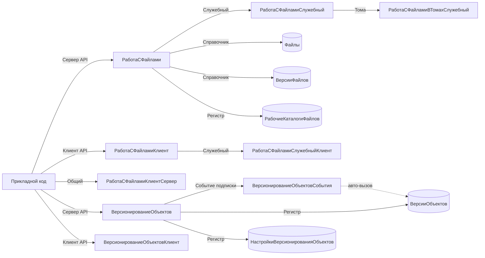

# BSP Files and Versions (РаботаСФайлами + ВерсионированиеОбъектов)

Скил по двум тесно связанным подсистемам: «Работа с файлами» (присоединённые файлы, хранение в ИБ и томах, ЭП, шифрование) и «Версионирование объектов» (история изменений справочников и документов, отчёты по версиям). Обе подсистемы прорастают в формы объектов через типовые «гиперссылки» и «команды», поэтому в большинстве прикладных конфигураций ссылки на их общие модули встречаются в каждом документе и справочнике.

Скил не покрывает общие файловые операции вне БСП (создание временных каталогов, открытие Проводника) — это `bsp-base-common`. Не покрывает электронную подпись и шифрование файлов как таковые — это `bsp-esign-mcd`. Не покрывает печатные формы, даже если они выводятся из присоединённого файла — это `bsp-print-reports`.

## When to use

- Нужно прикрепить файл (скан договора, изображение товара, PDF акта) к элементу справочника или документу из серверного кода с адресом во временном хранилище или путём на диске сервера.
- Нужно прочитать двоичные данные существующего присоединённого файла, обновить их без создания новой версии, или скопировать набор присоединённых файлов с одного объекта на другой того же типа.
- Нужно открыть форму присоединённого файла из клиентского кода (в т. ч. как обработчик «открытия»), либо вызвать диалог пакетного добавления файлов с фильтром по расширению.
- Нужно проверить, что к объекту метаданных вообще можно присоединять файлы (например, при динамическом определении владельца), либо собрать все присоединённые файлы объекта в массив.
- Нужно программно включить или проверить версионирование для конкретного объекта метаданных (например, при начальном заполнении ИБ), либо подключить механизм версионирования к форме объекта.
- Нужно явно записать версию объекта (вне стандартной подписки на событие), прочитать данные ранее сохранённой версии или открыть отчёт сравнения версий из клиентского кода.
- Нужно программно сформировать «отчёт по версии объекта» на сервере (печатная форма/табличный документ, показывающий реквизиты выбранной версии) или получить список версий через экспортные методы подсистемы.

## Не использовать, если

- Нужна печать печатных форм (в т. ч. на основе присоединённого файла) — это `bsp-print-reports` (`УправлениеПечатью`).
- Нужно хранить пароли/токены для внешних сервисов — это `bsp-base-common` и регистр сведений `БезопасноеХранилищеДанных` (через `ОбщегоНазначения.ЗаписатьДанныеВБезопасноеХранилище`).
- Нужна работа с файловой системой (временные каталоги, Проводник, запуск приложений) — это `bsp-base-common` (`ФайловаяСистема`, `ФайловаяСистемаКлиент`).
- Нужны электронная подпись и шифрование как самостоятельная подсистема — это `bsp-esign-mcd` (`ЭлектроннаяПодпись*`).
- Нужно модифицировать само поведение БСП (какие объекты версионируются, какие файлы считаются «ненужными») — это через `РаботаСФайламиПереопределяемый`, `ВерсионированиеОбъектовПереопределяемый` (не прямой вызов, а переопределение).
- Задача не связана с присоединёнными файлами или историей изменений (типовое расширение конфигурации без БСП-подсистем `РаботаСФайлами`/`ВерсионированиеОбъектов`).

## Core concepts

### Жизненный цикл присоединённого файла

Объект присоединённого файла — это **элемент справочника**, подчинённый «владельцу» (определяемый тип `ВладелецПрисоединенныхФайлов`). Имя справочника хранения зависит от владельца (например, для `Справочник.ДоговорыКонтрагентов` — `Справочник.ДоговорыКонтрагентовПрисоединенныеФайлы`). Жизненный цикл в типичной прикладной задаче:

1. **Проверка возможности прикрепления** — `РаботаСФайлами.КОбъектуМожноПрисоединятьФайлы(ВладелецФайлов)`. Если у владельца нет ни одного справочника хранения — вернёт `Ложь`.
2. **Получение параметров добавления** — `РаботаСФайлами.ПараметрыДобавленияФайла(ДополнительныеРеквизиты)` (внутри `ДобавитьФайл` заполняется автоматически). Типичный набор полей: `ВладелецФайлов`, `ИмяБезРасширения`, `Расширение`, `ДатаМодификацииУниверсальная`.
3. **Помещение двоичных данных во временное хранилище** (с клиента) — стандартный `ПоместитьФайлНаСервер()` из БСП, либо платформенный `ПоместитьВоВременноеХранилище`. Возвращает `АдресФайлаВоВременномХранилище`.
4. **Создание элемента справочника** — `РаботаСФайлами.ДобавитьФайл(ПараметрыФайла, АдресФайлаВоВременномХранилище, ...)`. Возвращает ссылку на созданный файл.
5. **Чтение/обновление** — `РаботаСФайлами.ДанныеФайла(...)` для получения, `РаботаСФайлами.ОбновитьФайл(...)` для изменения **без** новой версии. Если у справочника хранения включён режим «Хранить версии» — `ОбновитьФайл` не подходит, нужно создавать новую версию через подсистему версионирования файлов.
6. **Удаление** — штатный механизм платформы (`СправочникОбъект.Удалить()`) или пометка удаления с очисткой через `РаботаСФайламиСлужебный.ПометитьНаУдалениеВерсииФайла` (⚠️ служебный) для массовой очистки версий.
7. **Копирование** — `РаботаСФайлами.СкопироватьПрисоединенныеФайлы(Источник, Получатель)` — используется в обработчиках «Скопировать» / «Создать на основании».

### Подписка на форму объекта

В типовых формах документа/справочника присоединённые файлы отображаются через типовой «командный интерфейс» — гиперссылку в подменю «Ещё». Чтобы он появился:

- В модуле формы вызвать `РаботаСФайлами.ПриСозданииНаСервере(Форма, ДобавляемыеЭлементы, НастройкиРаботыСФайламиВФорме)`. БСП сама добавит нужные элементы (гиперссылка, команды, поле предпросмотра).
- На клиенте — `РаботаСФайламиКлиент.ПриОткрытии(Форма, Отказ)` в обработчике `ПриОткрытии` и `РаботаСФайламиКлиент.ОбработкаОповещения(Форма, ИмяСобытия)` в обработчике `ОбработкаОповещения`.

Эти вызовы — **опциональные** (если БСП подключена через стандартный механизм «присоединённых файлов», она подцепится автоматически). Нужны только когда форма — нетиповая (например, расширение или своя форма).

### Версионирование: что и куда пишется

- **Регистр сведений `ВерсииОбъектов`** хранит сериализованный (XML) снимок объекта на момент записи. Ключ — `Объект` + `НомерВерсии`.
- **Регистр сведений `НастройкиВерсионированияОбъектов`** — управляющие настройки: «Хранить историю» (да/нет), «Вариант версионирования» (`ПеречислениеСсылка.ВариантыВерсионированияОбъектов`), «Срок хранения версий».
- Запись версий выполняется либо **автоматически** через подписки на события `ВерсионированиеОбъектовСобытия.ЗаписатьВерсиюОбъекта` / `…ЗаписатьВерсиюДокумента` (вызываются из подсистемных подписок на `ПриЗаписи` всех версионируемых объектов), либо **вручную** через прямой вызов `ВерсионированиеОбъектов.ЗаписатьВерсиюОбъекта(Источник, РежимЗаписи)`.
- Функциональная опция `ИспользоватьВерсионированиеОбъектов` глобально отключает запись версий (проверяется внутри `ЗаписатьВерсиюОбъекта`).

### Семантика «служебного» и «программного» интерфейса

В модуле `ВерсионированиеОбъектов` экспортные методы **разделены** областями:

- `#Область ПрограммныйИнтерфейс` — стабильный API, можно вызывать из прикладного кода: `ВключеноВерсионированиеОбъекта`, `ВключитьВерсионированиеОбъекта`, `ЗаписатьНастройкуВерсионированияПоОбъекту`, `ПриСозданииНаСервере`, `ЗначениеФлажкаХранитьИсторию`, `СведенияОВерсииОбъекта`, `ОтчетПоВерсииОбъекта`.
- `#Область СлужебныйПрограммныйИнтерфейс` — экспортные, но ⚠️ «обратная совместимость не гарантируется»: `ЗаписатьВерсиюОбъекта`, `ОчиститьУстаревшиеВерсииОбъектов`, `ПерейтиНаВерсиюСервер` и др. Использовать только если стабильного аналога нет.

### Карта «подсистема → общие модули»

**`РаботаСФайлами`** (прикладные + UI):
- `РаботаСФайлами` — серверный API: создание, обновление, копирование, присоединение.
- `РаботаСФайламиКлиент` — клиентский API: диалоги, открытие форм, сканирование, подписание.
- `РаботаСФайламиКлиентСервер` — общий код (структуры параметров, имя команд).
- `РаботаСФайламиПереопределяемый` / `РаботаСФайламиКлиентПереопределяемый` — переопределение поведения (НЕ вызов, а реализация).
- Служебные: `РаботаСФайламиСлужебный` (10K строк, ⚠️), `РаботаСФайламиСлужебныйКлиент` (12K строк, ⚠️), `РаботаСФайламиСлужебныйКлиентСервер`, `РаботаСФайламиСлужебныйВызовСервера`, `РаботаСФайламиСлужебныйПовтИсп`, `РаботаСФайламиСлужебныйКлиентПовтИсп`, `РаботаСФайламиСлужебныйВМоделиСервиса`, `РаботаСФайламиВТомахСлужебный`.
- `РаботаСФайламиЛокализация` — региональные особенности (не вызывать из прикладного кода).

**`ВерсионированиеОбъектов`** (история изменений):
- `ВерсионированиеОбъектов` — серверный API: настройки, чтение версий, формирование отчётов, события обмена.
- `ВерсионированиеОбъектовКлиент` — клиентский API: отчёты по версии/сравнению, открытие истории.
- `ВерсионированиеОбъектовПереопределяемый` — переопределение (НЕ вызов).
- `ВерсионированиеОбъектовСобытия` — обработчики событий `ПриЗаписи`/`ПередУдалением`, вызываются из подписок БСП; **напрямую из прикладного кода не вызывать** (вызываются БСП автоматически при записи версионируемого объекта).
- Служебный: `ВерсионированиеОбъектовСлужебныйВызовСервера` (⚠️ единственный «служебный» модуль в этой подсистеме; ⚠️ нет модуля `ВерсионированиеОбъектовСлужебный` без суффикса `ВызовСервера`).

> **Типовая ошибка:** вызвать `ВерсионированиеОбъектовСлужебный.ЗаписатьВерсиюОбъекта` — **такого модуля не существует**. Правильный путь: `ВерсионированиеОбъектов.ЗаписатьВерсиюОбъекта(Источник, РежимЗаписи)` (внутри `#Область СлужебныйПрограммныйИнтерфейс`, ⚠️ «обратная совместимость не гарантируется»). Стабильного публичного метода записи версии нет — это намеренно, чтобы прикладной код не дублировал логику подписок.

## Key methods

| Метод | Сигнатура | Сервер/Клиент | Назначение | Пример вызова | Стабильность |
|---|---|---|---|---|---|
| `РаботаСФайлами.КОбъектуМожноПрисоединятьФайлы` | `КОбъектуМожноПрисоединятьФайлы(ВладелецФайлов, ИмяСправочника = "")` | Сервер | Проверить, поддерживает ли владелец присоединённые файлы | `Если РаботаСФайлами.КОбъектуМожноПрисоединятьФайлы(Документ) Тогда ... КонецЕсли;` | стабильный |
| `РаботаСФайлами.ДобавитьФайл` | `ДобавитьФайл(ПараметрыФайла, Знач АдресФайлаВоВременномХранилище, Знач АдресВременногоХранилищаТекста = "", Знач Описание = "", Знач НоваяСсылкаНаФайл = Неопределено)` | Сервер | Создать присоединённый файл по адресу во временном хранилище | `НовыйФайл = РаботаСФайлами.ДобавитьФайл(ПараметрыФайла, АдресВХ, АдресТекстаВХ);` | стабильный |
| `РаботаСФайлами.ДобавитьФайлСДиска` | `ДобавитьФайлСДиска(ВладелецФайлов, ПутьКФайлуНаДиске)` | Сервер | Создать присоединённый файл из файла на серверном диске | `НовыйФайл = РаботаСФайлами.ДобавитьФайлСДиска(Документ, "C:\Scan\act001.pdf");` | стабильный |
| `РаботаСФайлами.ДанныеФайла` | `ДанныеФайла(Знач ПрисоединенныйФайл, Знач ДополнительныеПараметры = Неопределено, Знач УдалитьПолучатьСсылкуНаДвоичныеДанные = Истина, Знач УдалитьДляРедактирования = Ложь)` | Сервер | Получить реквизиты файла, опционально — адрес двоичных данных во временном хранилище | `Данные = РаботаСФайлами.ДанныеФайла(Файл, Неопределено);` | стабильный |
| `РаботаСФайлами.ОбновитьФайл` | `ОбновитьФайл(Знач ПрисоединенныйФайл, Знач ИнформацияОФайле)` | Сервер | Перезаписать двоичные данные / реквизиты файла **без** создания новой версии (только для справочников без хранения версий) | `РаботаСФайлами.ОбновитьФайл(Файл, Инфо);` | стабильный |
| `РаботаСФайлами.СкопироватьПрисоединенныеФайлы` | `СкопироватьПрисоединенныеФайлы(Знач Источник, Знач Получатель)` | Сервер | Программно скопировать все присоединённые файлы с одного объекта на другой (одного типа) | `РаботаСФайлами.СкопироватьПрисоединенныеФайлы(ДокументИсточник, ДокументПолучатель);` | стабильный |
| `РаботаСФайлами.ЗаполнитьПрисоединенныеФайлыКОбъекту` | `ЗаполнитьПрисоединенныеФайлыКОбъекту(Знач ВладелецФайла, Знач Файлы)` | Сервер | Заполнить переданный массив ссылками на все присоединённые файлы владельца | `МассивФайлов.Очистить(); РаботаСФайлами.ЗаполнитьПрисоединенныеФайлыКОбъекту(Документ, МассивФайлов);` | стабильный |
| `РаботаСФайламиКлиент.ОткрытьФормуФайла` | `ОткрытьФормуФайла(Знач ПрисоединенныйФайл, СтандартнаяОбработка = Ложь, ДополнительныеПараметры = Неопределено, ОписаниеОповещенияОЗакрытии = Неопределено)` | Клиент | Открыть карточку присоединённого файла (используется как обработчик команды «Открыть») | `РаботаСФайламиКлиент.ОткрытьФормуФайла(Файл, Ложь, , Оповещение);` | стабильный |
| `РаботаСФайламиКлиент.ДобавитьФайлы` | `ДобавитьФайлы(Знач ВладелецФайла, Знач ИдентификаторФормы, Знач Фильтр = "", ГруппаФайлов = Неопределено, ОбработчикРезультата = Неопределено)` | Клиент | Открыть диалог множественного добавления файлов с фильтром по расширению | `РаботаСФайламиКлиент.ДобавитьФайлы(Документ, УникальныйИдентификатор, "pdf,docx", , Оповещение);` | стабильный |
| `РаботаСФайламиСлужебный.ПометитьНаУдалениеВерсииФайла` | `ПометитьНаУдалениеВерсииФайла(Знач ФайлСсылка, Знач ВерсияИсключение)` | Сервер | Массовая пометка удаления всех версий файла (используется при очистке устаревших версий) | `РаботаСФайламиСлужебный.ПометитьНаУдалениеВерсииФайла(Файл, Неопределено);` | ⚠️ служебный |
| `ВерсионированиеОбъектов.ПриСозданииНаСервере` | `ПриСозданииНаСервере(Форма)` | Сервер | Подключить механизм версионирования к форме объекта (установить параметр функциональной опции) | `ВерсионированиеОбъектов.ПриСозданииНаСервере(ЭтаФорма);` | стабильный |
| `ВерсионированиеОбъектов.ВключеноВерсионированиеОбъекта` | `ВключеноВерсионированиеОбъекта(ИмяОбъекта)` | Сервер | Проверить, включена ли запись истории для конкретного объекта метаданных | `Если ВерсионированиеОбъектов.ВключеноВерсионированиеОбъекта("Документ.ЗаказПоставщику") Тогда ... КонецЕсли;` | стабильный |
| `ВерсионированиеОбъектов.ВключитьВерсионированиеОбъекта` | `ВключитьВерсионированиеОбъекта(ИмяОбъекта, Знач ВариантВерсионирования = Неопределено)` | Сервер | Включить запись истории для конкретного объекта метаданных (из кода начального заполнения) | `ВерсионированиеОбъектов.ВключитьВерсионированиеОбъекта("Справочник.ДоговорыКонтрагентов");` | стабильный |
| `ВерсионированиеОбъектов.ЗаписатьНастройкуВерсионированияПоОбъекту` | `ЗаписатьНастройкуВерсионированияПоОбъекту(Знач ТипОбъекта, Знач ВариантВерсионирования, Знач СрокХраненияВерсий = Неопределено)` | Сервер | Записать настройку версионирования в регистр сведений (с указанием варианта и срока хранения) | `ВерсионированиеОбъектов.ЗаписатьНастройкуВерсионированияПоОбъекту(Тип, Вариант, Срок);` | стабильный |
| `ВерсионированиеОбъектов.ЗначениеФлажкаХранитьИсторию` | `ЗначениеФлажкаХранитьИсторию()` | Сервер | Текущее значение функциональной опции «Использовать версионирование объектов» (для отображения в форме настроек) | `Хранить = ВерсионированиеОбъектов.ЗначениеФлажкаХранитьИсторию();` | стабильный |
| `ВерсионированиеОбъектов.ЗаписатьВерсиюОбъекта` | `ЗаписатьВерсиюОбъекта(Знач Источник, РежимЗаписи = Неопределено)` | Сервер | Принудительно записать версию объекта (в обход автоматической подписки). Находится в `#Область СлужебныйПрограммныйИнтерфейс` | `ВерсионированиеОбъектов.ЗаписатьВерсиюОбъекта(ОбъектСправочника, РежимЗаписиДокумента.Запись);` | ⚠️ служебный |
| `ВерсионированиеОбъектов.СведенияОВерсииОбъекта` | `СведенияОВерсииОбъекта(Знач Ссылка, Знач НомерВерсии)` | Сервер | Прочитать данные сохранённой версии (возвращает структуру с реквизитами объекта на момент версии) | `Сведения = ВерсионированиеОбъектов.СведенияОВерсииОбъекта(Ссылка, 3);` | стабильный |
| `ВерсионированиеОбъектов.ОтчетПоВерсииОбъекта` | `ОтчетПоВерсииОбъекта(СсылкаНаОбъект, Знач ВерсияОбъекта = Неопределено, ПользовательскийНомерВерсии = Неопределено)` | Сервер | Сформировать табличный документ с реквизитами указанной версии объекта (печатная форма отчёта по версии) | `ТабДок = ВерсионированиеОбъектов.ОтчетПоВерсииОбъекта(Ссылка, 3);` | стабильный |
| `ВерсионированиеОбъектовКлиент.ПоказатьИсториюИзменений` | `ПоказатьИсториюИзменений(Ссылка, ФормаВладелец)` | Клиент | Открыть форму истории изменений объекта (из формы объекта) | `ВерсионированиеОбъектовКлиент.ПоказатьИсториюИзменений(Объект.Ссылка, ЭтаФорма);` | стабильный |
| `ВерсионированиеОбъектовКлиент.ОткрытьОтчетПоВерсииОбъекта` | `ОткрытьОтчетПоВерсииОбъекта(Ссылка, АдресСериализованногоОбъекта)` | Клиент | Открыть отчёт по конкретной версии (после клика на версию в форме истории) | `ВерсионированиеОбъектовКлиент.ОткрытьОтчетПоВерсииОбъекта(Ссылка, АдресВХ);` | стабильный |

## Patterns

### 1. Прикрепить файл к документу из серверного кода

Типичный сценарий: документ «Заказ поставщику», к нему прикрепляется PDF-счёт, пришедший из внешней системы через HTTP-сервис. Двоичные данные уже лежат во временном хранилище.

```bsl
// В серверном обработчике, после ПолучитьИзВременногоХранилища + БинарныеДанные + ПоместитьВоВременноеХранилище
ПараметрыФайла = РаботаСФайлами.ПараметрыДобавленияФайла();
ПараметрыФайла.ВладелецФайлов      = ЗаказПоставщику;
ПараметрыФайла.ИмяБезРасширения    = "Счёт_" + ЗаказПоставщику.Номер;
ПараметрыФайла.Расширение          = "pdf";
ПараметрыФайла.ДатаМодификацииУниверсальная = ТекущаяДатаСеанса();

ПрисоединенныйФайл = РаботаСФайлами.ДобавитьФайл(
    ПараметрыФайла,
    АдресДвоичныхДанныхВХ,    // адрес из ПоместитьВоВременноеХранилище
    "",                       // без извлечения текста
    "Загружен из EDI");       // комментарий
```

Ключевой нюанс: `ПараметрыФайла` — это **структура**, не набор отдельных аргументов. Имя владельца берётся из `ПараметрыФайла.ВладелецФайлов`. Если передать `ВладелецФайлов` первым позиционным аргументом — метод выбросит исключение «Не задано значение параметра ПараметрыФайла.ВладелецФайлов».

### 2. Открыть присоединённый файл из клиентской команды формы

```bsl
// В модуле формы документа, в обработчике команды
&НаКлиенте
Процедура ОткрытьСканДоговора(Команда)
    Если Объект.Ссылка.Пустая() Тогда
        Возврат;  // нельзя открыть файлы незаписанного объекта
    КонецЕсли;

    МассивФайлов = Новый Массив;
    РаботаСФайлами.ЗаполнитьПрисоединенныеФайлыКОбъекту(Объект.Ссылка, МассивФайлов);

    Если МассивФайлов.Количество() = 1 Тогда
        РаботаСФайламиКлиент.ОткрытьФормуФайла(МассивФайлов[0], Ложь);
    Иначе
        Оповещение = Новый ОписаниеОповещения("ВыборФайлаЗавершён", ЭтаФорма);
        РаботаСФайламиКлиент.ОткрытьФормуВыбораФайлов(Объект.Ссылка, Элементы.СканДоговора, Ложь, Оповещение);
    КонецЕсли;
КонецПроцедуры
```

`ОткрытьФормуФайла` используется **и** как самостоятельный метод, **и** как обработчик команды (параметр `СтандартнаяОбработка = Ложь` — это **возвращаемое** значение, метод всегда ставит его в `Ложь`, чтобы стандартная платформенная обработка не срабатывала).

### 3. Включить версионирование для своего справочника программно

```bsl
// В обработчике начального заполнения ИБ (обработка "ЗаполнениеДанных")
ИмяОбъекта = "Справочник.ДоговорыКонтрагентов";

Если Не ВерсионированиеОбъектов.ВключеноВерсионированиеОбъекта(ИмяОбъекта) Тогда
    ВерсионированиеОбъектов.ВключитьВерсионированиеОбъекта(ИмяОбъекта);
КонецЕсли;

// Более тонкая настройка: вариант "КогдаЗаписывать" + срок хранения
ТипОбъекта = Тип("СправочникСсылка.ДоговорыКонтрагентов");
ВерсионированиеОбъектов.ЗаписатьНастройкуВерсионированияПоОбъекту(
    ТипОбъекта,
    Перечисления.ВариантыВерсионированияОбъектов.ПриЗаписи,
    Перечисления.СрокиХраненияВерсий.ПоследнийГод);
```

После этого каждая запись договора будет порождать новую версию в регистре `ВерсииОбъектов` (через подписку `ВерсионированиеОбъектовСобытия.ЗаписатьВерсиюОбъекта`).

### 4. Прочитать данные конкретной версии и показать пользователю

```bsl
// В серверном обработчике, когда пользователь кликнул на версию в форме истории
Сведения = ВерсионированиеОбъектов.СведенияОВерсииОбъекта(СсылкаНаОбъект, НомерВерсии);
// Сведения — Структура: НомерВерсии, ДатаВерсии, АвторВерсии, Комментарий,
// ДанныеОбъекта (Структура, реквизиты объекта на момент версии), XMLПредставление

// Показать как табличный документ (печатная форма отчёта по версии)
ТабДок = ВерсионированиеОбъектов.ОтчетПоВерсииОбъекта(СсылкаНаОбъект, НомерВерсии);
ТабДок.Показать("Версия №" + НомерВерсии);
```

`СведенияОВерсииОбъекта` требует привилегированного режима (метод сам его устанавливает внутри), но **проверяет** право `ЧтениеДанныхВерсийОбъектов` через `ЕстьПравоЧтенияДанныхВерсийОбъектов`. Если у пользователя нет роли на чтение версий — выбросит исключение «Не удалось получить предыдущую версию объекта».

### 5. Подключить версионирование к своей форме (расширение)

```bsl
// В модуле формы объекта, в обработчике ПриСозданииНаСервере
&НаСервере
Процедура ПриСозданииНаСервере(Отказ, СтандартнаяОбработка)
    // ...ваша логика...

    // Подключаем механизм версионирования (установит параметр ФО "ТипВерсионируемогоОбъекта")
    ВерсионированиеОбъектов.ПриСозданииНаСервере(ЭтаФорма);
КонецПроцедуры
```

Без этого вызова кнопка «История изменений» в форме объекта не появится, даже если глобально версионирование включено и для объекта есть записи в `НастройкиВерсионированияОбъектов`.

## Anti-patterns

### ❌ Вызывать `РаботаСФайлами.ПолучитьДанныеФайла` (метод не существует)

```bsl
// ❌ ОШИБКА КОМПИЛЯЦИИ: Метод объекта не обнаружен
Данные = РаботаСФайлами.ПолучитьДанныеФайла(Файл);
```

```bsl
// ✅ Реальное имя метода — ДанныеФайла (без "Получить")
Данные = РаботаСФайлами.ДанныеФайла(Файл, Неопределено);
```

Имя историческое: в более ранних версиях БСП метод назывался `ПолучитьДанныеФайла`, в 3.1.11 — `ДанныеФайла`. В `bsp-base-common` есть похожий шаблон «метод без префикса `Получить`» (например, `ЗначениеРеквизитаОбъекта`).

### ❌ Вызывать `РаботаСФайлами.УдалитьФайл` (метод не существует)

```bsl
// ❌ ОШИБКА КОМПИЛЯЦИИ: Метод объекта не обнаружен
РаботаСФайлами.УдалитьФайл(Файл);
```

```bsl
// ✅ Штатное удаление — платформенный механизм пометки удаления
ФайлОбъект = Файл.ПолучитьОбъект();
ФайлОбъект.УстановитьПометкуУдаления(Истина);

// ✅ Массовая очистка версий файла — через служебный модуль
РаботаСФайламиСлужебный.ПометитьНаУдалениеВерсииФайла(Файл, Неопределено);
```

Удаление присоединённых файлов намеренно не вынесено в `РаботаСФайлами.УдалитьФайл` — это операция с обширными сайд-эффектами (очистка версий, регистров, ЭП), и БСП не хочет, чтобы прикладной код её вызывал мимо подписок. Используйте платформенный `УстановитьПометкуУдаления` или ⚠️ служебный `РаботаСФайламиСлужебный.ПометитьНаУдалениеВерсииФайла`.

### ❌ Вызывать `ВерсионированиеОбъектовСлужебный.ЗаписатьВерсиюОбъекта` (модуль не существует)

```bsl
// ❌ ОШИБКА КОМПИЛЯЦИИ: Модуль объекта не обнаружен
ВерсионированиеОбъектовСлужебный.ЗаписатьВерсиюОбъекта(Объект);
```

```bsl
// ✅ Реальный путь — ВерсионированиеОбъектов (основной модуль),
//    метод в #Область СлужебныйПрограммныйИнтерфейс (⚠️ без гарантий совместимости)
ВерсионированиеОбъектов.ЗаписатьВерсиюОбъекта(Объект, РежимЗаписиДокумента.Запись);
```

В подсистеме `ВерсионированиеОбъектов` **нет** модуля с суффиксом `Служебный` (без `ВызовСервера`). Единственный «служебный» — `ВерсионированиеОбъектовСлужебныйВызовСервера`. Все нужные операции (включая запись версии) — в основном модуле `ВерсионированиеОбъектов`, разнесённые по областям.

### ❌ Вызывать `ВерсионированиеОбъектовКлиент.ОткрытьИсторию` (метод не существует)

```bsl
// ❌ ОШИБКА КОМПИЛЯЦИИ: Метод объекта не обнаружен
ВерсионированиеОбъектовКлиент.ОткрытьИсторию(Ссылка);
```

```bsl
// ✅ Реальное имя метода — ПоказатьИсториюИзменений
ВерсионированиеОбъектовКлиент.ПоказатьИсториюИзменений(Ссылка, ЭтаФорма);
```

Имя «логичное», но реальный метод называется `ПоказатьИсториюИзменений`, а не `ОткрытьИсторию`. В модуле `ВерсионированиеОбъектовКлиент` также есть `ОткрытьОтчетПоВерсииОбъекта` и `ОткрытьОтчетПоИзменениям` — но не `ОткрытьИсторию`.

### ❌ Дублировать логику записи версии вместо подписки на событие

```bsl
// ❌ В модуле объекта, в обработчике ПриЗаписи — дублируем логику БСП
Процедура ПриЗаписи(Отказ)
    Если ОбменДанными.Загрузка Тогда Возврат; КонецЕсли;
    // ...вручную сериализуем объект, пишем в регистр ВерсииОбъектов...
КонецПроцедуры
```

```bsl
// ✅ НЕ писать код в модуле объекта. Подсистема "Версионирование объектов"
//    подключается через свою подписку на событие ПриЗаписи всех версионируемых
//    объектов (через ВерсионированиеОбъектовСобытия.ЗаписатьВерсиюОбъекта).
//    Включить/выключить версионирование для объекта — через
//    ВерсионированиеОбъектов.ВключитьВерсионированиеОбъекта(ИмяОбъекта).
//    Запись в регистр ВерсииОбъектов произойдёт автоматически.
```

Дублирование ломает интеграцию с другими подсистемами (отчёты по версиям, очистка устаревших версий, обмен через `ВерсионированиеОбъектовСобытия.ПриОтправкеДанныхПодчиненному`). БСП подключает свои подписки автоматически.

### ❌ Использовать `РаботаСФайлами.ОбновитьФайл` для файла, хранящего версии

```bsl
// ❌ Тихая потеря версий
// Если у справочника хранения включён режим "Хранить версии" (ВерсионированиеОбъектов.ВключеноВерсионированиеОбъекта = Истина
// для данного типа), то ОбновитьФайл перезапишет текущую версию, а старая потеряется
РаботаСФайлами.ОбновитьФайл(Файл, ИнформацияОФайле);
```

```bsl
// ✅ Проверить режим хранения версий
Если ВерсионированиеОбъектов.ВключеноВерсионированиеОбъекта("Справочник." + ФайлМетаданные.Имя) Тогда
    // Создаём новую версию через подсистему версионирования файлов (РаботаСФайламиСлужебный)
    // или используем типовой механизм "Занять файл для редактирования" в форме файла
Иначе
    РаботаСФайлами.ОбновитьФайл(Файл, ИнформацияОФайле);
КонецЕсли;
```

`ОбновитьФайл` явно документирован как «использовать только для файлов, которые не хранят версии». Для версионируемых файлов нужно либо создавать новую версию через механизм «Занять/Освободить», либо явно создавать элемент `Справочник.ВерсииФайлов`.

## How to explore deeper

### Где искать исходный код в репозитории конфигурации

**`РаботаСФайлами` (присоединённые файлы):**
- Общий модуль `РаботаСФайлами` — серверный API, присоединение, обновление, копирование.
- Общий модуль `РаботаСФайламиКлиент` — клиентский API, диалоги, сканирование, открытие форм.
- Общий модуль `РаботаСФайламиКлиентСервер` — общий код (структуры параметров команд, имён команд).
- Общий модуль `РаботаСФайламиПереопределяемый` / `РаботаСФайламиКлиентПереопределяемый` — переопределение (НЕ вызов).
- Справочник `Файлы` + `ВерсииФайлов` + `<ИмяВладельца>ПрисоединенныеФайлы` — объекты хранения.
- Регистр сведений `РабочиеКаталогиФайлов` — настройки рабочего каталога.
- Перечисление `СпособыСравненияВерсийФайлов` — настройки сравнения версий.
- Общая команда `ПрисоединенныеФайлы` — типовая команда «Присоединённые файлы» в формах.

**`ВерсионированиеОбъектов` (история изменений):**
- Общий модуль `ВерсионированиеОбъектов` — настройки, чтение версий, отчёты.
- Общий модуль `ВерсионированиеОбъектовКлиент` — клиентский UI (отчёты, история).
- Общий модуль `ВерсионированиеОбъектовПереопределяемый` — переопределение.
- Общий модуль `ВерсионированиеОбъектовСобытия` — обработчики подписок (НЕ вызывать напрямую).
- Регистр сведений `ВерсииОбъектов` — хранилище сериализованных версий.
- Регистр сведений `НастройкиВерсионированияОбъектов` — управляющие настройки.
- Подписки на события (поиск по имени `Версионирование*` в дереве метаданных) — связь БСП с объектами.

### Grep-шаблоны

```text
# Найти все экспортные методы конкретного модуля (для оценки объёма API)
^(Функция|Процедура) [А-Я][А-Яа-яA-Za-z_]+\(.*\) Экспорт

# Найти стабильный API (для вызова из прикладного кода)
^#Область ПрограммныйИнтерфейс

# Найти служебный API в основном модуле (⚠️ без гарантий совместимости)
^#Область СлужебныйПрограммныйИнтерфейс

# Проверить существование метода в модуле
^(Функция|Процедура) <ИмяМетода>\(

# Найти, какие объекты участвуют в подписках на версионирование
# (в дереве метаданных: ПодпискиНаСобытия → "ВерсионированиеОбъектовПередЗаписью" / "...ПриЗаписи")
```

### Glob-маски

- `CommonModules/РаботаСФайлами*/Ext/Module.bsl` — все модули семейства «Работа с файлами».
- `CommonModules/ВерсионированиеОбъектов*/Ext/Module.bsl` — все модули семейства «Версионирование».
- `Catalogs/*ПрисоединенныеФайлы/Ext/ObjectModule.bsl` — модули объектов присоединённых файлов (для отладки логики «ПриЗаписи»).
- `Catalogs/ВерсииФайлов/Ext/ObjectModule.bsl` — модуль объекта версий файлов.
- `InformationRegisters/ВерсииОбъектов/Ext/RecordSetModule.bsl` — модуль набора записей (глубокая отладка записи версий).
- `InformationRegisters/НастройкиВерсионированияОбъектов/Ext/RecordSetModule.bsl` — настройки.

### На что обратить внимание в дереве метаданных

- **`ПодпискиНаСобытия`**, источник `ВсеСправочники` / `ВсеДокументы` + обработчик `ВерсионированиеОбъектовСобытия.ЗаписатьВерсиюОбъекта` / `…ЗаписатьВерсиюДокумента` — это связь БСП с прикладными объектами. Без этих подписок версионирование **не работает**, даже если настройка в регистре есть.
- **`Определяемые типы`** `ВладелецПрисоединенныхФайлов`, `ПрисоединенныйФайл` — границы подсистемы.
- **`Функциональные опции`** `ИспользоватьВерсионированиеОбъектов` — глобальный выключатель. Если `Ложь` — `ВключеноВерсионированиеОбъекта` всё равно вернёт `Истина` (берёт из настроек), но `ЗаписатьВерсиюОбъекта` отработает вхолостую (проверяет опцию).
- **`Роли`** `ЧтениеДанныхВерсийОбъектов`, `ДобавлениеИзменениеПапокИФайлов` — определяют, кому доступны операции.
- В **формах** прикладных объектов: `РаботаСФайлами.ПриСозданииНаСервере(Форма)` в обработчике формы и `РаботаСФайламиКлиент.ПриОткрытии(Форма, Отказ)` / `…ОбработкаОповещения` — типичные точки интеграции.

### Mermaid — карта модулей подсистем


