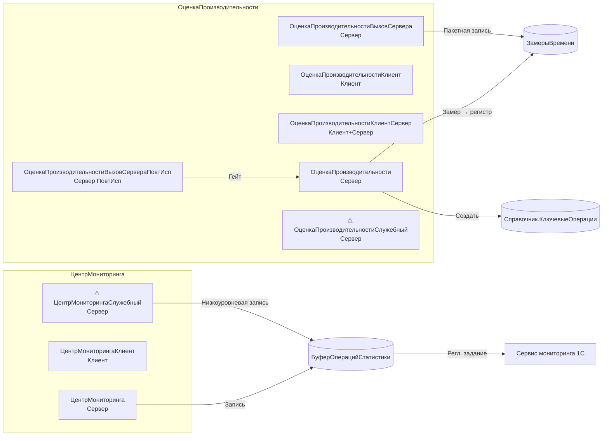

# BSP Performance Monitoring (ОценкаПроизводительности + ЦентрМониторинга)

Скил по двум связанным подсистемам БСП 3.1.11: «Оценка производительности» (APDEX-замеры по ключевым операциям) и «Центр мониторинга» (отправка обезличенной бизнес-статистики и технологических сведений в сервис 1С или сторонний сервис). Цель — научить агента правильно обрамлять бизнес-операции замерами и регистрировать произвольные количественные показатели, не дублируя эту функциональность собственными обёртками.

Это **L2-скил** (P1). Подключать после `bsp-fundamentals` (навигация по БСП) и `bsp-base-common` (общие утилиты: сообщения, безопасное хранилище, строки). Сам по себе он не покрывает длительные операции как механизм (фоновые задания) — для них есть отдельный скил по подсистеме «Длительные операции» (`bsp-longs-and-jobs`); здесь рассматривается только замер времени **внутри** длительной операции.

## When to use

- Нужно обернуть серверный метод («провести документ», «сформировать отчёт», «загрузить файл») замером APDEX и записать результат в регистр `ЗамерыВремени`.
- Нужно замерить сложную операцию с вложенными шагами (загрузка → разбор → запись в ИБ) и получить детализацию по каждому шагу.
- Нужно зарегистрировать бизнес-статистику: «сколько раз пользователь нажал кнопку», «сколько документов такого-то вида проведено за сутки», «средний размер вложения».
- Нужно программно проверить, включён ли Центр мониторинга в текущей информационной базе, и условно выполнить код (например, регистрировать событие только при включённом центре).
- Нужно программно включить или отключить подсистему «Центр мониторинга» (включая регламентное задание сбора и отправки статистики).
- Нужно программно создать новую ключевую операцию в справочнике `КлючевыеОперации` (целевое время, признак «длительная»).

## Не использовать, если

- Нужно **выполнить** длительную операцию в фоне (`ДлительныеОперации.ВыполнитьФункцию`, `ДлительныеОперацииКлиент.ВыполнитьОперацию`) — это подсистема «Длительные операции», отдельный скил.
- Нужно **планировать** регламентное задание (`РегламентныеЗаданияСервер.ДобавитьЗадание`) — это подсистема «Регламентные задания», отдельный скил.
- Нужно программно отправить отчёт об ошибке в сервис учёта ошибок 1С — это UI-механика `ЦентрМониторингаКлиент.ПоказатьНастройкиЦентраМониторинга`, не серверный API.
- Нужно измерить произвольный интервал времени «для себя» (без записи в регистр замеров) — используйте платформенный `ТекущаяУниверсальнаяДатаВМиллисекундах()` напрямую, БСП-обёртки не нужны.
- Нужна чистая запись в журнал регистрации — это `ЗаписьЖурналаРегистрации`, отдельная тема (см. `bsp-base-common`).

## Core concepts

### Две подсистемы с разными задачами

| Подсистема | Что делает | Где накапливается | Кто потребляет |
|---|---|---|---|
| `ОценкаПроизводительности` | Замеры времени **ключевых операций** по APDEX | Регистр сведений `ЗамерыВремени` | Встроенный отчёт «Оценка производительности по ключевым операциям» |
| `ЦентрМониторинга` | Обезличенная бизнес-статистика и технологические сведения | Регистр `БуферОперацийСтатистики` → регламентная отправка пакетов | Сервис 1С (Центр контроля качества) или сторонний сервис по HTTP |

Обе подсистемы **независимы по данным**, но пересекаются по инфраструктуре: `ОценкаПроизводительности` использует константу `ВыполнятьЗамерыПроизводительности` для гейтинга, `ЦентрМониторинга` — параметры `ПараметрыЦентраМониторинга` и регламентное задание `СборИОтправкаСтатистики`. Связь между ними — на уровне инфраструктуры БСП, не на уровне API.

### Семейство модулей «Оценка производительности»

| Модуль | Контекст | Зачем |
|---|---|---|
| `ОценкаПроизводительности` | Сервер, Внешнее соединение | Серверные замеры: `НачатьЗамерВремени`, `ЗакончитьЗамерВремени`, `НачатьЗамерДлительнойОперации`, `ЗакончитьЗамерДлительнойОперации`, `ЗафиксироватьЗамерДлительнойОперации`, `СоздатьКлючевуюОперацию` |
| `ОценкаПроизводительностиКлиент` | Тонкий клиент, Толстый клиент | Клиентские замеры: `ЗамерВремени` (однострочный, авто-завершение), `НачатьЗамерВремени` + `ЗавершитьЗамерВремени` (явный цикл), `УстановитьПараметрыЗамера`, `УстановитьПризнакОшибкиЗамера` |
| `ОценкаПроизводительностиКлиентСервер` | Клиент + Сервер + Внешнее | Утилиты клиент-сервер (`НеПроверятьПриоритет`, `ТолькоСимволыНациональногоАлфавитаВСтроке`) — не основное API |
| `ОценкаПроизводительностиВызовСервера` | Сервер | Пакетная запись: `ЗафиксироватьДлительностьКлючевыхОпераций(ЗамерыДляЗаписи)` — низкоуровневая запись массива замеров |
| `ОценкаПроизводительностиВызовСервераПовтИсп` | Сервер, `ПовтИсп` | Кешированная проверка `ВыполнятьЗамерыПроизводительности()` — гейтинг всех замеров |
| `ОценкаПроизводительностиГлобальный` | Глобальный | Служебные обработчики авто-замера: `ЗакончитьЗамерВремениАвто`, `ЗаписатьРезультатыАвто` |
| ⚠️ `ОценкаПроизводительностиСлужебный` | Сервер | Служебный API (внутренние регистры, инициализация) — ⚠️ обратная совместимость не гарантируется |

**Ключевая сущность** — справочник `КлючевыеОперации`. Каждой замеряемой операции соответствует **один элемент** этого справочника с именем и целевым временем. Способы передачи в `ЗакончитьЗамерВремени`:
- **Строка** (имя ключевой операции) — БСП сама найдёт/создаст элемент при записи.
- **`СправочникСсылка.КлючевыеОперации`** — если элемент уже получен через `СоздатьКлючевуюОперацию`.

### Семейство модулей «Центр мониторинга»

| Модуль | Контекст | Зачем |
|---|---|---|
| `ЦентрМониторинга` | Сервер, Внешнее соединение | Стабильный API: `ЦентрМониторингаВключен`, `ВключитьПодсистему`, `ОтключитьПодсистему`, `ИдентификаторИнформационнойБазы`, `ЗаписатьОперациюБизнесСтатистики` (простая), `ЗаписатьОперациюБизнесСтатистикиЧас` (с контролем уникальности за час), `ЗаписатьОперациюБизнесСтатистикиСутки`, `ЗаписыватьОперацииБизнесСтатистики` |
| `ЦентрМониторингаКлиент` | Тонкий клиент, Толстый клиент | UI: `ПоказатьНастройкиЦентраМониторинга`, `ЗаписатьОперациюБизнесСтатистики` (тонкий клиент, без параметров `Комментарий`/`Разделитель`) |
| `ЦентрМониторингаСлужебный` | Сервер | Служебный: `ЗаписатьОперациюБизнесСтатистикиСлужебная(ПараметрыЗаписи)`, управление регламентным заданием `СборИОтправкаСтатистики`, `ПолучитьПараметрыЦентраМониторинга` — ⚠️ обратная совместимость не гарантируется |
| `ЦентрМониторингаГлобальный` | Глобальный | Служебные обработчики периодической отправки данных клиента на сервер |
| `ЦентрМониторингаПереопределяемый` | Сервер | Крючки переопределения для прикладной конфигурации |

### Паттерн замера времени (важно)

Все методы `ОценкаПроизводительности.*Замер*` устроены как **пара «Начать → Закончить»** с пробросом контекста через возвращаемое значение:

1. `ВремяНачала = ОценкаПроизводительности.НачатьЗамерВремени()` — фиксирует UTC-время в миллисекундах, возвращает `Число`. Если замеры выключены — возвращает `0` (без ошибки).
2. *…бизнес-логика…*
3. `ОценкаПроизводительности.ЗакончитьЗамерВремени(КлючеваяОперация, ВремяНачала, …)` — пишет в регистр `ЗамерыВремени`.

Если в `ЗакончитьЗамерВремени` передан `ВремяНачала = 0` (замеры были выключены в момент старта) — запись пропускается. Это **нормально**, не требует проверки на стороне вызывающего кода.

Длительные операции устроены аналогично, но контекст — **`Соответствие`** (а не число), и поддерживаются **вложенные шаги** через `ЗафиксироватьЗамерДлительнойОперации(ОписаниеЗамера, КоличествоДанных, ИмяШага, …)`.

### Гейтинг и поведение по умолчанию

`НачатьЗамерВремени` и `ЗаписатьОперациюБизнесСтатистики` **сами** проверяют состояние подсистемы:

- `ОценкаПроизводительности.НачатьЗамерВремени` → проверяет `ВыполнятьЗамерыПроизводительности` (через `ОценкаПроизводительностиВызовСервераПовтИсп`); если выключено — возвращает `0`.
- `ЦентрМониторинга.ЗаписатьОперациюБизнесСтатистики` → проверяет `ЗаписыватьОперацииБизнесСтатистики()`; если выключено — запись в буфер не происходит.

Поэтому **не нужно** оборачивать вызовы в `Если ЦентрМониторинга.ЦентрМониторингаВключен() Тогда` — это лишнее условие. Но если логика сложнее («хочу записать в локальный лог, если центр выключен») — проверка `ЦентрМониторингаВключен` уместна.

## Key methods

| Метод | Сигнатура | Сервер/Клиент | Назначение | Стабильность | Пример вызова |
|---|---|---|---|---|---|
| `ОценкаПроизводительности.НачатьЗамерВремени` | `НачатьЗамерВремени()` → `Число` (UTC, мс) | Сервер, Внешнее соединение | Старт замера ключевой операции. Возвращает `0`, если замеры выключены | стабильный | `ВремяНачала = ОценкаПроизводительности.НачатьЗамерВремени();` |
| `ОценкаПроизводительности.ЗакончитьЗамерВремени` | `ЗакончитьЗамерВремени(КлючеваяОперация, ВремяНачала, ВесЗамера = 1, Комментарий = Неопределено, ВыполненСОшибкой = Ложь)` | Сервер, Внешнее соединение | Завершить замер и записать в регистр `ЗамерыВремени`. `КлючеваяОперация` — `Строка` или `СправочникСсылка.КлючевыеОперации` | стабильный | `ОценкаПроизводительности.ЗакончитьЗамерВремени("ПроведениеДокументаЗаказ", ВремяНачала, 1, , Ложь);` |
| `ОценкаПроизводительности.НачатьЗамерДлительнойОперации` | `НачатьЗамерДлительнойОперации(КлючеваяОперация)` → `Соответствие` (контекст замера) | Сервер, Внешнее соединение | Старт замера длительной операции. Возвращает контекст, который передаётся в `Зафиксировать…` / `Закончить…` | стабильный | `Замер = ОценкаПроизводительности.НачатьЗамерДлительнойОперации("МассоваяЗагрузкаНоменклатуры");` |
| `ОценкаПроизводительности.ЗафиксироватьЗамерДлительнойОперации` | `ЗафиксироватьЗамерДлительнойОперации(ОписаниеЗамера, КоличествоДанных, ИмяШага, Комментарий = "")` | Сервер, Внешнее соединение | Зафиксировать вложенный шаг длительной операции. Допустимо многократно для одного `ОписаниеЗамера` с разными `ИмяШага` | стабильный | `ОценкаПроизводительности.ЗафиксироватьЗамерДлительнойОперации(Замер, 100, "ЧтениеФайла");` |
| `ОценкаПроизводительности.ЗакончитьЗамерДлительнойОперации` | `ЗакончитьЗамерДлительнойОперации(ОписаниеЗамера, КоличествоДанных, ИмяШага = "", Комментарий = "")` | Сервер, Внешнее соединение | Завершить замер длительной операции. `ИмяШага = ""` → если есть вложенные шаги, фиксируется «ПоследнийШаг» | стабильный | `ОценкаПроизводительности.ЗакончитьЗамерДлительнойОперации(Замер, 1000, "ЗаписьВБД", "");` |
| `ОценкаПроизводительности.СоздатьКлючевуюОперацию` | `СоздатьКлючевуюОперацию(ИмяКлючевойОперации, ЦелевоеВремя = 1, Длительная = Ложь)` → `СправочникСсылка.КлючевыеОперации` | Сервер, Внешнее соединение | Создать (или найти) элемент справочника `КлючевыеОперации`. `Длительная = Истина` — для операций с удельным временем | стабильный | `КлючеваяОперация = ОценкаПроизводительности.СоздатьКлючевуюОперацию("ПроведениеДокументаЗаказ", 1, Ложь);` |
| `ОценкаПроизводительностиКлиент.ЗамерВремени` | `ЗамерВремени(КлючеваяОперация = Неопределено, ФиксироватьСОшибкой = Ложь, АвтоЗавершение = Истина)` → `УИДЗамера` | Тонкий клиент, Толстый клиент | Однострочный клиентский замер с авто-завершением. Сам закрывает замер при завершении работы/перед записью результата | стабильный | `УИД = ОценкаПроизводительностиКлиент.ЗамерВремени("ОткрытиеФормыДокумента");` |
| `ОценкаПроизводительностиКлиент.НачатьЗамерВремени` | `НачатьЗамерВремени(АвтоЗавершение = Истина, КлючеваяОперация = Неопределено)` → `УИДЗамера` | Тонкий клиент, Толстый клиент | Явный старт клиентского замера. Используется в паре с `ЗавершитьЗамерВремени`. `АвтоЗавершение = Ложь` → нужен явный `ЗавершитьЗамерВремени` | стабильный | `УИД = ОценкаПроизводительностиКлиент.НачатьЗамерВремени(Ложь, "ДлительнаяКлиентскаяОперация");` |
| `ОценкаПроизводительностиКлиент.ЗавершитьЗамерВремени` | `ЗавершитьЗамерВремени(УИДЗамера, ВыполненСОшибкой = Ложь)` | Тонкий клиент, Толстый клиент | Явное завершение клиентского замера. Если `АвтоЗавершение = Истина` — вызывается автоматически | стабильный | `ОценкаПроизводительностиКлиент.ЗавершитьЗамерВремени(УИД);` |
| `ЦентрМониторинга.ЦентрМониторингаВключен` | `ЦентрМониторингаВключен()` → `Булево` | Сервер, Внешнее соединение | Проверить состояние подсистемы (включена ли отправка сведений в 1С или стороннему получателю) | стабильный | `Если ЦентрМониторинга.ЦентрМониторингаВключен() Тогда …` |
| `ЦентрМониторинга.ЗаписатьОперациюБизнесСтатистики` | `ЗаписатьОперациюБизнесСтатистики(ИмяОперации, Значение, Комментарий = Неопределено, Разделитель = ".")` | Сервер, Внешнее соединение | Записать количественное значение бизнес-операции. Молча игнорирует, если запись выключена | стабильный | `ЦентрМониторинга.ЗаписатьОперациюБизнесСтатистики("Документы.ЗаказПокупателя.Проведение", 1, , ".");` |
| `ЦентрМониторинга.ЗаписатьОперациюБизнесСтатистикиЧас` | `ЗаписатьОперациюБизнесСтатистикиЧас(ИмяОперации, КлючУникальности, Значение, Замещать = Ложь)` | Сервер, Внешнее соединение | Записать операцию с уникальностью в разрезе часа. `КлючУникальности` — ≤ 100 символов. `Замещать = Истина` — перезаписывать | стабильный | `ЦентрМониторинга.ЗаписатьОперациюБизнесСтатистикиЧас("Отчеты.Продажи.Формирование", ИмяОтчета, 1, Ложь);` |
| `ЦентрМониторинга.ЗаписатьОперациюБизнесСтатистикиСутки` | `ЗаписатьОперациюБизнесСтатистикиСутки(ИмяОперации, КлючУникальности, Значение, Замещать = Ложь)` | Сервер, Внешнее соединение | То же, в разрезе суток. Подходит для счётчиков, инкрементируемых многократно за день | стабильный | `ЦентрМониторинга.ЗаписатьОперациюБизнесСтатистикиСутки("РегламентныеЗадания.Успех", ИмяЗадания, 1, Истина);` |
| ⚠️ `ЦентрМониторингаСлужебный.ЗаписатьОперациюБизнесСтатистикиСлужебная` | `ЗаписатьОперациюБизнесСтатистикиСлужебная(ПараметрыЗаписи)` | Сервер, Внешнее соединение | Низкоуровневая запись с произвольным `ПериодЗаписи` (тип 1 = час, 2 = сутки). Используется из `ЦентрМониторинга.Записать…Час/Сутки`. **Только** когда нужного метода нет в стабильном API | ⚠️ служебный | `⚠️ ЦентрМониторингаСлужебный.ЗаписатьОперациюБизнесСтатистикиСлужебная(ПараметрыЗаписи);` |

> ⚠️ **Не путать:** в роадмапе указано имя `ОценкаПроизводительности.ЗафиксироватьДлительностьКлючевойОперации` — **такого метода нет**. Эквивалент для одиночной записи — `ЗакончитьЗамерВремени` (принимает `ВремяНачала` и сам считает длительность). Эквивалент для пакетной записи — `ОценкаПроизводительностиВызовСервера.ЗафиксироватьДлительностьКлючевыхОпераций(ЗамерыДляЗаписи)` (низкоуровневый, для внутренних нужд БСП).

## Patterns

### 1. Серверный замер бизнес-операции (проведение документа)

```bsl
// В модуле документа, в обработчике «ОбработкаПроведения»
ВремяНачала = ОценкаПроизводительности.НачатьЗамерВремени();

Попытка
    // ...штатная логика проведения...
    Отказ = Ложь;
Исключение
    Отказ = Истина;
    ОценкаПроизводительности.ЗакончитьЗамерВремени(
        "Документы.ЗаказПокупателя.Проведение",
        ВремяНачала,
        1,                  // ВесЗамера
        ,
        Истина);            // ВыполненСОшибкой
    ВызватьИсключение;
КонецПопытки;

ОценкаПроизводительности.ЗакончитьЗамерВремени(
    "Документы.ЗаказПокупателя.Проведение",
    ВремяНачала);
```

`ВремяНачала` — `Число` (UTC в мс). Если замеры выключены, `НачатьЗамерВремени` вернёт `0`, а `ЗакончитьЗамерВремени(…, 0, …)` молча ничего не запишет. Дополнительных проверок не требуется.

### 2. Замер длительной операции с вложенными шагами

```bsl
// В серверном обработчике, выполняющем многошаговую операцию
Замер = ОценкаПроизводительности.НачатьЗамерДлительнойОперации("МассоваяЗагрузкаНоменклатуры");

// Шаг 1: чтение файла
ДанныеФайла = ПрочитатьФайл(ИмяФайла);
ОценкаПроизводительности.ЗафиксироватьЗамерДлительнойОперации(
    Замер,
    ДанныеФайла.КоличествоСтрок(),
    "ЧтениеФайла");

// Шаг 2: разбор
Строки = РазобратьДанные(ДанныеФайла);
ОценкаПроизводительности.ЗафиксироватьЗамерДлительнойОперации(
    Замер,
    Строки.Количество(),
    "РазборДанных");

// Шаг 3: запись в ИБ
Для Каждого Строка Из Строки Цикл
    ЗаписатьЭлемент(Строка);
КонецЦикла;

// Завершение: финальный шаг «ЗаписьВБД»
ОценкаПроизводительности.ЗакончитьЗамерДлительнойОперации(
    Замер,
    Строки.Количество(),
    "ЗаписьВБД",
    "");
```

В отчёте APDEX по этой ключевой операции будут видны **вложенные шаги** с удельным временем и весом (количество обработанных строк).

### 3. Регистрация бизнес-статистики (простой счётчик)

```bsl
// В обработчике проведения — инкремент счётчика
ЦентрМониторинга.ЗаписатьОперациюБизнесСтатистики(
    "Документы.ЗаказПокупателя.Проведение.Количество",  // ИмяОперации
    1,                                                 // Значение
    ,                                                  // Комментарий
    ".");                                               // Разделитель
```

Точка в `ИмяОперации` — это **иерархия** в дашборде центра мониторинга. Рекомендуемая конвенция: `<ТипОбъекта>.<Подтип>.<Действие>.<Сущность>` (например, `Документы.ЗаказПокупателя.Проведение.Количество`).

### 4. Счётчик с уникальностью за час

```bsl
// Несколько проведений одного документа в течение часа — пишется один раз
Для Каждого Строка Из ТаблицаДокументов Цикл
    ПровестиДокумент(Строка.Ссылка);
    ЦентрМониторинга.ЗаписатьОперациюБизнесСтатистикиЧас(
        "Документы.ЗаказПокупателя.Проведение.Факт",
        Строка.Ссылка.УникальныйИдентификатор(),  // КлючУникальности
        1,
        Ложь);                                   // Замещать = Ложь
КонецЦикла;
```

`Замещать = Ложь` → если запись с таким `КлючУникальности` за текущий час уже есть, новая запись игнорируется. `Замещать = Истина` → старая запись удаляется, новая пишется.

### 5. Условное выполнение по состоянию центра мониторинга

```bsl
// Проверить, включён ли центр, и выполнить расширенную регистрацию
Если ЦентрМониторинга.ЦентрМониторингаВключен() Тогда
    ЦентрМониторинга.ЗаписатьОперациюБизнесСтатистики(
        "Сервис.РасширеннаяРегистрация.Сессия",
        1,
        "session=" + ИмяПользователя(),
        ".");
КонецЕсли;
```

Оборачивать `ЗаписатьОперациюБизнесСтатистики` в `Если` **не нужно** — метод сам игнорирует вызов при выключенной подсистеме. Условное выполнение уместно, когда нужна **ветка кода**, отличная от простой записи (например, локальный лог + удалённая статистика).

## Anti-patterns

### ❌ Замер времени через `ТекущаяДата()` или `ТекущаяДатаСеанса()`

```bsl
// ❌ Низкая точность (секунды), нет связи с ключевой операцией
ВремяНачала = ТекущаяДата();
// ...
Сообщить("Длительность: " + (ТекущаяДата() - ВремяНачала));
```

```bsl
// ✅ Используйте ОценкаПроизводительности — точность до мс, APDEX, запись в регистр
ВремяНачала = ОценкаПроизводительности.НачатьЗамерВремени();
// ...
ОценкаПроизводительности.ЗакончитьЗамерВремени("МояОперация", ВремяНачала);
```

`ТекущаяДата()` — секунды, без часового пояса сеанса. Для замера короче секунды вернёт `0`. В БСП-замерах используется `ТекущаяУниверсальнаяДатаВМиллисекундах()` (платформенная, UTC в мс).

### ❌ Выдуманный метод `ЗафиксироватьДлительностьКлючевойОперации`

```bsl
// ❌ ОШИБКА КОМПИЛЯЦИИ: Метод объекта не обнаружен
ОценкаПроизводительности.ЗафиксироватьДлительностьКлючевойОперации(100);
```

```bsl
// ✅ Пара Начать + Закончить
ВремяНачала = ОценкаПроизводительности.НачатьЗамерВремени();
// ...операция...
ОценкаПроизводительности.ЗакончитьЗамерВремени("МояОперация", ВремяНачала);
```

### ❌ Выдуманный метод `ЦентрМониторинга.ЗаписатьОперацию`

```bsl
// ❌ ОШИБКА КОМПИЛЯЦИИ: Метод объекта не обнаружен
ЦентрМониторинга.ЗаписатьОперацию("Сервис.Тест", 1);
```

```bsl
// ✅ Полное имя метода
ЦентрМониторинга.ЗаписатьОперациюБизнесСтатистики("Сервис.Тест", 1, , ".");
```

### ❌ Вызывать `ЗакончитьЗамерВремени` без `НачатьЗамерВремени`

```bsl
// ❌ Длительность будет посчитана от "эпохи" (0 мс UTC) — огромное число
ОценкаПроизводительности.ЗакончитьЗамерВремени("МояОперация", 0);
```

```bsl
// ✅ Только в паре
ВремяНачала = ОценкаПроизводительности.НачатьЗамерВремени();
// ...
ОценкаПроизводительности.ЗакончитьЗамерВремени("МояОперация", ВремяНачала);
```

Исключение: если `НачатьЗамерВремени` вернул `0` (замеры выключены) — `ЗакончитьЗамерВремени(…, 0, …)` **молча** ничего не запишет. Это нормальный путь гейтинга.

### ❌ Использовать `ОценкаПроизводительности.НачатьЗамерВремени` на клиенте

```bsl
// ❌ ОШИБКА: модуль ОценкаПроизводительности — серверный
// В модуле управляемого приложения / команды формы:
ВремяНачала = ОценкаПроизводительности.НачатьЗамерВремени(); // ← сбой компиляции в тонком клиенте
```

```bsl
// ✅ Клиентский модуль — ОценкаПроизводительностиКлиент
УИДЗамера = ОценкаПроизводительностиКлиент.ЗамерВремени("ОткрытиеФормыДокумента");
```

Проверить контекст модуля: `ОценкаПроизводительности` помечен `<Server>true</Server>` + `<ClientOrdinaryApplication>true</ClientOrdinaryApplication>`, но **не** `<ClientManagedApplication>`. В управляемом клиенте (тонкий / веб) — только `ОценкаПроизводительностиКлиент`.

### ❌ Оборачивать регистрацию статистики в `Если ЦентрМониторингаВключен()`

```bsl
// ❌ Избыточная проверка: метод сам гейтит запись
Если ЦентрМониторинга.ЦентрМониторингаВключен() Тогда
    ЦентрМониторинга.ЗаписатьОперациюБизнесСтатистики("Сервис.Тест", 1);
КонецЕсли;
```

```bsl
// ✅ Прямой вызов — метод сам проверит состояние подсистемы
ЦентрМониторинга.ЗаписатьОперациюБизнесСтатистики("Сервис.Тест", 1, , ".");
```

`ЗаписатьОперациюБизнесСтатистики` внутри вызывает `ЗаписыватьОперацииБизнесСтатистики()` и при `Ложь` ничего не делает. Лишний `Если` — это шум в коде и потенциальный race (между проверкой и записью состояние может измениться).

### ❌ Обращаться напрямую к регистру `БуферОперацийСтатистики`

```bsl
// ❌ Прямая запись в регистр обходит служебные проверки
НаборЗаписей = РегистрыСведений.БуферОперацийСтатистики.СоздатьНаборЗаписей();
НаборЗаписей.Записать();
```

```bsl
// ✅ Через стабильный API модуля ЦентрМониторинга
ЦентрМониторинга.ЗаписатьОперациюБизнесСтатистики("Сервис.Тест", 1);
```

Регистр `БуферОперацийСтатистики` — внутреннее хранилище; структура может меняться между минорными версиями БСП. Прямая запись в обход `ЦентрМониторингаСлужебный.ЗаписатьОперациюБизнесСтатистикиСлужебная` — хрупкая интеграция.

## How to explore deeper

### Где искать модули в выгрузке конфигурации

Найди общий модуль `<Имя>` (BSL/XML) — открой область `#Область ПрограммныйИнтерфейс`, метод `<X>`. Все модули лежат в каталоге общих модулей конфигурации и физически присутствуют в репо, если подсистемы БСП «Оценка производительности» и «Центр мониторинга» подключены.

- `CommonModules/ОценкаПроизводительности/Ext/Module.bsl` — серверные замеры (`НачатьЗамерВремени`, `ЗакончитьЗамерВремени`, `НачатьЗамерДлительнойОперации`, `ЗакончитьЗамерДлительнойОперации`, `ЗафиксироватьЗамерДлительнойОперации`, `СоздатьКлючевуюОперацию`).
- `CommonModules/ОценкаПроизводительностиКлиент/Ext/Module.bsl` — клиентские замеры (`ЗамерВремени`, `НачатьЗамерВремени`, `ЗавершитьЗамерВремени`, `УстановитьПараметрыЗамера`).
- `CommonModules/ОценкаПроизводительностиВызовСервера/Ext/Module.bsl` — пакетная запись `ЗафиксироватьДлительностьКлючевыхОпераций` (низкоуровневая).
- `CommonModules/ОценкаПроизводительностиВызовСервераПовтИсп/Ext/Module.bsl` — кешированный гейт `ВыполнятьЗамерыПроизводительности()`.
- `CommonModules/ЦентрМониторинга/Ext/Module.bsl` — стабильный API центра мониторинга (`ЦентрМониторингаВключен`, `ВключитьПодсистему`, `ОтключитьПодсистему`, `ЗаписатьОперациюБизнесСтатистики` и часовые/суточные варианты).
- `CommonModules/ЦентрМониторингаКлиент/Ext/Module.bsl` — UI настроек и облегчённая запись из тонкого клиента.
- ⚠️ `CommonModules/ЦентрМониторингаСлужебный/Ext/Module.bsl` — служебный API: регламентное задание, низкоуровневая запись (`ЗаписатьОперациюБизнесСтатистикиСлужебная`).

Также в дереве метаданных:

- `Catalogs/КлючевыеОперации/` — справочник ключевых операций (имя, целевое время, признак «длительная»).
- `InformationRegisters/ЗамерыВремени/` — регистр результатов замеров (для отчёта APDEX).
- `InformationRegisters/ЗамерыВремениТехнологические/` — технологические замеры (для «Общей производительности системы»).
- `InformationRegisters/БуферОперацийСтатистики/` — буфер перед отправкой в центр мониторинга.
- `Constants/ВыполнятьЗамерыПроизводительности/` — гейт замеров.
- `Constants/ПараметрыЦентраМониторинга/` — настройки центра (хранилище значений).
- `ScheduledJobs/СборИОтправкаСтатистики/` — регламентное задание отправки пакетов.

### Grep-шаблоны

```text
# Все экспортные методы стабильного API модуля
^(Функция|Процедура) [А-Я][А-Яа-яA-Za-z_]+\(.*\) Экспорт

# Стабильная область
^#Область ПрограммныйИнтерфейс

# Служебный API (⚠️)
^#Область СлужебныйПрограммныйИнтерфейс

# Все вызовы замера в прикладном коде
ОценкаПроизводительности\.НачатьЗамерВремени

# Все вызовы регистрации бизнес-статистики
ЦентрМониторинга\.ЗаписатьОперациюБизнесСтатистики
```

### Glob-маски

- `CommonModules/ОценкаПроизводительности*/Ext/Module.bsl` — все суффиксные варианты семейства.
- `CommonModules/ЦентрМониторинга*/Ext/Module.bsl` — все варианты центра мониторинга (включая `*Служебный` и `*Переопределяемый`).
- `InformationRegisters/ЗамерыВремени*/` — все регистры замеров (основной + технологический + архивный `УдалитьЗамерыВремени3`).
- `InformationRegisters/*Статистики*/` — все регистры буфера и операций статистики.

### На что обратить внимание в формах/командах

- В формах списка/документа — наличие элемента `ГруппаЗамеров` (в формах с индикацией производительности).
- В командах объектов — вызовы `ОценкаПроизводительностиКлиент.ЗамерВремени` в обработчике `&НаКлиенте` — стандартный паттерн «замерить открытие формы».
- В модулях объектов — пары `НачатьЗамерВремени` + `ЗакончитьЗамерВремени` в `ОбработкаПроведения`, `ПередЗаписью`, `ПриЗаписи`.
- В обработчиках регламентных заданий — `ВыполнятьЗамерыПроизводительности` (через `ОценкаПроизводительностиВызовСервераПовтИсп`) перед началом работы.

### Карта модулей подсистемы


