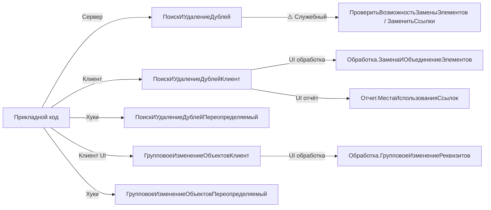

# BSP Report & Dedup (Поиск и удаление дублей, Групповое изменение объектов)

L3-скил по двум смежным подсистемам для **массовой обработки данных**:
**Поиск и удаление дублей** (программный и интерактивный поиск одинаковых элементов
справочников/планов счетов/планов видов характеристик, объединение, замена ссылок)
и **Групповое изменение объектов** (команда «Изменить выделенные» в формах списков,
форма групповой обработки реквизитов, ограничения редактируемых реквизитов).
Подсистемы тесно связаны через обработку `ГрупповоеИзменениеРеквизитов` и общий
механизм подключаемых команд.

Скил **не покрывает** печатные формы (`bsp-print-reports`), валюты и банки
(`bsp-currencies-banks`), базовые утилиты (`bsp-base-common`) и длительные операции
(`bsp-longs-and-jobs`, нужны для запуска `ЗаменитьСсылки` в фоне).

## When to use

- Нужно **программно найти дубли** для конкретного элемента справочника/плана счетов
  (например, найти все элементы номенклатуры, похожие на заданный, перед объединением).
- Нужно **нечёткое сравнение строк** по алгоритму Левенштейна-Дамерау (включая
  игнорирование регистра и порядка слов) с настраиваемыми порогами совпадения и
  списком слов-исключений (`ИП`, `ООО`, `ОАО`).
- Нужно **открыть форму объединения** дублей из обработчика команды в форме списка —
  пользователь увидит мастер сопоставления реквизитов и подтвердит замену.
- Нужно **открыть форму замены и удаления** для массива ссылок (заменить старый
  элемент на новый во всех местах использования, пометить исходный на удаление).
- Нужно **открыть отчёт «Места использования ссылок»** — где в ИБ встречается
  указанный массив ссылок (вспомогательные данные — наборы записей с ведущим
  измерением — в отчёт не включаются).
- Нужно **программно заменить одну ссылку на другую** во всей ИБ (транзакция по
  паре, контроль через модуль менеджера объекта `ВозможностьЗаменыЭлементов`,
  опциональная пометка/непосредственное удаление исходного элемента).
- Нужно **открыть форму «Изменить выделенные»** из обработчика команды формы списка —
  пользователь выберет реквизиты и установит новые значения для всех выделенных строк.
- Нужно **ограничить состав реквизитов**, доступных для группового изменения для
  конкретного объекта метаданных (через `РеквизитыРедактируемыеВГрупповойОбработке`
  / `РеквизитыНеРедактируемыеВГрупповойОбработке` в модуле менеджера).

## Не использовать, если

- Нужно сформировать **печатную форму** (табличный документ, вывод в
  `ТабличныйДокумент`) — `bsp-print-reports`.
- Нужна работа с **валютами, курсами, банками, организациями** —
  `bsp-currencies-banks`.
- Нужны **базовые утилиты** (сообщения пользователю, сериализация, безопасное
  хранилище, строки, даты) — `bsp-base-common`.
- Нужно **запустить замену ссылок в фоне** с прогрессом и отменой — оберните
  вызов `ПоискИУдалениеДублей.ЗаменитьСсылки` через `ДлительныеОперации` (см.
  `bsp-longs-and-jobs`).
- Нужно **проверить права** перед запуском массовой обработки — `bsp-users-access`
  (`УправлениеДоступом.ЧтениеРазрешено`, `Пользователи.РолиДоступны`). Обе
  подсистемы предполагают, что у вызывающего кода есть право «Изменение» на
  обрабатываемые объекты.
- Нужно **управлять версионированием объектов** при замене — `bsp-files-and-versions`.
- Нужно **очистить помеченные на удаление** объекты (не замену ссылок, а
  окончательное удаление) — отдельная подсистема, не покрыта этим скилом.

## Core concepts

### Карта «подсистема → общие модули»

Подсистемы имеют **предсказуемую** суффиксную систему имён. В отличие от
большинства подсистем, имена модулей здесь **совпадают** с именами подсистем
напрямую (без префикса `РаботаС`).

| Подсистема | Семейство общих модулей | Ключевое имя для стабильного API |
|---|---|---|
| `ПоискИУдалениеДублей` | `ПоискИУдалениеДублей`, `ПоискИУдалениеДублейКлиент`, `ПоискИУдалениеДублейПереопределяемый` | `ПоискИУдалениеДублей` (сервер), `ПоискИУдалениеДублейКлиент` (UI) |
| `ГрупповоеИзменениеОбъектов` | `ГрупповоеИзменениеОбъектов`, `ГрупповоеИзменениеОбъектовКлиент`, `ГрупповоеИзменениеОбъектовПереопределяемый` | `ГрупповоеИзменениеОбъектовКлиент` (UI), `ГрупповоеИзменениеОбъектовПереопределяемый` (хуки) |

⚠️ Модулей с суффиксами `Служебный` / `ВызовСервера` / `ПовтИсп` / `Глобальный` у
этих подсистем **нет** — служебные методы встроены в основные модули под
областью `#Область СлужебныйПрограммныйИнтерфейс`. В Key methods такие методы
отмечены явно.

### Сценарии «дедупликации»

Подсистема `ПоискИУдалениеДублей` поддерживает **три сценария**:

1. **Программный поиск дублей** — `ПоискИУдалениеДублей.НайтиДублиЭлемента` принимает
   `ОбластьПоиска` (полное имя метаданных, например `Справочник.Номенклатура`) и
   `ЭталонныйОбъект`. Возвращает `ТаблицаЗначений` с колонками `Ссылка`, `Код`,
   `Наименование`, `Родитель`, `ДругиеПоля`. Метод сам строит схему компоновки
   по доступным реквизитам, инициализирует `КомпоновщикПредварительногоОтбора`
   и через обработку `ПоискИУдалениеДублей` возвращает группы дублей.
2. **Программная замена ссылок** — `ПоискИУдалениеДублей.ЗаменитьСсылки` (⚠️
   служебный) принимает `ПарыЗамен` (соответствие `Ключ→Значение`, что заменяем
   → на что заменяем) и `АдресРезультата` для помещения `ТаблицыЗначений` с
   информацией об ошибках. Внутри — обёртка над
   `ОбщегоНазначения.ЗаменитьСсылки` (см. `bsp-base-common`).
3. **Интерактивный сценарий** — `ПоискИУдалениеДублейКлиент.ОбъединитьВыделенные`
   / `ЗаменитьВыделенные` / `ПоказатьМестаИспользования` открывают
   соответствующие формы обработки/отчёта. Обработчик в форме списка — типовой
   паттерн, описан в `## Patterns`.

### Два режима группового изменения

Подсистема `ГрупповоеИзменениеОбъектов` работает в **двух режимах**:

1. **Контролируемый** (транзакция, рекомендуемый). Если при сохранении одного
   объекта возникает ошибка — откатываются изменения во **всех** обработанных
   объектах. Это режим по умолчанию.
2. **Неконтролируемый** (вне транзакции). Каждый объект записывается
   независимо. Дополнительные флажки:
   - `ПрерыватьПоОшибке` — при ошибке остановить обработку, иначе пропустить
     проблемный объект и продолжить.

Эти режимы управляются **внутри формы** `Обработка.ГрупповоеИзменениеРеквизитов`
(доступной через `ИзменитьВыделенные`). Программного аналога «записать пакет
объектов в транзакции» в публичном API нет — для этого используется
`ПоискИУдалениеДублей.ЗаменитьСсылки` (служебный).

### Расширение прикладным кодом: переопределяемые модули

Обе подсистемы предоставляют **переопределяемые модули** для расширения
поведения в прикладной конфигурации:

- `ПоискИУдалениеДублейПереопределяемый`:
  - `ПриОпределенииОбъектовСПоискомДублей(Объекты)` — какие объекты участвуют
    в поиске дублей и какие обработчики определены в их модулях менеджеров.
  - `ПриОпределенииПараметровПоискаДублей(...)` — прикладные правила поиска.
  - `ПриПоискеДублей(...)` — пост-обработка результатов поиска.
  - `ПриОпределенииВозможностиЗаменыЭлементов(...)` — запрет замены по
    прикладным критериям (вызывается из `ПроверитьВозможностьЗаменыЭлементов`).
  - `ПриОпределенииМетодовРазрешенныхДляВызоваКакПроизвольныйКод(Методы)` —
    белый список методов, которые обработка `ГрупповоеИзменениеРеквизитов`
    может выполнить в режиме «Произвольный алгоритм» (безопасность).
- `ГрупповоеИзменениеОбъектовПереопределяемый`:
  - `ПриОпределенииОбъектовСКомандойГрупповогоИзмененияОбъектов(Объекты)` —
    в каких формах списков выводить команду «Изменить выделенные».
  - `ПриОпределенииОбъектовСРедактируемымиРеквизитами(Объекты)` — для каких
    объектов менять состав доступных реквизитов через функции
    `РеквизитыРедактируемыеВГрупповойОбработке` /
    `РеквизитыНеРедактируемыеВГрупповойОбработке` в модуле менеджера.
  - `ПриОпределенииРедактируемыхРеквизитовОбъекта(Объект, РедактируемыеРеквизиты,
    НередактируемыеРеквизиты)` — программное ограничение для конкретного
    объекта метаданных.

**Анти-паттерн:** реализовывать эти хуки в основных модулях
(`ПоискИУдалениеДублей`, `ГрупповоеИзменениеОбъектовКлиент`) — нельзя. Хуки
должны быть в одноимённых `*Переопределяемый` модулях **прикладной** конфигурации.

### Объекты метаданных

- `Обработка.ПоискИУдалениеДублей` — обработка помощника поиска дублей.
- `Обработка.ЗаменаИОбъединениеЭлементов` — формы объединения и замены.
- `Обработка.ГрупповоеИзменениеРеквизитов` — основная форма групповой обработки.
- `Отчет.МестаИспользованияСсылок` — отчёт по местам использования.
- `ОбщийМакет.КомпонентаПоискаСтрок` — внешняя компонента `FuzzyStringMatchExtension`
  (используется `НайтиПохожиеСтроки`).

## Key methods

| Метод | Сигнатура | Сервер/Клиент | Стабильность | Назначение | Пример вызова |
|---|---|---|---|---|---|
| `ПоискИУдалениеДублей.НайтиДублиЭлемента` | `НайтиДублиЭлемента(Знач ОбластьПоиска, Знач ЭталонныйОбъект, Знач ДополнительныеПараметры)` | Сервер | стабильный | Программный поиск дублей по эталону. `ОбластьПоиска` — полное имя метаданных (`Справочник.Номенклатура`). Возвращает `ТаблицаЗначений` с колонками `Ссылка`, `Код`, `Наименование`, `Родитель`, `ДругиеПоля` | `Дубли = ПоискИУдалениеДублей.НайтиДублиЭлемента("Справочник.Номенклатура", Элемент, Неопределено)` |
| `ПоискИУдалениеДублей.НайтиПохожиеСтроки` | `НайтиПохожиеСтроки(ИсходнаяСтрока, СтрокаПоиска, Разделитель = "~", ПараметрыПоиска = Неопределено)` | Сервер | стабильный | Нечёткий поиск строк (Левенштейн-Дамерау, без учёта регистра и порядка слов). `ИсходнаяСтрока` — набор строк через `Разделитель` (`"~"` по умолчанию). Возвращает `Строка` — индексы похожих строк через запятую (нумерация с 0) | `Индексы = ПоискИУдалениеДублей.НайтиПохожиеСтроки("Стол~Стул~Тумба", "Стол")` |
| `ПоискИУдалениеДублей.ПараметрыПоискаПохожихСтрок` | `ПараметрыПоискаПохожихСтрок(ПодключитьКомпоненту = Истина)` | Сервер | стабильный | Возвращает `Структура` настроек для `НайтиПохожиеСтроки`: `ПроцентСовпаденияСтрок` (90), `ПроцентСовпаденияНебольшихСтрок` (80), `ДлинаНебольшихСтрок` (30), `СловаИсключения` (Массив), `КомпонентаПоиска` (ОбъектВнешнейКомпоненты). Передавать кэшированную структуру в `НайтиПохожиеСтроки` для оптимизации массовых вызовов | `Параметры = ПоискИУдалениеДублей.ПараметрыПоискаПохожихСтрок(Ложь)` |
| `ПоискИУдалениеДублей.ДополнитьДублиСвязаннымиПодчиненнымиОбъектами` | `ДополнитьДублиСвязаннымиПодчиненнымиОбъектами(ПарыЗамен, ПараметрыЗамены)` | Сервер | стабильный | Дополняет `ПарыЗамен` (Соответствие вида «что заменяем → на что») связанными подчинёнными объектами (например, при замене контрагента — заменить и его банковский счёт). `ПараметрыЗамены` — структура из `ОбщегоНазначения.ПараметрыЗаменыСсылок` | `ПоискИУдалениеДублей.ДополнитьДублиСвязаннымиПодчиненнымиОбъектами(ПарыЗамен, ПараметрыЗамены)` |
| `ПоискИУдалениеДублейКлиент.ОбъединитьВыделенные` | `ОбъединитьВыделенные(Знач ОбъединяемыеЭлементы, ДополнительныеПараметры = Неопределено)` | Клиент | стабильный | Открывает форму мастера объединения элементов. `ОбъединяемыеЭлементы` — `ТаблицаФормы`, `Массив из ЛюбаяСсылка` или `СписокЗначений` с реквизитом `Ссылка` | `ПоискИУдалениеДублейКлиент.ОбъединитьВыделенные(Элементы.Список)` |
| `ПоискИУдалениеДублейКлиент.ЗаменитьВыделенные` | `ЗаменитьВыделенные(Знач ЗаменяемыеЭлементы, ДополнительныеПараметры = Неопределено)` | Клиент | стабильный | Открывает форму замены и удаления. `ЗаменяемыеЭлементы` — то же, что в `ОбъединитьВыделенные`. В форме пользователь выбирает новые значения и подтверждает замену | `ПоискИУдалениеДублейКлиент.ЗаменитьВыделенные(Элементы.Список)` |
| `ПоискИУдалениеДублейКлиент.ПоказатьМестаИспользования` | `ПоказатьМестаИспользования(Знач Элементы, Знач ПараметрыОткрытия = Неопределено)` | Клиент | стабильный | Открывает отчёт `МестаИспользованияСсылок` с отбором по переданным ссылкам. Вспомогательные данные (наборы записей с ведущим измерением) **не включаются** | `ПоискИУдалениеДублейКлиент.ПоказатьМестаИспользования(Элементы.Список)` |
| `ГрупповоеИзменениеОбъектовКлиент.ИзменитьВыделенные` | `ИзменитьВыделенные(СписокЭлемент, Знач СписокРеквизит = Неопределено)` | Клиент | стабильный | Открывает форму `Обработка.ГрупповоеИзменениеРеквизитов` для выделенных строк списка. `СписокРеквизит` — `ДинамическийСписок` формы (опционально, для передачи отбора) | `ГрупповоеИзменениеОбъектовКлиент.ИзменитьВыделенные(Элементы.Список, Список)` |
| `ПоискИУдалениеДублей.ПроверитьВозможностьЗаменыЭлементов` | `ПроверитьВозможностьЗаменыЭлементов(ПарыЗамен, ПараметрыЗамены)` | Сервер | ⚠️ **служебный** | Проверяет допустимость замены: опрашивает `ВозможностьЗаменыЭлементов` модуля менеджера объекта (если определён) и `ПоискИУдалениеДублейПереопределяемый.ПриОпределенииВозможностиЗаменыЭлементов`. Возвращает `Соответствие` (пустое, если замена разрешена) | `Ошибки = ПоискИУдалениеДублей.ПроверитьВозможностьЗаменыЭлементов(ПарыЗамен, ПараметрыЗамены)` |
| `ПоискИУдалениеДублей.ЗаменитьСсылки` | `ЗаменитьСсылки(Параметры, Знач АдресРезультата)` | Сервер | ⚠️ **служебный** | Программная замена ссылок во всей ИБ. `Параметры.ПарыЗамен` — соответствие `что→на что`, `Параметры.СпособУдаления` — `""` / `"Пометка"` / `"Непосредственно"`. Результат (таблица с колонками `Ссылка`, `ОбъектОшибки`, `ТипОшибки`, `ТекстОшибки`) помещается в `АдресРезультата` (временное хранилище). **Обёртка над `ОбщегоНазначения.ЗаменитьСсылки`** с принудительным `ВключатьБизнесЛогику = Истина` | `ПоискИУдалениеДублей.ЗаменитьСсылки(Параметры, АдресРезультата)` |

## Patterns

### 1. Программный поиск дублей номенклатуры перед объединением

```bsl
// Сервер, например в регламентном задании или обработке
ПарыЗамен = Новый Соответствие;
Эталон = Справочники.Номенклатура.НайтиПоНаименованию("Стол обеденный");

Если Эталон.Пустая() Тогда
    Возврат;
КонецЕсли;

Дубли = ПоискИУдалениеДублей.НайтиДублиЭлемента(
    "Справочник.Номенклатура", Эталон, Неопределено);

Для Каждого СтрокаДубля Из Дубли Цикл
    Если СтрокаДубля.Ссылка = Эталон Тогда
        Продолжить;
    КонецЕсли;
    ПарыЗамен.Вставить(СтрокаДубля.Ссылка, Эталон);
КонецЦикла;

Если ПарыЗамен.Количество() = 0 Тогда
    Возврат;
КонецЕсли;

// Проверить допустимость замены
ПараметрыЗамены = ОбщегоНазначения.ПараметрыЗаменыСсылок();
ПараметрыЗамены.СпособУдаления = "Пометка";
Ошибки = ПоискИУдалениеДублей.ПроверитьВозможностьЗаменыЭлементов(ПарыЗамен, ПараметрыЗамены);
Если Ошибки.Количество() > 0 Тогда
    // ...вывести ошибки пользователю через ОбщегоНазначения.СообщитьПользователю
    Возврат;
КонецЕсли;

// Дополнить связанными объектами (банковский счёт, ключи аналитики и т. п.)
ПоискИУдалениеДублей.ДополнитьДублиСвязаннымиПодчиненнымиОбъектами(ПарыЗамен, ПараметрыЗамены);

// Запустить замену (лучше в фоне — см. bsp-longs-and-jobs)
АдресРезультата = ПоместитьВоВременноеХранилище(Неопределено, УникальныйИдентификатор);
Параметры = Новый Структура("ПарыЗамен, СпособУдаления", ПарыЗамен, "Пометка");
ПоискИУдалениеДублей.ЗаменитьСсылки(Параметры, АдресРезультата);
```

`НайтиДублиЭлемента` сам строит схему компоновки, инициализирует отбор и через
обработку `ПоискИУдалениеДублей` получает группы дублей. Метод учитывает
прикладные правила (`ПриОпределенииПараметровПоискаДублей`) и обработчик
`ПриПоискеДублей` для пост-обработки.

### 2. Команда «Объединить выделенные» в форме списка

```bsl
// Модуль формы списка справочника
&НаКлиенте
Процедура Подключаемый_ОбъединитьВыделенные(Команда)
    ПоискИУдалениеДублейКлиент.ОбъединитьВыделенные(Элементы.Список);
КонецПроцедуры

&НаКлиенте
Процедура Подключаемый_ПоказатьМестаИспользования(Команда)
    ПоискИУдалениеДублейКлиент.ПоказатьМестаИспользования(Элементы.Список);
КонецПроцедуры
```

При использовании подсистемы `ПодключаемыеКоманды` (см. `bsp-commands-external`)
эти команды добавляются автоматически через `ПоискИУдалениеДублей` —
в `ПриОпределенииКомандПодключенныхКОбъекту`. Если подсистема подключаемых
команд не используется — добавить команды в форму вручную, как показано.

### 3. Команда «Изменить выделенные» в форме списка

```bsl
// Модуль формы списка справочника (например, Контрагенты)
&НаКлиенте
Процедура Подключаемый_ИзменитьВыделенные(Команда)
    МожноРедактировать = Истина;
    Для Каждого ВыделеннаяСтрока Из Элементы.Список.ВыделенныеСтроки Цикл
        ТекДанные = Элементы.Список.ДанныеСтроки(ВыделеннаяСтрока);
        Если ТекДанные <> Неопределено
            И НЕ ТекДанные.Ссылка.Пустая()
            И НЕ ТекДанные.Ссылка.ПометкаУдаления Тогда
            Продолжить;
        КонецЕсли;
        МожноРедактировать = Ложь;
        Прервать;
    КонецЦикла;
    
    Элементы.ФормаИзменитьВыделенные.Видимость = МожноРедактировать;
    
    Если МожноРедактировать Тогда
        ГрупповоеИзменениеОбъектовКлиент.ИзменитьВыделенные(Элементы.Список, Список);
    КонецЕсли;
КонецПроцедуры
```

Типовая рекомендация из документации БСП: управлять видимостью команды
«Изменить выделенные» по доступности прав «Изменение» и отсутствию пометки
удаления хотя бы у одной выделенной строки. Сам `ИзменитьВыделенные` не
проверяет права — это делает платформа при записи объектов.

### 4. Ограничение редактируемых реквизитов через модуль менеджера

```bsl
// Модуль менеджера справочника Контрагенты
Функция РеквизитыНеРедактируемыеВГрупповойОбработке() Экспорт
    Результат = Новый Массив;
    Результат.Добавить("ИНН");
    Результат.Добавить("КПП");
    Результат.Добавить("ОсновнойДоговорКонтрагента");
    Возврат Результат;
КонецФункции
```

И зарегистрировать в `ГрупповоеИзменениеОбъектовПереопределяемый`:

```bsl
// ГрупповоеИзменениеОбъектовПереопределяемый (прикладная конфигурация)
Процедура ПриОпределенииОбъектовСРедактируемымиРеквизитами(Объекты) Экспорт
    Объекты.Вставить(Метаданные.Справочники.Контрагенты.ПолноеИмя(),
        "РеквизитыНеРедактируемыеВГрупповойОбработке");
КонецПроцедуры
```

`РеквизитыНеРедактируемыеВГрупповойОбработке` имеет приоритет над
`РеквизитыРедактируемыеВГрупповойОбработке` при заполнении обоих списков.

## Anti-patterns

### ❌ Вызывать `ПоискИУдалениеДублей.ЗаменитьСсылки` без проверки допустимости

```bsl
// ❌ Замена пройдёт без проверки прикладных правил (ВозможностьЗаменыЭлементов)
Параметры = Новый Структура("ПарыЗамен, СпособУдаления", ПарыЗамен, "");
ПоискИУдалениеДублей.ЗаменитьСсылки(Параметры, Адрес);
```

```bsl
// ✅ Сначала проверить допустимость через служебный метод
ПараметрыЗамены = ОбщегоНазначения.ПараметрыЗаменыСсылок();
ПараметрыЗамены.СпособУдаления = "Пометка";
Ошибки = ПоискИУдалениеДублей.ПроверитьВозможностьЗаменыЭлементов(ПарыЗамен, ПараметрыЗамены);
Если Ошибки.Количество() > 0 Тогда
    Возврат;  // вывести ошибки через СообщитьПользователю
КонецЕсли;
ПоискИУдалениеДублей.ЗаменитьСсылки(Параметры, Адрес);
```

`ЗаменитьСсылки` — ⚠️ служебный метод: обратная совместимость **не гарантируется**,
а вызов без `ПроверитьВозможностьЗаменыЭлементов` может обойти прикладные правила
замены (запрет менять валюту в проведённых документах, запрет менять
организацию при закрытом периоде и т. п.).

### ❌ Запускать `НайтиПохожиеСтроки` без `ПараметрыПоискаПохожихСтрок` в цикле

```bsl
// ❌ Каждый вызов заново подключает внешнюю компоненту — дорого по времени
Для Каждого Запрос Из МассивЗапросов Цикл
    Индексы = ПоискИУдалениеДублей.НайтиПохожиеСтроки(ИсходнаяСтрока, Запрос);
КонецЦикла;
```

```bsl
// ✅ Один раз получить параметры (с подключённой компонентой) и переиспользовать
Параметры = ПоискИУдалениеДублей.ПараметрыПоискаПохожихСтрок();  // ПодключитьКомпоненту = Истина
Для Каждого Запрос Из МассивЗапросов Цикл
    Индексы = ПоискИУдалениеДублей.НайтиПохожиеСтроки(ИсходнаяСтрока, Запрос, "~", Параметры);
КонецЦикла;
```

`ПараметрыПоискаПохожихСтрок(Ложь)` — тоже валидный сценарий, если компонента
уже подключена где-то выше по стеку. Передача `ПараметрыПоиска` в
`НайтиПохожиеСтроки` — штатный путь оптимизации.

### ❌ Вызывать `ИзменитьВыделенные` для ссылок без проверки `ИзменитьВыделенные` в форме

```bsl
// ❌ Открывает форму, но платформа при записи упадёт с нарушением прав
ГрупповоеИзменениеОбъектовКлиент.ИзменитьВыделенные(Элементы.Список);
```

```bsl
// ✅ Проверить право "Изменение" до открытия формы
Если НЕ ПравоДоступа("Изменение", Метаданные.Справочники.Контрагенты) Тогда
    Возврат;
КонецЕсли;
ГрупповоеИзменениеОбъектовКлиент.ИзменитьВыделенные(Элементы.Список, Список);
```

`ИзменитьВыделенные` не делает проверок прав — форма откроется, но запись
упадёт при первой ошибке доступа. Проверять право нужно в вызывающем коде
(или `УправлениеДоступом.ИзменениеРазрешено` для учёта RLS).

### ❌ Добавлять кнопки «Объединить выделенные» / «Места использования» в форму вручную при подключённой подсистеме `ПодключаемыеКоманды`

```bsl
// ❌ Дублирование — подключаемые команды уже добавляют эти кнопки
//    автоматически через ПоискИУдалениеДублей.ПриОпределенииКомандПодключенныхКОбъекту
```

```bsl
// ✅ Один из двух путей:
//    1) Использовать ПодключаемыеКоманды.ПриСозданииНаСервере (bsp-commands-external) —
//       команды "Объединить выделенные..." и "Заменить выделенные..." появятся
//       автоматически в подменю "Сервис" формы списка.
//    2) Если ПодключаемыеКоманды не используются — добавить кнопки вручную и
//       в обработчике вызвать ПоискИУдалениеДублейКлиент.ОбъединитьВыделенные
//       (см. Pattern 2).
```

### ❌ Вызывать `ПоискИУдалениеДублей.ТипыИсключаемыеИзВозможныхДублей` из прикладного кода

```bsl
// ❌ Метод в #Область СлужебныйПрограммныйИнтерфейс — обратная совместимость
//    не гарантируется. Вызывается самой подсистемой при поиске дублей.
```

```bsl
// ✅ Если нужно расширить состав исключаемых типов — реализовать хук
//    ИнтеграцияПодсистемБСП.ПриДобавленииТиповИсключаемыхИзВозможныхДублей
//    в прикладной конфигурации (см. §Ключевые переопределяемые модули выше).
```

## How to explore deeper

### Модули семейства (имена для поиска в дереве конфигурации)

- `ПоискИУдалениеДублей` (сервер) — `#Область ПрограммныйИнтерфейс`
  (`НайтиДублиЭлемента`, `НайтиПохожиеСтроки`, `ПараметрыПоискаПохожихСтрок`,
  `ДополнитьДублиСвязаннымиПодчиненнымиОбъектами`),
  `#Область СлужебныйПрограммныйИнтерфейс`
  (`ТипыИсключаемыеИзВозможныхДублей`, `ПроверитьВозможностьЗаменыЭлементов`,
  `ПроверитьВозможностьЗаменыЭлементовСтрока`, `ОпределитьМестаИспользования`,
  `НастройкиОбъектовМетаданных`, `ОбъектыСПоискомДублей`, `ЗаменитьСсылки`),
  `#Область ОбработчикиСобытийПодсистемКонфигурации` (события подключаемых
  команд, вариантов отчётов), `#Область СлужебныеПроцедурыИФункции` (внутреннее).
- `ПоискИУдалениеДублейКлиент` (клиент) — `#Область ПрограммныйИнтерфейс`
  (`ОбъединитьВыделенные`, `ЗаменитьВыделенные`, `ПоказатьМестаИспользования`),
  `#Область СлужебныйПрограммныйИнтерфейс`
  (`ИмяФормыОбработкиПоискИУдалениеДублей`).
- `ПоискИУдалениеДублейПереопределяемый` (сервер) — хуки прикладной
  конфигурации (см. Core concepts).
- `ГрупповоеИзменениеОбъектов` (сервер) — `#Область ДляВызоваИзДругихПодсистем`
  (подключение команды через подсистему `ПодключаемыеКоманды`).
- `ГрупповоеИзменениеОбъектовКлиент` (клиент) — `#Область ПрограммныйИнтерфейс`
  (`ИзменитьВыделенные`), `#Область СлужебныйПрограммныйИнтерфейс`
  (`ОбработчикКоманды`, `НачатьИзменениеВыделенныхСОповещением`).
- `ГрупповоеИзменениеОбъектовПереопределяемый` (сервер) — хуки прикладной
  конфигурации.

### Grep-шаблон

```text
# Найти экспортные методы основного модуля ПоискИУдалениеДублей
^(Функция|Процедура) [А-Я][А-Яа-я]+\(.*\) Экспорт

# Стабильный API модуля
^#Область ПрограммныйИнтерфейс

# Служебный API (⚠️ — обратная совместимость не гарантируется)
^#Область СлужебныйПрограммныйИнтерфейс

# Хуки переопределяемого модуля (прикладной код — реализация, не вызов)
ПриОпределенииОбъектовСПоискомДублей|ПриОпределенииПараметровПоискаДублей|ПриПоискеДублей|ПриОпределенииВозможностиЗаменыЭлементов|ПриОпределенииМетодовРазрешенныхДляВызоваКакПроизвольныйКод

# Хуки группового изменения (прикладной код — реализация, не вызов)
ПриОпределенииОбъектовСКомандойГрупповогоИзмененияОбъектов|ПриОпределенииОбъектовСРедактируемымиРеквизитами|ПриОпределенииРедактируемыхРеквизитовОбъекта
```

### Mermaid — карта модулей подсистем


