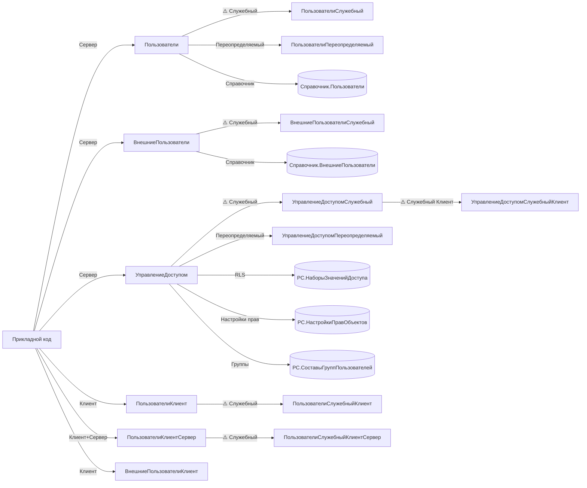

# BSP Users & Access (Пользователи / УправлениеДоступом / ВнешниеПользователи)

Скил по подсистемам **Пользователи**, **УправлениеДоступом** и **ВнешниеПользователи** — основной API для работы с текущим пользователем сеанса, ролями и ограничениями доступа на уровне записей (RLS). Покрывает все три подсистемы, потому что они тесно связаны концептуально: «кто сейчас в сеансе», «какие роли у него есть», «что ему разрешено на уровне записей».

Не покрывает: создание/удаление пользователей ИБ (см. служебный слой `ПользователиСлужебный`), политику паролей, формы ввода логина/пароля, разграничение по группам доступа (отдельные подсистемы уровня L2/L3).

## When to use

- Нужно в прикладном коде получить **текущего пользователя сеанса** как `СправочникСсылка.Пользователи` — для подстановки в реквизит «Ответственный», «Автор» и т. п.
- Нужно отличить вход **обычного пользователя** от входа **внешнего пользователя** (контрагент, партнёр, общий сценарий B2B-портала) и корректно обработать оба варианта.
- Нужно проверить, что у текущего пользователя есть конкретная **роль конфигурации** или **профиль полных прав**, чтобы открыть административный интерфейс.
- Нужно **до выполнения запроса** проверить на уровне записей (RLS), что пользователю разрешено **чтение/изменение** конкретного объекта или набора записей, и при запрете — сгенерировать исключение.
- Нужно проверить, что у пользователя настроено **право на объект** (по правилам `УправлениеДоступомПереопределяемый.ПриЗаполненииВозможныхПравДляНастройкиПравОбъектов`): например, «УправлениеПравами», «Чтение», «ИзменениеПапок» для папки файлов.
- Нужно программно **открыть форму настройки прав доступа** из управляемой формы (в обработчике команды).

## Не использовать, если

- Нужны **безопасные общие утилиты** (`СообщитьПользователю`, `ЗаписатьДанныеВБезопасноеХранилище`, форматирование строк) — переключайтесь на `bsp-base-common`.
- Нужно **создать/изменить/удалить пользователя ИБ** из прикладного кода — `Пользователи.СоздатьПользователяИБ` **не существует** в БСП 3.1.11. Прямое программное создание пользователей ИБ — служебная задача уровня конфигурации (`ПользователиСлужебный.ЗаписатьПользователяИБ` принимает `ПользовательОбъект` и `ПараметрыОбработки` — формат меняется между версиями, обратная совместимость не гарантируется).
- Нужна **политика паролей** (сложность, длина, срок действия) — это `ПользователиСлужебный.ОбновитьПолитикуПаролей*`, отдельная подсистема.
- Нужна **форма интерактивной авторизации** (ввод логина/пароля ОС или OpenID) — такой формы в `ПользователиКлиент` нет. Используется платформенный `ПользователиИнформационнойБазы.НайтиПоИмени()` или `ВвестиЗначение()`.
- Нужен **поиск пользователей ИБ** по произвольному отбору — `Пользователи.НайтиПоИмени`, `НайтиПоИдентификатору`, `НайтиПоСсылке` (стабильный API, но узкая задача; в этом скиле не покрывается).
- Задача вне БСП (типовое расширение без вызовов БСП-модулей).

## Core concepts

### Архитектура подсистемы

В БСП 3.1.11 «пользователи и доступ» — это **три отдельные подсистемы верхнего уровня** в `СтандартныеПодсистемы`:

| Подсистема | Назначение |
|---|---|
| `Пользователи` | Учётные записи пользователей ИБ, их связь со справочником `Пользователи`, роли, группы пользователей |
| `ВнешниеПользователи` | Справочник `ВнешниеПользователи` (контрагенты, партнёры) с привязкой к пользователю ИБ — для B2B-порталов и SaaS-конфигураций |
| `УправлениеДоступом` | RLS на уровне записей, группы доступа, профили, настройки прав на объекты через `УправлениеДоступомПереопределяемый` |

Все три подсистемы **тесно интегрированы**: сеанс, открытый внешним пользователем, требует `ВнешниеПользователи.ТекущийВнешнийПользователь()`, а не `Пользователи.ТекущийПользователь()` (последний в этом случае бросает исключение). Метод `Пользователи.АвторизованныйПользователь()` — универсальная обёртка, возвращающая тот или иной тип ссылки в зависимости от того, кто вошёл.

### Карта «подсистема → общие модули»

| Подсистема | Стабильные модули | Служебные / клиентские варианты |
|---|---|---|
| `Пользователи` | `Пользователи`, `ПользователиКлиентСервер`, `ПользователиПереопределяемый` | `ПользователиКлиент`, `ПользователиСлужебный` (⚠️ без гарантий), `ПользователиСлужебныйКлиент`, `ПользователиСлужебныйКлиентСервер`, `ПользователиСлужебныйПовтИсп` |
| `ВнешниеПользователи` | `ВнешниеПользователи` | `ВнешниеПользователиКлиент`, `ВнешниеПользователиСлужебный` (⚠️) |
| `УправлениеДоступом` | `УправлениеДоступом`, `УправлениеДоступомПереопределяемый` | `УправлениеДоступомСлужебный` (⚠️), `УправлениеДоступомСлужебныйКлиент`, `УправлениеДоступомСлужебныйКлиентСервер`, `УправлениеДоступомСлужебныйВызовСервера` (⚠️), `УправлениеДоступомСлужебныйПовтИсп` |

**⚠️ `УправлениеДоступомКлиент` (без префикса `Служебный`) — не существует.** Если нужен клиентский код подсистемы «Управление доступом» (например, обработчики полей формы настройки прав) — это `УправлениеДоступомСлужебныйКлиент` со всеми вытекающими ограничениями стабильности.

**⚠️ `ПользователиСлужебный.СоздатьПользователяИБ` — не существует** (см. таблицу Key methods ниже). В модуле `ПользователиСлужебный` есть `ЗаписатьПользователяИБ(ПользовательОбъект, ПараметрыОбработки)` и `УдалитьПользователяИБ(ПользовательОбъект, ПараметрыОбработки)` — но они принимают готовый объект и формат `ПараметрыОбработки` не задокументирован как стабильный.

### Сценарий «кто в сеансе» — три функции, разная семантика

| Функция | Возвращает | Когда бросает исключение | Когда использовать |
|---|---|---|---|
| `Пользователи.ТекущийПользователь()` | `СправочникСсылка.Пользователи` | Если в сеансе — внешний пользователь | Код, который **не поддерживает** внешних пользователей |
| `ВнешниеПользователи.ТекущийВнешнийПользователь()` | `СправочникСсылка.ВнешниеПользователи` | Если в сеансе — обычный пользователь | Код, который работает **только** с внешними |
| `Пользователи.АвторизованныйПользователь()` | `СправочникСсылка.Пользователи` или `СправочникСсылка.ВнешниеПользователи` | Никогда | Код, который **поддерживает оба** варианта |

Проверка `Пользователи.ЭтоСеансВнешнегоПользователя()` нужна, чтобы выбрать, какую из двух «типизированных» функций звать, и в какой справочник записывать.

### `ЕстьПраво` vs `ЕстьРоль` vs `РолиДоступны`

Три функции, легко спутать:

| Функция | Что проверяет | Где смотреть «разрешения» |
|---|---|---|
| `УправлениеДоступом.ЕстьПраво(Право, СсылкаНаОбъект, Пользователь)` | Настроено ли **право** (из `УправлениеДоступомПереопределяемый.ПриЗаполненииВозможныхПравДляНастройкиПравОбъектов`) для конкретного объекта с учётом наследования | В настройках прав объекта, в группах доступа, в иерархии папок |
| `УправлениеДоступом.ЕстьРоль(Роль, СсылкаНаОбъект, Пользователь)` | Есть ли **роль конфигурации** (дополнительное право) в одном из профилей групп доступа, в которых участвует пользователь, с учётом RLS на чтение | В профилях групп доступа |
| `Пользователи.РолиДоступны(ИменаРолей, Пользователь, УчитыватьПривилегированныйРежим)` | Доступна ли хотя бы одна из указанных **ролей конфигурации** напрямую (без учёта RLS) | В ролях пользователя ИБ |

**Не путать** `ЕстьПраво` с `ЧтениеРазрешено`/`ИзменениеРазрешено`: первое — про «доп. права на объект» (например, «УправлениеПравами» на папку файлов), вторые — про RLS на чтение/изменение.

### Области в общем модуле БСП

Каждый модуль `Пользователи*`, `УправлениеДоступом*`, `ВнешниеПользователи*` разделён на области:

- `#Область ПрограммныйИнтерфейс` — стабильный API, можно вызывать из прикладного кода.
- `#Область СлужебныйПрограммныйИнтерфейс` — экспортные методы для внутренних нужд БСП, **обратная совместимость не гарантируется**. В Key methods этого скила — **только** стабильные методы. Если вынуждены использовать служебный — отметьте это ⚠️ в коде.
- `#Область СлужебныеПроцедурыИФункции` — не экспорт, не вызывать.

## Key methods

| Метод | Сигнатура | Сервер/Клиент | Назначение | Пример вызова | Стабильность |
|---|---|---|---|---|---|
| `Пользователи.ТекущийПользователь` | `ТекущийПользователь()` | Сервер | Текущий пользователь как `СправочникСсылка.Пользователи`. Бросает исключение, если в сеансе внешний пользователь | `ТекПользователь = Пользователи.ТекущийПользователь();` | стабильный |
| `Пользователи.АвторизованныйПользователь` | `АвторизованныйПользователь()` | Сервер | Универсальная обёртка: возвращает ссылку на `Пользователи` или `ВнешниеПользователи` в зависимости от того, кто вошёл | `ТекПользователь = Пользователи.АвторизованныйПользователь();` | стабильный |
| `Пользователи.ЭтоСеансВнешнегоПользователя` | `ЭтоСеансВнешнегоПользователя()` | Сервер | `Истина`, если в сеансе внешний пользователь | `Если Пользователи.ЭтоСеансВнешнегоПользователя() Тогда ...` | стабильный |
| `Пользователи.ЭтоПолноправныйПользователь` | `ЭтоПолноправныйПользователь(Пользователь = Неопределено, ПроверятьПраваАдминистрированияСистемы = Ложь, УчитыватьПривилегированныйРежим = Истина)` | Сервер | Проверка ролей `ПолныеПрава`/`АдминистраторСистемы` (с учётом привилегированного режима) | `Если Пользователи.ЭтоПолноправныйПользователь(, Истина) Тогда ОткрытьАдминку();` | стабильный |
| `Пользователи.РолиДоступны` | `РолиДоступны(ИменаРолей, Пользователь = Неопределено, УчитыватьПривилегированныйРежим = Истина)` | Сервер | Доступна ли хотя бы одна из указанных ролей (через запятую). `ИменаРолей` — строка имён ролей через `,` | `Если Пользователи.РолиДоступны("ДобавлениеИзменениеСправочников,ЧтениеКадровыхДанных") Тогда ...` | стабильный |
| `ПользователиКлиент.ТекущийПользователь` | `ТекущийПользователь()` | Клиент | То же, что `Пользователи.ТекущийПользователь`, но с клиента (тонкий/толстый клиент) | `ТекПользователь = ПользователиКлиент.ТекущийПользователь();` | стабильный |
| `ПользователиКлиент.АвторизованныйПользователь` | `АвторизованныйПользователь()` | Клиент | Универсальная обёртка с клиента | `ТекПользователь = ПользователиКлиент.АвторизованныйПользователь();` | стабильный |
| `ПользователиКлиент.ЭтоПолноправныйПользователь` | `ЭтоПолноправныйПользователь(ПроверятьПраваАдминистрированияСистемы = Ложь)` | Клиент | Проверка «полных прав» с клиента (только для текущего пользователя) | `Если ПользователиКлиент.ЭтоПолноправныйПользователь(Истина) Тогда ...` | стабильный |
| `ПользователиКлиентСервер.ТекущийПользователь` | `ТекущийПользователь()` | Клиент + Сервер | Общий (без серверного вызова) вариант для кросс-контекстных модулей | `ТекПользователь = ПользователиКлиентСервер.ТекущийПользователь();` | стабильный |
| `ПользователиКлиентСервер.ТекущийВнешнийПользователь` | `ТекущийВнешнийПользователь()` | Клиент + Сервер | Общий вариант для внешних пользователей | `ТекВнешний = ПользователиКлиентСервер.ТекущийВнешнийПользователь();` | стабильный |
| `ПользователиКлиентСервер.ЭтоСеансВнешнегоПользователя` | `ЭтоСеансВнешнегоПользователя()` | Клиент + Сервер | Универсальная проверка типа сеанса (из общего модуля) | `Если ПользователиКлиентСервер.ЭтоСеансВнешнегоПользователя() Тогда ...` | стабильный |
| `ВнешниеПользователи.ТекущийВнешнийПользователь` | `ТекущийВнешнийПользователь()` | Сервер | Текущий внешний пользователь как `СправочникСсылка.ВнешниеПользователи`. Бросает исключение, если в сеансе обычный пользователь | `ТекВнешний = ВнешниеПользователи.ТекущийВнешнийПользователь();` | стабильный |
| `ВнешниеПользователи.ИспользоватьВнешнихПользователей` | `ИспользоватьВнешнихПользователей()` | Сервер | `Истина`, если подсистема внешних пользователей внедрена (через `ВнешниеПользователиСлужебный.ВнешниеПользователиВнедрены()`) | `Если ВнешниеПользователи.ИспользоватьВнешнихПользователей() Тогда ...` | стабильный |
| `ВнешниеПользователи.ПолучитьОбъектАвторизацииВнешнегоПользователя` | `ПолучитьОбъектАвторизацииВнешнегоПользователя(ВнешнийПользователь = Неопределено)` | Сервер | Получить объект-«контрагент» (или иной владелец), к которому привязан внешний пользователь | `Контрагент = ВнешниеПользователи.ПолучитьОбъектАвторизацииВнешнегоПользователя(ТекВнешний);` | стабильный |
| `УправлениеДоступом.ЧтениеРазрешено` | `ЧтениеРазрешено(ОписаниеДанных, Пользователь = Неопределено)` | Сервер | RLS-проверка чтения для ссылки, ключа записи или набора записей | `Если УправлениеДоступом.ЧтениеРазрешено(СсылкаНаДокумент) Тогда ...` | стабильный |
| `УправлениеДоступом.ИзменениеРазрешено` | `ИзменениеРазрешено(ОписаниеДанных, Пользователь = Неопределено)` | Сервер | RLS-проверка изменения. Для нового объекта — только объект в памяти, для ссылки — только БД | `Если УправлениеДоступом.ИзменениеРазрешено(ДокументОбъект) Тогда ...` | стабильный |
| `УправлениеДоступом.ПроверитьЧтениеРазрешено` | `ПроверитьЧтениеРазрешено(ОписаниеДанных)` | Сервер (процедура) | То же, что `ЧтениеРазрешено`, но при запрете **бросает исключение** | `УправлениеДоступом.ПроверитьЧтениеРазрешено(СсылкаНаДокумент);` | стабильный |
| `УправлениеДоступом.ЕстьПраво` | `ЕстьПраво(Право, СсылкаНаОбъект, Знач Пользователь = Неопределено)` | Сервер | Проверка «права на объект» из `УправлениеДоступомПереопределяемый.ПриЗаполненииВозможныхПравДляНастройкиПравОбъектов` с учётом иерархии | `Если УправлениеДоступом.ЕстьПраво("ИзменениеПапок", ПапкаФайлов) Тогда ...` | стабильный |
| `УправлениеДоступом.ЕстьРоль` | `ЕстьРоль(Знач Роль, Знач СсылкаНаОбъект = Неопределено, Знач Пользователь = Неопределено)` | Сервер | Есть ли у пользователя **роль** в профиле групп доступа (с учётом RLS на чтение) | `Если УправлениеДоступом.ЕстьРоль("ДобавлениеИзменениеПапокФайлов", ПапкаФайлов) Тогда ...` | стабильный |
| `ПользователиСлужебный.АвторизоватьТекущегоПользователяПриВходе` | `АвторизоватьТекущегоПользователяПриВходе(РегистрироватьВЖурнале)` | Сервер | ⚠️ Проверяет возможность входа (блокировка, дубли, обновление паролей). Вызывается из обработчика `УстановкаПараметровСеанса`, **не** из прикладного кода | `ПользователиСлужебный.АвторизоватьТекущегоПользователяПриВходе(Истина);` | ⚠️ служебный |

## Patterns

### 1. Получить ссылку текущего пользователя один раз в начале серверного вызова

```bsl
// В серверной процедуре/функции
ТекущийПользователь = Пользователи.АвторизованныйПользователь();
// ...далее используем кэшированное значение, не дёргая функцию повторно
```

**Если код поддерживает внешних пользователей** — всегда используйте `АвторизованныйПользователь()`, а не `ТекущийПользователь()`. Последний бросает исключение, если вход выполнил внешний пользователь, и прикладной код упадёт в неожиданном месте.

### 2. Проверить право чтения перед запросом данных

```bsl
// Перед выполнением тяжёлого запроса — проверить RLS один раз
Если Не УправлениеДоступом.ЧтениеРазрешено(СсылкаНаДокумент) Тогда
    ВызватьИсключение СтрШаблон("Чтение документа %1 запрещено", СсылкаНаДокумент);
КонецЕсли;

// Или — сокращённый вариант с автоматическим исключением
УправлениеДоступом.ПроверитьЧтениеРазрешено(СсылкаНаДокумент);
```

`ЧтениеРазрешено` использует `Пользователь = Неопределено` для текущего. Если нужно проверить права **другого** пользователя — передавайте вторым параметром (требуются административные права, привилегированный режим не учитывается).

### 3. Проверить «полные права» перед открытием админки

```bsl
// В обработчике команды формы
Если ПользователиКлиент.ЭтоПолноправныйПользователь(Истина) Тогда
    // Истина = проверить не только ПолныеПрава, но и АдминистраторСистемы
    ОткрытьФорму("Обработка.НастройкиПрограммы.Форма");
КонецЕсли;
```

`ЭтоПолноправныйПользователь` на **сервере** принимает `Пользователь` (можно проверить произвольного). На **клиенте** — только текущего.

### 4. Работа с внешним пользователем

```bsl
// В коде, который явно рассчитан на внешних пользователей
Если ВнешниеПользователи.ИспользоватьВнешнихПользователей()
   И Пользователи.ЭтоСеансВнешнегоПользователя() Тогда
    ТекВнешний = ВнешниеПользователи.ТекущийВнешнийПользователь();
    Контрагент  = ВнешниеПользователи.ПолучитьОбъектАвторизацииВнешнегоПользователя(ТекВнешний);
    // ... дальше работаем с Контрагентом
КонецЕсли;
```

**Сначала** проверяем `ЭтоСеансВнешнегоПользователя()`, **потом** зовём `ВнешниеПользователи.ТекущийВнешнийПользователь()` — иначе последний бросит исключение.

### 5. Проверка нескольких ролей

```bsl
// Проверить, что у пользователя есть хотя бы одна из трёх ролей
Если Пользователи.РолиДоступны("ДобавлениеИзменениеСправочников,ЧтениеКадровыхДанных,Администрирование") Тогда
    // ...
КонецЕсли;
```

`ИменаРолей` — **строка** с именами через запятую, не массив. Если хотите проверить одну роль — `Пользователи.РолиДоступны("ИмяРоли")` (запятая не нужна). `Пользователи.РолиДоступны` дополнительно вернёт `Истина`, если пользователь — полноправный (с учётом флага `УчитыватьПривилегированныйРежим`).

## Anti-patterns

### ❌ Хранить `ИмяПользователя()` в реквизитах документов

```bsl
// ❌ ИмяПользователя() — платформенный, возвращает строку; при смене имени ломает логику
ДокументОбъект.Ответственный = ИмяПользователя();
```

```bsl
// ✅ Ссылка на пользователя БСП — стабильный идентификатор
ДокументОбъект.Ответственный = Пользователи.АвторизованныйПользователь();
```

`ИмяПользователя()` — платформенный глобальный метод (не БСП). Меняется администратором — старые ссылки в отчётах «уезжают». БСП-обёртка возвращает **ссылку** на справочник `Пользователи`, привязанную к записи в `ПользователиИнформационнойБазы` через `ИдентификаторПользователяИБ`.

### ❌ Использовать `РольДоступна()` напрямую

```bsl
// ❌ Платформенный метод, не учитывает полноправность и привилегированный режим
Если РольДоступна("ПолныеПрава") Тогда
```

```bsl
// ✅ БСП-обёртка корректно учитывает и ПолныеПрава, и привилегированный режим
Если Пользователи.ЭтоПолноправныйПользователь(, Истина) Тогда
```

`Пользователи.ЭтоПолноправныйПользователь(, Истина)` проверяет роль `АдминистраторСистемы` (второй параметр — `ПроверятьПраваАдминистрированияСистемы = Истина`). Если нужна только роль `ПолныеПрава` — второй параметр `Ложь` (по умолчанию).

### ❌ Обходить `УправлениеДоступом` и писать собственные RLS-фильтры

```bsl
// ❌ Своя «оптимизация» через «Если РольДоступна("ЧтениеДокументов») Тогда»
Запрос = Новый Запрос("ВЫБРАТЬ * ИЗ Документ.Заказ ГДЕ ...");
```

```bsl
// ✅ Делегировать проверку подсистеме УправлениеДоступом — она учитывает RLS, группы доступа, профили
УправлениеДоступом.ПроверитьЧтениеРазрешено(СсылкаНаДокумент);
```

RLS в 1С настраивается через `УправлениеДоступомПереопределяемый.ПриЗаполненииВозможныхПравДляНастройкиПравОбъектов` + регистры сведений `НаборыЗначенийДоступа`, `НастройкиПравОбъектов`. Свои проверки через `Если РольДоступна` — **анти-паттерн**: они не учитывают RLS-ограничения, действующие на конкретный объект, и расходятся с моделью безопасности БСП.

### ❌ Вызывать несуществующий `Пользователи.СсылкаТекущегоПользователя`

```bsl
// ❌ ОШИБКА КОМПИЛЯЦИИ: Метод объекта не обнаружен
ТекСсылка = Пользователи.СсылкаТекущегоПользователя();
```

```bsl
// ✅ ТекущийПользователь() ВОЗВРАЩАЕТ ссылку — отдельный метод не нужен
ТекСсылка = Пользователи.ТекущийПользователь();
```

В БСП 3.1.11 функции `Пользователи.СсылкаТекущегоПользователя` нет. `ТекущийПользователь()` сам возвращает `СправочникСсылка.Пользователи` — отдельный «геттер» не нужен.

### ❌ Вызывать несуществующий `ПользователиКлиент.Авторизоваться`

```bsl
// ❌ ОШИБКА КОМПИЛЯЦИИ: Метод объекта не обнаружен
ПользователиКлиент.Авторизоваться();
```

```bsl
// ✅ Прочитать текущего пользователя с клиента через существующий метод
ТекПользователь = ПользователиКлиент.АвторизованныйПользователь();
```

`ПользователиКлиент.Авторизоваться` — типовая ошибка «по аналогии» с `Зарегистрироваться`/`Авторизоваться` из других библиотек. В БСП 3.1.11 этой функции нет. Если нужна интерактивная форма ввода логина/пароля — это либо платформенный `ПользователиИнформационнойБазы.НайтиПоИмени()`, либо собственная форма в прикладной конфигурации.

### ❌ Неправильная сигнатура `УправлениеДоступом.ЕстьПраво(Право, Метаданные)`

```bsl
// ❌ ОШИБКА КОМПИЛЯЦИИ: слишком мало аргументов (или «Метаданные» вместо «СсылкаНаОбъект»)
УправлениеДоступом.ЕстьПраво("Чтение", Метаданные.Справочники.Файлы);
```

```bsl
// ✅ Правильная сигнатура: право + ссылка на конкретный объект + (опц.) пользователь
Если УправлениеДоступом.ЕстьПраво("Чтение", СсылкаНаПапку) Тогда
```

`ЕстьПраво` проверяет настройки **прав на конкретный объект** (с учётом наследования в иерархии папок), а не настройки метаданных в целом. Второй аргумент — `СправочникСсылка.Файлы`/`ПланВидовХарактеристикСсылка` и т. п. **— ссылка на владельца прав из `УправлениеДоступомПереопределяемый.ПриЗаполненииВозможныхПравДляНастройкиПравОбъектов`**.

### ❌ Лезть в `ПользователиСлужебный.СоздатьПользователяИБ`

```bsl
// ❌ ОШИБКА КОМПИЛЯЦИИ: Метод объекта не обнаружен
ПользователиСлужебный.СоздатьПользователяИБ(ОписаниеПользователя);
```

```bsl
// ✅ Программное создание пользователя — через объект и Записать (⚠️ служебный слой)
НовыйПользователь = Справочники.Пользователи.СоздатьЭлемент();
НовыйПользователь.Наименование = ФИО;
// ...заполнить реквизиты
НовыйПользователь.Записать();
// Создание пользователя ИБ — отдельный шаг, реализуется через служебный
// ПользователиСлужебный.ЗаписатьПользователяИБ(ПользовательОбъект, ПараметрыОбработки),
// формат ПараметрыОбработки — нестабильный, см. ПользователиСлужебный модуль
```

`ПользователиСлужебный.СоздатьПользователяИБ` — **не существует**. Создание пользователя ИБ в БСП 3.1.11 идёт через `ЗаписатьПользователяИБ(ПользовательОбъект, ПараметрыОбработки)`, и эта функция принимает **уже заполненный объект справочника** (плюс `ПараметрыОбработки` — структуру с дополнительными настройками). Из прикладного кода создание пользователя — задача **уровня внедрения**, а не прикладной разработки.

## How to explore deeper

### Какие общие модули изучить

- `Пользователи` (стабильный API) — `ОбщегоНазначения`-аналог для пользователей: `ТекущийПользователь`, `АвторизованныйПользователь`, `ЭтоСеансВнешнегоПользователя`, `ЭтоПолноправныйПользователь`, `РолиДоступны`, поиск (`НайтиПоИмени`, `НайтиПоИдентификатору`, `НайтиПоСсылке`), `НовоеОписаниеПользователяИБ`.
- `ПользователиКлиент` (клиент) — зеркало `Пользователи` для клиентского контекста: `ТекущийПользователь`, `АвторизованныйПользователь`, `ЭтоСеансВнешнегоПользователя`, `ЭтоПолноправныйПользователь`.
- `ПользователиКлиентСервер` (общий) — кросс-контекстные обёртки, не делающие серверный вызов: `ТекущийПользователь`, `ТекущийВнешнийПользователь`, `АвторизованныйПользователь`, `ЭтоСеансВнешнегоПользователя`.
- `ПользователиПереопределяемый` — «крючки» для переопределения поведения БСП в прикладной конфигурации (например, `ПриОпределенииНазначенияРолей`). **Не вызывать, только переопределять**.
- `УправлениеДоступом` (стабильный API) — RLS, группы доступа, профили, настройки прав на объекты: `ЧтениеРазрешено`, `ИзменениеРазрешено`, `ПроверитьЧтениеРазрешено`, `ПроверитьИзменениеРазрешено`, `ЕстьПраво`, `ЕстьРоль`, `ПраваДоступаКДанным`, `ВключитьПрофильПользователю`, `ВыключитьПрофильПользователю`, `ОграничиватьДоступНаУровнеЗаписей`, `ПроизводительныйВариант`, `ЗаполнитьНаборыЗначенийДоступа`, `НастроитьОтборыДинамическогоСписка`.
- `УправлениеДоступомПереопределяемый` — переопределение видов доступа, возможных прав, текстов ограничений доступа. **Не вызывать, только переопределять**.
- `УправлениеДоступомСлужебный` (⚠️ служебный) — внутренние функции RLS, регистры `НаборыЗначенийДоступа`, обновление прав. Не использовать из прикладного кода без явной отметки.
- `УправлениеДоступомСлужебныйКлиент` (⚠️ служебный) — обработчики формы настройки прав: `ЗначенияДоступаПриИзменении`, `ВидыДоступаПриАктивизацииСтроки`, `ПоказатьПраваПользователяНаТаблицы`. Используется БСП-формами, не вызывайте из своего кода напрямую.
- `ВнешниеПользователи` (стабильный API) — `ТекущийВнешнийПользователь`, `ИспользоватьВнешнихПользователей`, `ПолучитьОбъектАвторизацииВнешнегоПользователя`, `ГруппаВсеВнешниеПользователи`, `НастроитьОтображениеСпискаВнешнихПользователей`.
- `ВнешниеПользователиКлиент` — клиентский вариант, `ТекущийВнешнийПользователь` (для тонкого клиента, где нужна работа с внешними пользователями в UI).

### Grep-шаблоны

```text
# Найти все экспортные методы модуля (для оценки размера API)
^(Функция|Процедура) [А-ЯA-Za-z_]+

# Стабильный API внутри модуля
^#Область ПрограммныйИнтерфейс

# Служебный API (⚠️ — обратная совместимость не гарантируется)
^#Область СлужебныйПрограммныйИнтерфейс

# Проверить существование метода в модуле
^(Функция|Процедура) <ИмяМетода>\(.*\) Экспорт

# Поиск всех вызовов ТекущийПользователь (кто и где использует)
\b(Пользователи|ПользователиКлиент|ПользователиКлиентСервер)\.ТекущийПользователь\b
```

### Glob-маски

- `CommonModules/Пользователи*/Ext/Module.bsl` — все суффиксные варианты модуля `Пользователи` (включая `ПользователиСлужебный*`, `ПользователиПереопределяемый`, `ПользователиКлиент*`).
- `CommonModules/УправлениеДоступом*/Ext/Module.bsl` — все варианты `УправлениеДоступом` (включая `УправлениеДоступомСлужебный*`, `УправлениеДоступомПереопределяемый`).
- `CommonModules/ВнешниеПользователи*/Ext/Module.bsl` — все варианты `ВнешниеПользователи` (включая `ВнешниеПользователиКлиент`, `ВнешниеПользователиСлужебный*`).
- `Catalogs/Пользователи/Ext/ObjectModule.bsl` — модуль объекта справочника `Пользователи` (содержит подписки на события, в т. ч. `ПользовательОбъектПередЗаписью` из `ПользователиСлужебный`).
- `InformationRegisters/НаборыЗначенийДоступа/` — регистр RLS-ограничений (для глубокой отладки проблем доступа).
- `InformationRegisters/НастройкиПравОбъектов/` — настройки прав на объекты (для `ЕстьПраво`).
- `InformationRegisters/СоставыГруппПользователей/` — связь пользователей с группами (нужен для понимания `ЕстьРоль`).

### На что обратить внимание в дереве метаданных

- **Справочник `Пользователи`** и связанный с ним `Справочник.ВнешниеПользователи` — оба содержат реквизит `ИдентификаторПользователяИБ` (тип `УникальныйИдентификатор`), связывающий запись справочника с записью в `ПользователиИнформационнойБазы`.
- **Регистры сведений RLS** в подсистеме `УправлениеДоступом` — `НаборыЗначенийДоступа`, `НастройкиПравОбъектов`, `ПраваПоЗначениямДоступа`. Любые проблемы с `ЧтениеРазрешено`/`ИзменениеРазрешено` начинаются с диагностики этих регистров.
- **Подписки на события** в `ПользователиСлужебный` — `ПользовательОбъектПередЗаписью`, `ПользовательОбъектПередУдалением`, `ОбновитьВнешнегоПользователяПриЗаписи`. Срабатывают при программной записи элементов справочников.
- **Определяемые типы** в подсистеме — `ВладелецЗначенийДоступа`, `ЗначениеДоступа`, `Пользователь` (для `УправлениеДоступом`).

### Mermaid — карта модулей подсистемы


