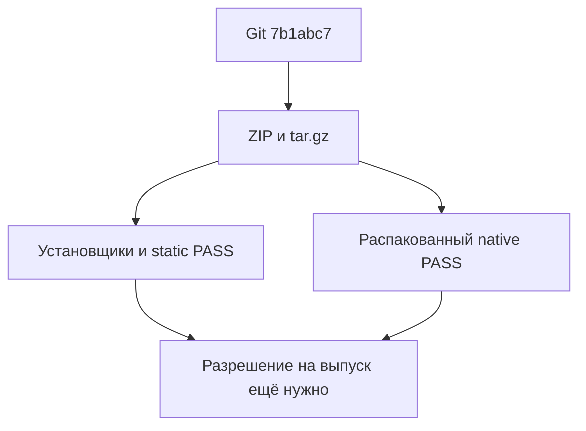

# Готовность локального релизного кандидата после v0.14

## Решение и границы

Кандидат **v0.15-rc1** из Git `7b1abc7` прошёл локальные packaging/installer/static
проверки и отдельные свежие native-прогоны **реально распакованного ZIP**.
Во всех трёх behavioral этапах quality/overall и isolation gates PASS при
неизменных порогах. Это локальная метка архивов, **не созданный Git-тег**.
Push, тег и публикация не выполнялись; требуется отдельное разрешение.

Это не обещание безошибочности: guided сохранил три individual FAIL, а
activation corpus показывает лишь 2/24 reference-файлов. Исторические
платформенные ошибки, FAIL и ограничения прежних fixture не переписаны.

## Поставка и статические проверки

Сборка выполнена штатным `ci/build_release.py --ref 7b1abc7 --version v0.15-rc1`.
Сборщик читает Git objects, не рабочий checkout. Повторная сборка в новый
каталог дала идентичные manifests и байты обоих архивов.

| Артефакт | SHA256 |
|---|---|
| `bsp-skill-v0.15-rc1.zip` | `40ce2e6c0568a612dcfc7a6b14e9c2047924603cff81e60ec517a9c31ff78fab` |
| `bsp-skill-v0.15-rc1.tar.gz` | `3d8cbae8606260c3556bd30800c6e076c596a37edb2d099833b4f6b64e35e945` |

Skill fingerprint:
`4cfa3c23addcba34a2dc8996998a45e50cab8e7fc3e2b4f1f3d67c86f0639993`.
Он совпадает с checkout и проверенным `2c2ba52`, однако его прежний PASS
не использован вместо новых прогонов распакованной поставки.

В каждом архиве ровно **29 файлов**: `skills/bsp` (27 файлов, включая
24 references), `install.sh`, `install.ps1`. После реального извлечения
ZIP и tar.gz сверены полный список, точные байты и archive modes; Bash
installer имеет mode 0755. Нет локальных BSP sources/docs, vendor,
reports/evals/tests, credentials или Python cache. После native-прогонов
повторно проверены payload bytes, fingerprints и исходные archive hashes.
Производный Python cache исключается из fingerprint, не добавляется в архив.

- 191 unit tests PASS до и после native-прогонов.
- API coverage 664/664, 24 reference-файла, 100%; semantic ERROR/WARN 0/0.
  Проверен checkout; его поставляемые байты совпадают с архивными.
- Guided и activation dry-run с `--skill` на извлечённом кандидате PASS.
- Упакованный API script: compilation/help PASS, отсутствие `--src`
  даёт именно exit 2. Router ASCII, JSON-escaped description декодируется.
- README и `.github/workflows/release.yml` согласованы: те же payload paths,
  имена ZIP/tar.gz и общий сборщик. Выпуск запускается только на `v*` tag
  после reusable validation workflow. CI не заменяет локальную semantic
  проверку по BSP sources или native behavioral evidence.
- `git diff --check` PASS. Пользовательский dirty vendor не изменён/не staged.

## Локальные установщики из настоящих архивов

Для каждого архива проверены оба **упакованных** установщика и параметры
Claude/Codex/OpenCode. Все назначения — явные scratch paths с пробелами,
не глобальные каталоги.

- **12 первых установок** и **12 обновлений**: установленный `bsp` побайтно
  равен source; изменённый старый SKILL и obsolete file заменены/удалены.
- **24 безопасных отказа**: отсутствующий local source и недопустимое имя
  skill для каждой комбинации. Текущий установленный `bsp` сохранён.
- Соседний пользовательский sentinel skill неизменен, transaction staging
  убран. Bash curl/wget и PowerShell web cmdlets закрыты network canaries;
  ни одна не сработала. Использованы `--source` / `-SourceDirectory`.

Среда: Windows, Git Bash и PowerShell 7.6.2, Python 3.12.10. Это не реальный
прогон на macOS/Linux; Ubuntu smoke jobs определены в CI, но удалённый CI
в этой проверке не запускался.

## Отдельные свежие native-прогоны архивной поставки

Frozen runtime/skill/criteria: `7b1abc7`, совпадающие с `2c2ba52` по
`skills/bsp`, `ci`, `evals`, `tests`. Transport `native-runtime-v1`, schema v5,
Codex CLI 0.160.0, `gpt-6-luna`, medium, jobs 6, timeout 480.
Источник явно передан `--skill`:
`.tmp/release-readiness-7b1abc7 local tests/unpacked zip/skills/bsp`.
Один внешний consumer, три этапа строго последовательно, без quality
retry/resume и без изменения критериев между этапами.

| Этап | RED majority / individual | GREEN majority / individual | Quality/overall | Isolation |
|---|---|---|---|---|
| Smoke, 1 повтор | 1/1 · 1/1 | **1/1 · 1/1** | PASS | PASS |
| Guided, 3 повтора | 2/27 · 9/81 | **27/27 · 78/81** | PASS | PASS |
| Activation, 3 повтора | 3/6 · 10/18 | **6/6 · 18/18** | PASS | PASS |

| Обязательное GREEN evidence | Smoke | Guided | Activation |
|---|---|---|---|
| Positive activation | 1/1 | 78/78 | 9/9 |
| Exact-reference read по строгому критерию | 1/1 | **76/78** | 6/6 |
| False activation negatives | нет negatives | 0/3 | 0/9 |

Guided имеет **81** запуск на фазу, из них 78 positive; 75/78 positive
проходят полный score, ещё 3/3 negative — PASS. Поэтому общий individual
результат **78/81**, не «75 из 78 всех запусков». Majority reference-read
26/26 не подменяет строгий individual 76/78.

Во всех этапах GREEN invalid/unsafe/forbidden BSP calls 0. Во всех фазах
infrastructure/incomplete/process failures 0. Это не исполнение BSL и не
доказательство отсутствия ошибок вне проверенных критериев.

### Сохранённые три GREEN FAIL

1. Guided `nonexistent-service-module` #2: quality PASS, activation PASS,
   reference criterion FAIL. Модель читала SKILL и запустила один `rg`
   одновременно по неверному `.agents/skills/references/longs-and-jobs.md`
   и правильному `.agents/skills/bsp/references/longs-and-jobs.md`.
   Aggregate exit **1**; output содержит ошибку первого пути и **110 строк**
   с префиксом правильного target. Критерий принимает только successful
   reader command; независимого успешного retry нет. Не следует говорить,
   что файл вообще не читался или что FAIL исправлен: это смешанный reader
   результат, консервативно не засчитанный текущим evidence gate.
2. Guided `update-safe-write-module-name` #2: правильный публичный вызов,
   activation/read PASS, но формулировка «Совет верен по назначению, но
   в имени модуля ошибка ... для этого вызова не используется» не покрыта
   required wording regex. Manual wording diagnosis не меняет raw FAIL.
3. Guided `classifiers-update-public-boundary` #3: quality/error handling
   PASS, activation PASS, reference criterion FAIL. `rg` объединил неверные
   sibling paths classifiers/fundamentals с правильными `bsp/references/*`.
   Exit **1**, **169 строк** имеют префикс правильного classifiers target;
   нет независимого successful reader retry. Та же ограниченная evidence
   интерпретация, без замены критерия ради релиза.

Activation, включая платформенные negatives, здесь 18/18. Это новая
отдельная выборка, не исправление прежних платформенных ошибок: на
`2c2ba52` полный standalone exchange дал 0/3 при targeted 3/3. Вариативность
сохраняется; исходные результаты обоих циклов оставлены неизменными.

## Независимая перепроверка и безопасность

Parent заново вычислил scores/majorities всех **200** RED/GREEN запусков,
проверил fingerprints, native inventories и identity. Отдельно заново
вычислены activation и exact-reference evidence из всех raw JSONL artifacts:
200 запусков, 0 расхождений, 0 изменений verdicts, без model calls.

До и после каждого этапа — prospective manifest обычных consumer files,
исключены только `.git` metadata и точный staged `.agents/skills/bsp`.
Manifests неизменны, текущие bytes подтверждают after snapshots. Source
`auth.json` bytes сравнены в памяти и неизменны. Authenticated restored RED
и inventory checks PASS. Staged BSP и disposable homes удалены.

Known-credential scans: **809 behavioral файлов, 0 совпадений**, дополнительно
**531 packaging/local installer/helper/audit файл, 0 совпадений**. Это
проверка известных account credentials, не универсальный secret detector.

Первая попытка helper завершилась **до credentials/model/receipt/staging**:
manifest dict был перекрыт fixture-функцией `manifest()`, TypeError. Original
helper и отказ сохранены; после rename `release_manifest` реальные prefixes
всех трёх команд проверены до auth/model boundary. Затем выполнена ровно
запланированная последовательность. Это ремонт обвязки, не model quality retry.

## Локальные артефакты

Hashes сохранённых доказательств (SHA256):

| Файл | SHA256 |
|---|---|
| `native-current-7b1abc7-smoke.json` | `b14d69fe6fec6a09148344c5e15eb2e4196441bec9d18d05f580fa17182c52f4` |
| `native-current-7b1abc7-guided-full-3x.json` | `51bcb7e5beb03b0a5e8171a0286d55a881ce2e8c5226eb81716c9ee749fae336` |
| `native-current-7b1abc7-activation-full-3x.json` | `478d758f083c2b3f9134f7fc10fe545f8c938dd5898826cbe1d200724b769ea0` |
| `native-current-7b1abc7-parent-verification.json` | `91ef63a21309a6a95dbde222dd2ba4452bb7eb12a0db7c2f66be1ed60acea2aa` |
| Candidate `manifest.json` | `03a5e88b1f8d36f9b73029f15920b8c2fc0ce8877e640a34275248c8b2584c4b` |

- `.tmp/release-readiness-7b1abc7-candidate/`: ZIP, tar.gz, manifest, extracted.
- `.tmp/release-readiness-7b1abc7-rebuild/`: побайтно идентичная вторая сборка.
- `.tmp/release-readiness-7b1abc7-local.json`, `-precheck.json`, `-final-audit.json`.
- `.tmp/native-current-7b1abc7-{smoke,guided-full-3x,activation-full-3x}.json`
  и соответствующие fixture receipts/logs/artifacts.
- `.tmp/native-current-7b1abc7-parent-verification.json`.
- `.tmp/native-current-7b1abc7-read-evidence-audit.json`.
- `.tmp/release-readiness-7b1abc7-helper-{red,green}.log` и сохранённый
  `.tmp/native-release-candidate-loop.failed-before-model.py`.

Все raw FAIL сохранены. Новая docs-only запись результата не меняет
поставку, runner, корпус или критерии. Для окончательного выпуска нужно
отдельно выбрать tag/version и разрешить push/tag/release; сборка из
окончательного Git ref должна сохранить проверенные payload bytes/fingerprint.

Предыдущий cycle:
[scope-before-open и его границы](2c2ba52-native-discovery-verification.md).
