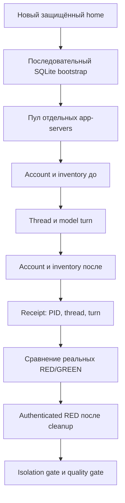

# P0 — native runtime: commit → run → fix → rerun

Дата: 2026-10-08. Новый профиль `native-runtime-v1`, не эквивалентный
историческому `exec`. Скил v0.14 и quality thresholds не менялись.
**Runtime-inventory часть P0 закрыта для `native-runtime-v1`:** свежий полный
baseline и оба gate PASS. Уточнение по ревью 2026-10-09: обычные consumer-файлы
не входят в inventory gate. Отдельный ретроспективный аудит подтвердил
нейтральный текст наблюдаемых RED/GREEN чтений README, но полного исторического
manifest нет; закрытие всех критериев P0 не доказано.
[Fixture audit и границы resume](v0.14-0749271-review-followup.md).
Исторический/стандартный `exec` не получает native доказательства;
его ограничения остаются. Числа и исходные behavioral reports ниже не изменены.

## Зафиксированные итерации

| Итерация | Код | Проверка | Результат |
|---|---|---|---|
| 0 | `926fa24` | Native preflight без модели | PASS положительной пробы, корректный отказ постороннему проектному скилу |
| 1 | `f32469a` | `message-bound-to-field`, RED/GREEN 1×, native | INFRA FAIL до model turn: обе фазы отклонили `account/read`; model tokens 0 |
| 2 | `59653f4` | Новый RED/GREEN smoke 1× | RED 1/1, GREEN 1/1; isolation и общий gate PASS, infra 0 |
| 2 resume | `59653f4` | Тот же отчёт, новый disposable home | PASS без новых model turns; сохранённые receipts и restored control совпали |
| 3 | Runtime-код `59653f4`, документы `563f516` | Независимый smoke 3× | GREEN 3/3 individual, RED 1/3; isolation и общий gate PASS, infra 0 |
| 4 | Тот же runtime-код | Полный native baseline 27 × 3 × 2 | GREEN 27/27 majority, 79/81 individual; общий/isolation gate FAIL из-за пяти cold-start RED процессов |
| 5 | `3cae3de` | Smoke после serialized bootstrap | RED/GREEN 1/1, isolation/общий gate PASS |
| 6 | `3cae3de` | Свежий полный baseline 27 × 3 × 2 | GREEN 27/27 majority, 77/81 individual; isolation/общий gate PASS, infra 0 |
| 6 resume | `3cae3de` | Полный отчёт в новом disposable home | PASS без новых model turns, gates пересчитаны после authenticated bootstrap/cleanup |

Исходный FAIL не переписан: `.tmp/native-runtime-message-r1.json` и соседние
artifacts. На каждый model run отдельный app-server, protected disposable
`CODEX_HOME`; оригинальный auth.json проверен неизменным после итерации 1.

### Причина итерации 1 и исправление

Sanitized native diagnostic уточнил RPC error:
`workspace routing discovery failed`. Фильтр parent environment удалял
необходимые `HTTP_PROXY`/`HTTPS_PROXY`, хотя их значения не содержали credentials.
После разрешения **только** credential-free proxy URL (без userinfo/query/
fragment/произвольного path) отдельный `account/read` возвращает ChatGPT account.
API keys, provider overrides, integration tokens и proxy credentials не
передаются. Endpoint-настройки входят в environment fingerprint.

Native RPC error details теперь сохраняются только после redaction credentials;
raw config/auth RPC в artifacts не записываются. Старый preflight по-прежнему
не публикует raw RPC error messages.

Независимое ревью обнаружило недостаточное доказательство авторизации
post-cleanup контроля: unauthenticated restored snapshot мог совпасть по
каталогу. Добавлен authenticated restored snapshot с `account/read`, проверкой
идентичности приватного auth и сравнением account fingerprints с реальными
RED/GREEN runs. Missing/restored identity даёт отказ. При resume старые PASS
gates очищаются до начала новой проверки; complete=False сохраняется сразу.

Исправления покрыты регрессиями; **161 unit-тест PASS**. Повторный smoke после
коммита исправления сохранён в `.tmp/native-runtime-message-r2.json`: GREEN
активировал скил и прочёл reference (1/1), invalid/unsafe/forbidden/infra 0.
До/после turn inventories совпали; actual model `gpt-6-luna`, effort medium,
read-only/never подтверждены native thread profile. RED ответил правильно без
скила: этот smoke не доказывает прироста качества, только работоспособность
нового transport и наблюдаемую изоляцию в одном сценарии.

В RED receipt связаны PID `8076`, thread `01a11ab4-0136-70f3-b1e8-d413fac12008`,
turn `01a11ab4-014a-7ab0-8153-5e9c1fd13cf6`; в GREEN — PID `29156`, thread
`01a11ab4-55a8-7c91-8bad-f20477cd1c7f`, turn `01a11ab4-55c3-7ff3-bb16-4198aca8c4bf`.
Исходный auth.json снова проверен неизменным. Resume на той же ревизии сохранил
оба завершённых run и прошёл post-cleanup проверку в новом disposable home;
модель повторно не вызывалась. Это не новый независимый behavioral PASS.

Независимый smoke 3×: `.tmp/native-runtime-message-3x.json`. GREEN 3/3
individual и 1/1 majority, активация/reference-read по majority 1/1,
invalid/unsafe/forbidden/infra 0. RED 1/3 individual и 0/1 majority; один RED
ответ содержит forbidden pattern. Isolation и общий gate PASS.

Первый полный baseline завершён: `.tmp/native-runtime-guided-full-3x.json`.
GREEN 27/27 majority, 79/81 individual, activation/reference-read 26/26,
invalid/unsafe/forbidden/process/infra 0. RED 1/25 полностью оценённых кейсов;
две задачи не полностью оценены из-за пяти инфраструктурных отказов. Общий
и isolation gate **FAIL**, не частичный PASS. Исходный отчёт сохранён;
результаты разных профилей/корпусов не объединяются.

### SQLite cold-start race

Пять RED workers первой холодной группы (`message-bound-to-field` #1/#2/#3,
`long-operation-with-result` #1/#2) закрыли stdout до initialize/inventory,
thread/turn IDs отсутствуют, model tokens 0. Последующие workers, включая
весь GREEN, работали без infrastructure errors.

Контроль без model turns в новом защищённом home воспроизвёл ошибку:
параллельные шесть app-servers — 3/6 успешных; sanitized stderr отказов:
`failed to initialize sqlite state runtime`. Один последовательный
bootstrap перед тем же пулом дал 6/6 успешных. Артефакты диагностики —
`.tmp/native-cold-start-diagnostic.py` и
`.tmp/native-cold-start-diagnostic-result.json` (credentials redacted).

Исправление `3cae3de`: один authenticated RED bootstrap до ThreadPool и любых
model turns; его inventory сравнивается с actual RED control. Ошибка bootstrap
останавливает прогон до модели; порядок и fail-closed проверены регрессией.

После коммита выполнены новый smoke `.tmp/native-runtime-message-r3.json` и
**свежий**, не resume старого FAIL, полный baseline
`.tmp/native-runtime-guided-full-r2-3x.json`. GREEN **27/27 majority, 77/81
individual**, activation/reference-read по majority 26/26, invalid/unsafe/
forbidden/process/infra 0. RED 4/27 majority, 10/81 individual, infra 0.
Все 162 runs завершены; account/config/catalog inventories совпали по
профильным критериям, включая bootstrap и authenticated post-cleanup RED.
Isolation и общий gate **PASS**.

Четыре individual GREEN quality failures сохранены без повторного выбора
удачного ответа: `scheduled-job-module-suffix` #3, `nonexistent-service-module`
#3, `sms-public-wrapper-not-hook` #3, `connected-command-hook-boundary` #1.
Все прочли reference; причины относятся к полноте/формулировкам/кодовым
требованиям, не к API или инфраструктуре. Их содержательный разбор — отдельная
итерация P2, а не основание ослабить gate. Это не 81/81 и не доказательство
безусловной правильности скила.

Source auth.json проверен неизменным после smoke и полного прогона;
проверенные report/artifact файлы (658) не содержали известных credentials.
Staging и private runtime homes удалены. Parent повторно сверил SHA256 runner,
helpers в отчётах с текущим кодом, затем выполнил full `--resume` в новом home:
оба gate PASS, новых model turns нет. Это проверка resume, не независимый
второй full behavioral прогон.

Дополнительная unit-регрессия проверила failed resume: старые PASS gates
не остаются в файле с complete=False, новых model turns нет, staging очищен.
Текущий статический набор — **162 теста PASS**, API 664/664, semantic
0 ERROR / 0 WARN, оба корпуса dry-run PASS.

## Что связывается с модельным запуском

Scorer получает normalized native command/answer items с теми же правилами
активации, чтения reference и BSL quality. Commentary не становится финальным
ответом; early notifications не теряются до RPC ack; stdout и native artifacts
редактируются для удаления credentials. Source credentials не меняются;
Windows disposable home защищается ACL **до** записи auth.json.

Resume schema v5 связывает corpus/matrix/skill/runner/transport helpers,
профиль, модель/effort, workdir, account identity и пороги. Account identity —
не fingerprint токенов; managed refresh private auth не меняет исходный файл.
Временные пути system-метаданных нормализованы, чтобы новый disposable home
не создавал ложного изменения catalog при resume. Обычное содержимое consumer
не связано этими fingerprints: сохранённый PASS resume не доказывает
неизменности README/fixture. Для следующих baseline/resume требуется отдельный
исходный manifest и его повторная сверка; текущий snapshot не восстанавливает
отсутствовавший исторический manifest.

## Ограничения и следующий шаг

- Native inventory — наблюдение поддерживаемого native API в конкретном
  процессе, а не доказательство отсутствия всех скрытых факторов провайдера
  или adversarial filesystem race. User/system-скилы могут оставаться, но их
  metadata/content должны совпадать; plugins/apps/hooks/memories/goals/
  multi-agent отключены одинаково для фаз.
- Snapshot PASS не заменяет behavioral quality. INFRA FAIL до turn не является
  ошибкой скила и не исправляется уменьшением порогов.
- Результаты не переносятся на старые `exec`-отчёты v0.13/v0.14 и не смешиваются
  с отдельным activation corpus.
- Следующий этап — P1/P2: отдельно расширять границы активации и разбирать
  четыре individual quality failures по сохранённым ответам и источникам.
  Activation corpus в этой итерации не запускался через native transport;
  его результаты v0.14 не переносятся сюда. Push/релиз не выполнялись.
