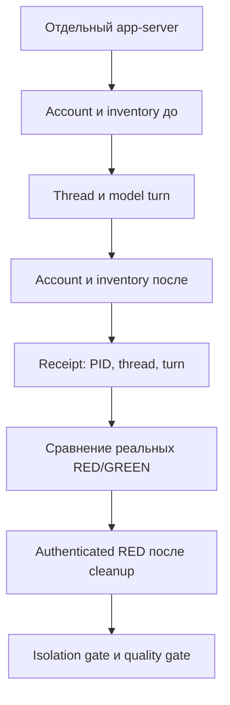

# P0 — native runtime: commit → run → fix → rerun

Дата: 2026-10-08. Новый профиль `native-runtime-v1`, не эквивалентный
историческому `exec`. Скил v0.14 и quality thresholds не менялись.
**P0 открыт до успешного реального smoke/baseline.**

## Зафиксированные итерации

| Итерация | Код | Проверка | Результат |
|---|---|---|---|
| 0 | `926fa24` | Native preflight без модели | PASS положительной пробы, корректный отказ постороннему проектному скилу |
| 1 | `f32469a` | `message-bound-to-field`, RED/GREEN 1×, native | INFRA FAIL до model turn: обе фазы отклонили `account/read`; model tokens 0 |

Исходный FAIL не переписан: `.tmp/native-runtime-message-r1.json` и соседние
artifacts. На каждый model run отдельный app-server, protected disposable
`CODEX_HOME`; оригинальный auth.json проверен неизменным после итерации 1.

### Причина итерации 1 и исправление

Sanitized native diagnostic уточнил RPC error:
`workspace routing discovery failed`. Фильтр parent environment удалял
необходимые `HTTP_PROXY`/`HTTPS_PROXY`, хотя их значения не содержали credentials.
После разрешения **только** credential-free proxy URL (без userinfo/query/
fragment/произвольного path) отдельный `account/read` возвращает ChatGPT account.
API keys, provider overrides, integration tokens и proxy credentials не
передаются. Endpoint-настройки входят в environment fingerprint.

Native RPC error details теперь сохраняются только после redaction credentials;
raw config/auth RPC в artifacts не записываются. Старый preflight по-прежнему
не публикует raw RPC error messages.

Независимое ревью обнаружило недостаточное доказательство авторизации
post-cleanup контроля: unauthenticated restored snapshot мог совпасть по
каталогу. Добавлен authenticated restored snapshot с `account/read`, проверкой
идентичности приватного auth и сравнением account fingerprints с реальными
RED/GREEN runs. Missing/restored identity даёт отказ. При resume старые PASS
gates очищаются до начала новой проверки; complete=False сохраняется сразу.

Исправления покрыты регрессиями; повторный model smoke будет выполнен после
коммита исправления, в новом отчёте `.tmp/native-runtime-message-r2.json`.

## Что связывается с модельным запуском

Scorer получает normalized native command/answer items с теми же правилами
активации, чтения reference и BSL quality. Commentary не становится финальным
ответом; early notifications не теряются до RPC ack; stdout и native artifacts
редактируются для удаления credentials. Source credentials не меняются;
Windows disposable home защищается ACL **до** записи auth.json.

Resume schema v5 связывает corpus/matrix/skill/runner/transport helpers,
профиль, модель/effort, workdir, account identity и пороги. Account identity —
не fingerprint токенов; managed refresh private auth не меняет исходный файл.
Временные пути system-метаданных нормализованы, чтобы новый disposable home
не создавал ложного изменения catalog при resume.

## Ограничения и следующий шаг

- Native inventory — наблюдение поддерживаемого native API в конкретном
  процессе, а не доказательство отсутствия всех скрытых факторов провайдера
  или adversarial filesystem race. User/system-скилы могут оставаться, но их
  metadata/content должны совпадать; plugins/apps/hooks/memories/goals/
  multi-agent отключены одинаково для фаз.
- Snapshot PASS не заменяет behavioral quality. INFRA FAIL до turn не является
  ошибкой скила и не исправляется уменьшением порогов.
- Результаты не переносятся на старые `exec`-отчёты v0.13/v0.14 и не смешиваются
  с отдельным activation corpus.
- После исправленного smoke: повтор 3× и проверка resume, затем новый полный
  native baseline. Код и отчёты коммитятся отдельно; push/релиз не выполняются.
