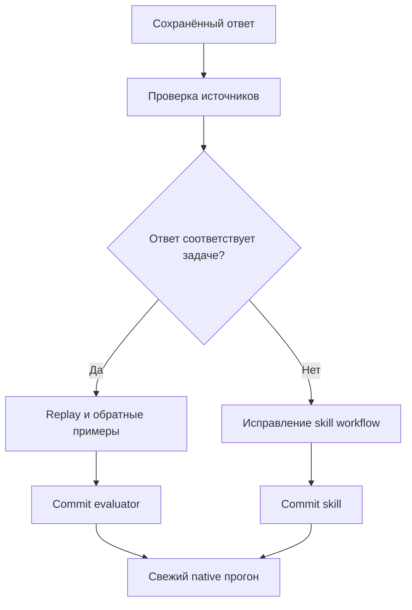

# P2: разбор scoring и native activation после v0.14

Дата: 2026-10-08. Исходное состояние: `c5b97c0`, native-runtime-v1,
gpt-6-luna medium, отдельный consumer Git-корень. Push/релиз не выполняются.
Пороги и отрицательные API-ограничения сохраняются.

## Четыре guided failures: ложные отрицательные оценки

Исходный full `.tmp/native-runtime-guided-full-r2-3x.json` сохранён:
GREEN 27/27 majority, 77/81 individual. Разбор использует ответы именно этого
прогона, а не новые удачные выборки.

| Сценарий / run | Причина | Исправление |
|---|---|---|
| scheduled-job-module-suffix #3 | «Например» наследовало отрицание про другой конструктор вместо ближайшего положительного предложения | Ограничить наследование ближайшим предложением; сохранить запрет явно названного вызова |
| sms-public-wrapper-not-hook #3 | «логин и пароль в этот вызов передавать не нужно» скрывало правильный вызов целиком | Отделить локальный предикат передачи аргументов от запрета вызова |
| nonexistent-service-module #3 | Regex не принимал «имя модуля указано неправильно» | Добавить равнозначную отрицательную формулировку |
| connected-command-hook-boundary #1 | Regex не принимал латинское BSP в «BSP вызывает его» | Принять обе формы названия библиотеки |

Основные сигнатуры и контракт проверены сначала по документации БСП 3.1.11
(`489_добавитьзадание.md`, `1944_отправитьsms.md`,
`089_сообщитьпрогресс.md`, `2080_приопределениикомандподключенныхкобъекту.md`,
`2065_добавитьусловиевидимостикоманды.md`), затем по исходной выгрузке.
Публичные вызовы находятся в ПрограммныйИнтерфейс; процедура переопределения
— хук, не прикладной вызов. Это проверка соответствующих фрагментов,
не исполнение BSL в платформе и не гарантия всех утверждений ответа.

Детерминированный loop:
`python -m unittest discover -s tests -p test_p2_response_scoring.py -v`.
До исправлений: 6 failures, включая четыре replay-ответа и невидимый ошибочный
вызов рядом с ancillary warning. После: PASS. Полный набор: 167 tests PASS,
API 664/664, semantic 0 ERROR / 0 WARN, оба dry-run PASS.

Portable replay: `tests/fixtures/responses/native-guided-p2.json`; абсолютный
consumer путь заменён нейтральным. Обратные примеры сохраняют отказ для
неверного метода, отсутствия исправления совета/границы хука и явного запрета
вызова. Весь исторический full пересчитан отдельно:
`.tmp/p2-guided-offline-replay.json` — GREEN 81/81, RED 10/81, изменились ровно
четыре указанных GREEN оценки. **Это offline replay, не новый модельный
baseline и не новое isolation proof.** Старый отчёт/результат 77/81 не изменён.

## Первый native activation baseline: настоящий activation failure

До изменений кода/скила выполнен отдельный corpus 6 × 3 × RED/GREEN,
`.tmp/native-activation-before-p2-3x.json`. Isolation PASS, общий gate FAIL.
GREEN 4/6 majority, activation 1/3, reference-read 1/2, infra 0.

- neutral-message-near-field: 0/3 activation/read; два ответа используют
  устаревший метод, третий верный API без чтения reference.
- neutral-upgrade-safe-write: 3/3 PASS и activation/read.
- Все три platform-only negatives: 3/3 PASS каждый, activation 0.
- other-version-api-boundary: только 1/3 читает skill; два остальных отвечают
  по metadata/памяти. В одном корректном отказе regex дополнительно не узнаёт
  «он не может подтвердить»; это отдельный scoring дефект, не доказательство
  активации.

После scorer-коммита `1dfbbb6` уточнены положительные metadata triggers:
прочитать skill до выбора API даже при неявной БСП или знакомом методе;
отдельно server field validation, safe upgrade write и проверка любой версии
БСП. Platform-only negatives остались вне scope. Version boundary перенесена
в начало workflow; для отказа по версии API reference не нужен. Router
сохранил ASCII и не добавляет API-утверждений.

Denial regex принимает «он не может подтвердить», но парные тесты отвергают
подтверждение 3.2.1 по 3.1.11 и runnable transplanted call. Activation остаётся
отдельным обязательным условием, корректный отказ без чтения skill не PASS.
168 tests PASS, API 664/664, semantic 0/0, оба dry-run PASS.

Коммит metadata/denial `7ac46f0`: guided smoke PASS; свежий activation
`.tmp/native-activation-after-p2-r1-3x.json` — 5/6 majority, 16/18 individual,
activation 3/3, read 2/2, API/infra ошибок 0, оба gate PASS. Но в platform-only
exchange task два ответа лишний раз читали router, поэтому этот отрицательный
сценарий не прошёл majority. Корректный итог gate не скрывает эту границу.

Независимый adversarial review выявил, что добавленное голое «не может» могло
пропустить подтверждение «...подтверждаю 3.2.1...Она не может быть иной».
Контрпример воспроизведён RED и добавлен к тесту; новая ветка требует именно
«не может подтвердить/проверить». Metadata дополнительно отделяет платформенную
регистрацию обмена в начале scope, без общей перечисленной возможности
«exchange», конфликтовавшей с отрицательным task. Проверки снова PASS.

Коммит `57baf94`: свежий activation
`.tmp/native-activation-after-p2-r2-3x.json` — 5/6 majority, 14/18 individual,
но общий gate FAIL: activation 2/3, read 1/2, invalid 1, unsafe 1. Isolation
PASS, infra 0. Все три platform-only negatives теперь 3/3 PASS без активации,
но field-validation positive 0/3 читает skill; поэтому guided full не запускался.
Версионный boundary 2/3 PASS, upgrade 3/3 PASS. Исходный auth неизменён.

Следующая контролируемая гипотеза — русские metadata triggers для русских
задач с неявным названием стандартных подсистем. Description JSON-escaped
в double-quoted YAML сохраняет ASCII router; native skills/list должен
подтвердить декодирование до модельного прогона. Сигнатуры/имена API в
metadata не добавляются. После коммита — свежие activation и guided на
неизменном коде; неуспешные выборки остаются в истории.
Результаты разных корпусов и старого/нового scorer не объединяются.

## Итог на `181e0f6`

Native skills/list подтвердил **точное декодирование** русского description;
SKILL.md сохранил ASCII. Сигнатуры/references и глобальные настройки не менялись.

| Отдельный corpus | GREEN majority | Individual | Активация / reference по majority | Gate / isolation |
|---|---:|---:|---|---|
| Guided 27 × 3 | 27/27 | 80/81 | 26/26 / 26/26 | PASS / PASS |
| Activation 6 × 3 | 5/6 | 16/18 | 3/3 / 2/2 | PASS / PASS |

Отчёты: `.tmp/native-guided-after-p2-r1-3x.json` и
`.tmp/native-activation-after-p2-r3-3x.json`. Ни один quality failure не был
пересэмплирован через resume. В обоих GREEN invalid/unsafe/forbidden **БСП**
и infrastructure errors 0. В отрицательных activation cases ложных активаций
**0/9**; это наблюдение этого набора, не универсальная гарантия.

Оставшиеся **реальные** quality failures сохранены:

- `neutral-platform-exchange-registration` #2/#3: вместо регистрации
  показан `ПланыОбмена.ЗаписатьИзменения`. Required pattern верного
  механизма не выполнен. Это платформенная задача вне BSP scope, поэтому
  injecting её ответ в BSP metadata или принудительная активация скила
  исказили бы проверку. Содержание двух ответов FAIL, граница активации PASS.
- `connected-command-hook-boundary` #2: модель заявила недоступность справки,
  отказалась от каркаса и попросила выгрузку. Последующая проверка trace
  установила: в этом individual run reference-read не засчитан; 26/26 выше
  является majority по сценариям. Missing code requirements сохраняют FAIL;
  majority не превращает этот ответ в верный. Диагноз и исправление пути:
  [P3 reference recovery](p3-reference-recovery-after-p2.md).

Продолжение: отдельно проверить нормализацию reader evidence/ошибочных путей
на сохранённой trace и устойчивость доступа к reference. Платформенные
ошибки рассматривать вне skill API или в отдельном platform корпусе.
P1-покрытие activation остаётся 2/24 reference, расширение не выполнено.

Parent повторно сверил fingerprints runner/helpers/skill/corpus со свежими
отчётами. **168 unit tests PASS**, coverage 664/664, semantic 0 ERROR / 0 WARN,
оба dry-run и py_compile/git diff check PASS. Source auth неизменён по
before/after in-memory checks; scan известных credentials по 794 итоговым
report/artifact файлам PASS; staging удалён, private runtime homes осталось 0.
Это не полный аудит неизвестных секретов/внешнего провайдера.

Последний коммит skill: `181e0f6`. Документация результатов коммитится отдельно;
никакого push, релиза или обновления пользовательского vendor submodule.

