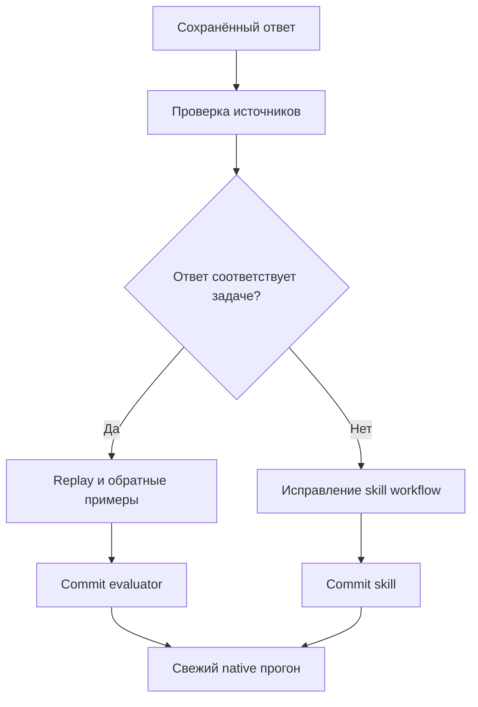

# P2: разбор scoring и native activation после v0.14

Дата: 2026-10-08. Исходное состояние: `c5b97c0`, native-runtime-v1,
gpt-6-luna medium, отдельный consumer Git-корень. Push/релиз не выполняются.
Пороги и отрицательные API-ограничения сохраняются.

## Четыре guided failures: ложные отрицательные оценки

Исходный full `.tmp/native-runtime-guided-full-r2-3x.json` сохранён:
GREEN 27/27 majority, 77/81 individual. Разбор использует ответы именно этого
прогона, а не новые удачные выборки.

| Сценарий / run | Причина | Исправление |
|---|---|---|
| scheduled-job-module-suffix #3 | «Например» наследовало отрицание про другой конструктор вместо ближайшего положительного предложения | Ограничить наследование ближайшим предложением; сохранить запрет явно названного вызова |
| sms-public-wrapper-not-hook #3 | «логин и пароль в этот вызов передавать не нужно» скрывало правильный вызов целиком | Отделить локальный предикат передачи аргументов от запрета вызова |
| nonexistent-service-module #3 | Regex не принимал «имя модуля указано неправильно» | Добавить равнозначную отрицательную формулировку |
| connected-command-hook-boundary #1 | Regex не принимал латинское BSP в «BSP вызывает его» | Принять обе формы названия библиотеки |

Основные сигнатуры и контракт проверены сначала по документации БСП 3.1.11
(`489_добавитьзадание.md`, `1944_отправитьsms.md`,
`089_сообщитьпрогресс.md`, `2080_приопределениикомандподключенныхкобъекту.md`,
`2065_добавитьусловиевидимостикоманды.md`), затем по исходной выгрузке.
Публичные вызовы находятся в ПрограммныйИнтерфейс; процедура переопределения
— хук, не прикладной вызов. Это проверка соответствующих фрагментов,
не исполнение BSL в платформе и не гарантия всех утверждений ответа.

Детерминированный loop:
`python -m unittest discover -s tests -p test_p2_response_scoring.py -v`.
До исправлений: 6 failures, включая четыре replay-ответа и невидимый ошибочный
вызов рядом с ancillary warning. После: PASS. Полный набор: 167 tests PASS,
API 664/664, semantic 0 ERROR / 0 WARN, оба dry-run PASS.

Portable replay: `tests/fixtures/responses/native-guided-p2.json`; абсолютный
consumer путь заменён нейтральным. Обратные примеры сохраняют отказ для
неверного метода, отсутствия исправления совета/границы хука и явного запрета
вызова. Весь исторический full пересчитан отдельно:
`.tmp/p2-guided-offline-replay.json` — GREEN 81/81, RED 10/81, изменились ровно
четыре указанных GREEN оценки. **Это offline replay, не новый модельный
baseline и не новое isolation proof.** Старый отчёт/результат 77/81 не изменён.

## Первый native activation baseline: настоящий activation failure

До изменений кода/скила выполнен отдельный corpus 6 × 3 × RED/GREEN,
`.tmp/native-activation-before-p2-3x.json`. Isolation PASS, общий gate FAIL.
GREEN 4/6 majority, activation 1/3, reference-read 1/2, infra 0.

- neutral-message-near-field: 0/3 activation/read; два ответа используют
  устаревший метод, третий верный API без чтения reference.
- neutral-upgrade-safe-write: 3/3 PASS и activation/read.
- Все три platform-only negatives: 3/3 PASS каждый, activation 0.
- other-version-api-boundary: только 1/3 читает skill; два остальных отвечают
  по metadata/памяти. В одном корректном отказе regex дополнительно не узнаёт
  «он не может подтвердить»; это отдельный scoring дефект, не доказательство
  активации.

После scorer-коммита `1dfbbb6` уточнены положительные metadata triggers:
прочитать skill до выбора API даже при неявной БСП или знакомом методе;
отдельно server field validation, safe upgrade write и проверка любой версии
БСП. Platform-only negatives остались вне scope. Version boundary перенесена
в начало workflow; для отказа по версии API reference не нужен. Router
сохранил ASCII и не добавляет API-утверждений.

Denial regex принимает «он не может подтвердить», но парные тесты отвергают
подтверждение 3.2.1 по 3.1.11 и runnable transplanted call. Activation остаётся
отдельным обязательным условием, корректный отказ без чтения skill не PASS.
168 tests PASS, API 664/664, semantic 0/0, оба dry-run PASS.

Далее свежие native smoke, activation 3× и guided baseline на неизменном
commit. Результаты разных корпусов и старого/нового scorer не объединяются.

